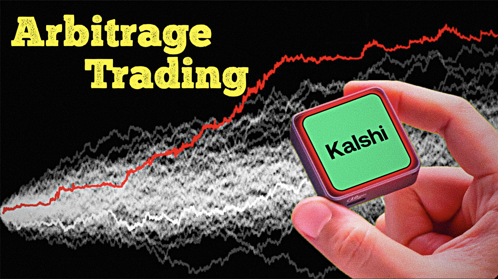

# Video 11: Kalshi Arbitrage Trading Bot

This video explores how an automated trading bot can find arbitrage opportunities across Kalshi's Bitcoin and Ethereum 15-minute crypto markets. The bot monitors both markets, compares available contract prices, and identifies setups where the combined trade creates a potential pricing edge.



## API key Filename
```
apikey
```
## Private Key Filename
```
privatekey
```

## <span style={{color: '#FFD700'}}>Paper-Trading Code</span>

```
; =========================
; Strategy Configuration
; =========================
assets := ["BTC", "ETH"]   ;correlation pair
timeDelay := 15            ; activation window in minutes. 15 = monitor the whole 15m market.
EntryRange := [0.8, 0.9]   ; [Min, Max] enter only when inverse pair sum is between 80c and 93c
PairExit := 0.75           ; Stop Loss
orderSize := 2             ; Size of order each shot
shots := 5                 ; max pair entry shots per 15m market
cooldownSec := 40          ; seconds to wait after one shot before seeking the next
noEntryMinutes := 1        ; last N minutes allow no new entry shots;
InitialBalance := 10000.00 ; paper-mode starting balance

; =============================================================
; Kalshi Order API Config 
; DO NOT TOUCH BELOW VALUES UNLESS YOU KNOW WHAT YOU ARE DOING
; =============================================================
BehaviorLookbackMs := 10000  ; behavior velocity lookback window
BehaviorSignEpsBps := 0.25   ; moves within this many bps are treated as baseline
BehaviorEmaAlpha := 0.22     ; smoothing for the behavior score stream
PairExitOrderPrice := 0.01
entryOrderPrice := 1.00      
enableLiveOrders := false     ; paper mode: never submit signed/live orders
pollIntervalMs := 700
marketRefreshMs := 5000       ; refresh market/session metadata less often; orderbook still refreshes every loop
priceRefreshMs := 1500        ; throttle live asset price calls used only for LogStream
restDelay := 2000            ; ms to let order rest before checking position
entryDiff := 0.00            ; legacy BUY offset; pair entry uses entryOrderPrice above.
kalshiApiBase := "https://api.elections.kalshi.com"
assetSeriesMap := { "BTC": "KXBTC15M", "ETH": "KXETH15M", "SOL": "KXSOL15M", "XRP": "KXXRP15M", "DOGE": "KXDOGE15M", "HYPE": "KXHYPE15M", "BNB": "KXBNB15M" }

; Track the locked pair after entry. Individual legs are also mirrored in positions.
positions := {}
paperCash := InitialBalance
paperOpenTrades := []
paperPositionsByTicker := {}
paperParticipatedMarkets := {}
paperMarketsParticipated := 0
paperResolutionWins := 0
paperLastPnl := 0
pairPhase := "WAIT_WINDOW"    ; WAIT_WINDOW | MONITORING | BUY_PENDING | IN_PAIR | BUY_FAILED | HAS_POSITION | EXITED
pairSessionKey := ""
activePair := ""
pendingPair := ""
pendingEntryOrderIds := []
pairShotsSubmitted := 0
pairShotsFilled := 0
pairFilledContracts := 0
pairLastShotTick := 0
assetPhase := {}              ; retained for legacy helper compatibility
assetLastPriceLogTick := {}   ; throttled logging control
assetSnapshotCache := {}
assetMarketRefreshTick := {}
assetPriceCache := {}
assetPriceRefreshTick := {}
pairBehaviorSessionKey := ""
pairBehaviorBtcOpen := ""
pairBehaviorEthOpen := ""
pairBehaviorLastUpdateTick := 0
pairBehaviorPrevBtcMoveBps := ""
pairBehaviorPrevEthMoveBps := ""
pairBehaviorEmaScore := ""
pairBehaviorState := "WAITING"
pairBehaviorScore := ""
pairBehaviorHistory := []

Log("Paper mode started | InitialBalance: $" FmtMoneyAbs(InitialBalance) " | EntryRange: " FmtEntryRange() " | BehaviorGate: SYNC | Exit < " FmtPairSum(PairExit) " | Window: last " timeDelay "m | Shots: " shots " x " orderSize " | Cooldown: " cooldownSec "s | No entry: last " noEntryMinutes "m | Assets: BTC/ETH")

loop {
    btcSnap := GetKalshiMarketSnapshot("BTC")
    ethSnap := GetKalshiMarketSnapshot("ETH")

    if (!IsObject(btcSnap) || !IsObject(ethSnap)) {
        if (IsObject(activePair) && PairSessionEnded(activePair, btcSnap, ethSnap))
            MarkPairHeldToResolution()
        LogOnce("PAIR", "NO_DATA_" CurrentQuarterIndex(), "PAIR Waiting for BTC/ETH market data")
        Random, pollJitterMs, 0, 250
        sleepMs := pollIntervalMs + pollJitterMs
        Sleep %sleepMs%
        continue
    }

    if !PairSnapshotsAligned(btcSnap, ethSnap) {
        LogOnce("PAIR", "MISALIGNED_" PairMarketSuffix(btcSnap.marketTicker) "_" PairMarketSuffix(ethSnap.marketTicker), "PAIR Waiting for aligned BTC/ETH market | BTC " btcSnap.marketTicker " | ETH " ethSnap.marketTicker)
        Random, pollJitterMs, 0, 250
        sleepMs := pollIntervalMs + pollJitterMs
        Sleep %sleepMs%
        continue
    }

    sessionKey := BuildPairSessionKey(btcSnap, ethSnap)

    if (IsObject(activePair) && PairSessionEnded(activePair, btcSnap, ethSnap)) {
        MarkPairHeldToResolution()
        Random, pollJitterMs, 0, 250
        sleepMs := pollIntervalMs + pollJitterMs
        Sleep %sleepMs%
        continue
    }

    if (pairSessionKey = "" || pairSessionKey != sessionKey) {
        if IsObject(pendingPair) {
            if !PairSessionEnded(pendingPair, btcSnap, ethSnap) {
                pairSessionKey := sessionKey
                assetLastPriceLogTick["PAIR"] := 0
                LogOnceReset("PAIR")
                Log("PAIR Session key refreshed while entry pending | BTC " btcSnap.marketTicker " | ETH " ethSnap.marketTicker)
            } else {
                if PairAnyPositionOpen(pendingPair) {
                    CancelKalshiOrders(pendingEntryOrderIds)
                    Log(pendingPair.name " pending entry crossed session boundary with open leg(s); canceled remaining buy order(s)")
                    ClearPendingPairEntry()
                    pairSessionKey := sessionKey
                    pairPhase := "HAS_POSITION"
                    Log("PAIR Existing BTC or ETH position found, waiting for next session")
                } else {
                    ClearPendingPairEntry()
                    pairSessionKey := sessionKey
                    pairPhase := "WAIT_WINDOW"
                    ResetPairShotState()
                    assetLastPriceLogTick["PAIR"] := 0
                    LogOnceReset("PAIR")
                    Log("PAIR New session | BTC " btcSnap.marketTicker " | ETH " ethSnap.marketTicker)

                    if (HasExistingPosition(btcSnap.marketTicker) || HasExistingPosition(ethSnap.marketTicker)) {
                        pairPhase := "HAS_POSITION"
                        Log("PAIR Existing BTC or ETH position found, waiting for next session")
                    }
                }
            }
        } else {
            pairSessionKey := sessionKey
            pairPhase := "WAIT_WINDOW"
            ResetPairShotState()
            ClearPendingPairEntry()
            assetLastPriceLogTick["PAIR"] := 0
            LogOnceReset("PAIR")
            Log("PAIR New session | BTC " btcSnap.marketTicker " | ETH " ethSnap.marketTicker)

            if (HasExistingPosition(btcSnap.marketTicker) || HasExistingPosition(ethSnap.marketTicker)) {
                pairPhase := "HAS_POSITION"
                Log("PAIR Existing BTC or ETH position found, waiting for next session")
            }
        }

        if (!IsObject(pendingPair) || PairSessionEnded(pendingPair, btcSnap, ethSnap)) {
            Random, pollJitterMs, 0, 250
            sleepMs := pollIntervalMs + pollJitterMs
            Sleep %sleepMs%
            continue
        }
    }

    ; --- Entry pending: buy orders were submitted but both legs are not confirmed yet. ---
    if IsObject(pendingPair) {
        streamPair := IsObject(activePair) ? activePair : pendingPair
        LogPairStream(btcSnap, ethSnap, streamPair)

        if IsObject(activePair) {
            if TryExitLockedPairIfNeeded(btcSnap, ethSnap) {
                Random, pollJitterMs, 0, 250
                sleepMs := pollIntervalMs + pollJitterMs
                Sleep %sleepMs%
                continue
            }
        }

        if PairAllPositionsOpen(pendingPair) {
            activePair := pendingPair
            ClearPendingPairEntry()
            MarkPairShotFilled(activePair)
            SetPairPositionState(activePair)
            pairPhase := "IN_PAIR"
            assetLastPriceLogTick["PAIR"] := 0
            Log(activePair.name " shot " pairShotsFilled "/" shots " pending entry filled and locked | monitoring next shots")
            if TryExitLockedPairIfNeeded(btcSnap, ethSnap) {
                Random, pollJitterMs, 0, 250
                sleepMs := pollIntervalMs + pollJitterMs
                Sleep %sleepMs%
                continue
            }
        } else {
            pairPhase := IsObject(activePair) ? "IN_PAIR" : "BUY_PENDING"
            if IsObject(activePair)
                LogOnce("PAIR", "BUY_PENDING_ADD_" pendingPair.shotNumber, pendingPair.name " shot " pendingPair.shotNumber "/" shots " waiting for target quantity")
            else if PairAnyPositionOpen(pendingPair)
                LogOnce("PAIR", "BUY_PENDING_PARTIAL_" pendingPair.shotNumber, pendingPair.name " partial entry fill open, waiting for remaining leg(s); no unwind")
            else
                LogOnce("PAIR", "BUY_PENDING_" pendingPair.shotNumber, pendingPair.name " entry buy order(s) open, waiting for fill")
        }

        Random, pollJitterMs, 0, 250
        sleepMs := pollIntervalMs + pollJitterMs
        Sleep %sleepMs%
        continue
    }

    ; --- In pair: hold the locked pair and look for additional shots. ---
    if IsObject(activePair) {
        pairPhase := "IN_PAIR"
        LogPairStream(btcSnap, ethSnap, activePair)

        if TryExitLockedPairIfNeeded(btcSnap, ethSnap) {
            Random, pollJitterMs, 0, 250
            sleepMs := pollIntervalMs + pollJitterMs
            Sleep %sleepMs%
            continue
        }

        TryNextPairShot(btcSnap, ethSnap, true)

        Random, pollJitterMs, 0, 250
        sleepMs := pollIntervalMs + pollJitterMs
        Sleep %sleepMs%
        continue
    }

    if (pairPhase = "BUY_FAILED") {
        LogOnce("PAIR", "BUY_FAILED", "PAIR Buy failed earlier, waiting for next session")
        Random, pollJitterMs, 0, 250
        sleepMs := pollIntervalMs + pollJitterMs
        Sleep %sleepMs%
        continue
    }

    if (pairPhase = "EXITED") {
        LogOnce("PAIR", "EXITED", "PAIR Locked pair exited, waiting for next session")
        Random, pollJitterMs, 0, 250
        sleepMs := pollIntervalMs + pollJitterMs
        Sleep %sleepMs%
        continue
    }

    if (pairPhase = "HAS_POSITION") {
        LogOnce("PAIR", "HAS_POSITION", "PAIR Existing BTC or ETH position, waiting for next session")
        Random, pollJitterMs, 0, 250
        sleepMs := pollIntervalMs + pollJitterMs
        Sleep %sleepMs%
        continue
    }

    minsLeft := PairMinutesLeft(btcSnap, ethSnap)
    inEntryWindow := (minsLeft > 0 && minsLeft <= timeDelay)
    entryAllowed := (inEntryWindow && minsLeft > noEntryMinutes)

    if (!inEntryWindow) {
        if (minsLeft <= 0)
            LogOnce("PAIR", "SESSION_ENDED", "PAIR End of session, waiting for new market")
        else
            LogOnce("PAIR", "WAIT_WINDOW", "PAIR Waiting for last " timeDelay " minutes")
        pairPhase := "WAIT_WINDOW"
        Random, pollJitterMs, 0, 250
        sleepMs := pollIntervalMs + pollJitterMs
        Sleep %sleepMs%
        continue
    }

    if (!entryAllowed) {
        LogPairStream(btcSnap, ethSnap)
        LogOnce("PAIR", "NO_ENTRY_ZONE", "PAIR Last " noEntryMinutes " minute no-entry zone; holding only")
        pairPhase := "WAIT_WINDOW"
        Random, pollJitterMs, 0, 250
        sleepMs := pollIntervalMs + pollJitterMs
        Sleep %sleepMs%
        continue
    }

    if (pairPhase != "MONITORING") {
        pairPhase := "MONITORING"
        Log("PAIR Monitoring BTC/ETH inverse sums | EntryRange " FmtEntryRange() " | BehaviorGate SYNC | Exit < " FmtPairSum(PairExit) " | Shots " pairShotsSubmitted "/" shots)
    }

    LogPairStream(btcSnap, ethSnap)
    candidatePair := SelectPairEntry(btcSnap, ethSnap)
    if !IsObject(candidatePair) {
        Random, pollJitterMs, 0, 250
        sleepMs := pollIntervalMs + pollJitterMs
        Sleep %sleepMs%
        continue
    }
    if !PairEntrySignalMet(candidatePair) {
        Random, pollJitterMs, 0, 250
        sleepMs := pollIntervalMs + pollJitterMs
        Sleep %sleepMs%
        continue
    }

    if !CanPlaceOrderNow("PAIR") {
        LogOnce("PAIR", "NO_CREDS", "PAIR Missing credentials, cannot place orders")
        Random, pollJitterMs, 0, 250
        sleepMs := pollIntervalMs + pollJitterMs
        Sleep %sleepMs%
        continue
    }

    if (HasExistingPosition(btcSnap.marketTicker) || HasExistingPosition(ethSnap.marketTicker)) {
        pairPhase := "HAS_POSITION"
        Log("PAIR Existing BTC or ETH position found, waiting for next session")
        Random, pollJitterMs, 0, 250
        sleepMs := pollIntervalMs + pollJitterMs
        Sleep %sleepMs%
        continue
    }

    if !TrySubmitPairShot(candidatePair, false) {
        pairPhase := "BUY_FAILED"
        Log(candidatePair.name " pair order not filled after 4 attempts, skipping session")
    }

    Random, pollJitterMs, 0, 250
    sleepMs := pollIntervalMs + pollJitterMs
    Sleep %sleepMs%
}

LogOnce(asset, reason, msg) {
    global logOnceKeys
    if !IsObject(logOnceKeys)
        logOnceKeys := {}
    key := asset "|" reason
    if (logOnceKeys.HasKey(key))
        return
    logOnceKeys[key] := true
    Log(msg)
}

LogOnceReset(asset) {
    global logOnceKeys
    if !IsObject(logOnceKeys)
        return
    toRemove := []
    for k, _ in logOnceKeys {
        if (InStr(k, asset "|") = 1)
            toRemove.Push(k)
    }
    for _, k in toRemove
        logOnceKeys.Delete(k)
}

ResetPairShotState() {
    global pairShotsSubmitted, pairShotsFilled, pairFilledContracts, pairLastShotTick, shots
    pairShotsSubmitted := 0
    pairShotsFilled := 0
    pairFilledContracts := 0
    pairLastShotTick := 0
}

PairShotCooldownRemainingMs() {
    global pairLastShotTick, cooldownSec
    if (pairLastShotTick = 0)
        return 0
    remaining := (cooldownSec * 1000) - (A_TickCount - pairLastShotTick)
    return (remaining > 0) ? remaining : 0
}

LogPairShotStream() {
    ; Paper dashboard intentionally keeps only bUP-eDOWN, eUP-bDOWN, P/L, and wins.
}

PairEntryWindowOpen(minsLeft) {
    global timeDelay, noEntryMinutes
    return (minsLeft != "" && minsLeft > noEntryMinutes && minsLeft <= timeDelay)
}

PairCanSubmitNextShot(minsLeft) {
    global pairShotsSubmitted, shots, pendingPair
    if (pairShotsSubmitted >= shots)
        return false
    if IsObject(pendingPair)
        return false
    if !PairEntryWindowOpen(minsLeft)
        return false
    if (PairShotCooldownRemainingMs() > 0)
        return false
    return true
}

TryNextPairShot(btcSnap, ethSnap, allowAdd := true) {
    global activePair, pairShotsSubmitted, shots, noEntryMinutes
    if !IsObject(activePair)
        return false

    minsLeft := PairMinutesLeft(btcSnap, ethSnap)
    if (pairShotsSubmitted >= shots) {
        LogOnce("PAIR", "SHOTS_DONE", activePair.name " max shots reached " pairShotsSubmitted "/" shots)
        return false
    }
    if (minsLeft != "" && minsLeft <= noEntryMinutes) {
        LogOnce("PAIR", "NO_ENTRY_ZONE_ACTIVE", activePair.name " last " noEntryMinutes " minute no-entry zone; holding only")
        return false
    }
    if !PairCanSubmitNextShot(minsLeft)
        return false

    candidatePair := BuildPairFromName(activePair.name, btcSnap, ethSnap)
    AttachPairBehavior(candidatePair, UpdatePairBehaviorState(btcSnap, ethSnap))
    if !PairEntrySignalMet(candidatePair)
        return false

    return TrySubmitPairShot(candidatePair, allowAdd)
}

PairEntrySignalMet(pair) {
    if !IsObject(pair)
        return false
    if !PairSumInEntryRange(pair.sum)
        return false
    if (!IsObject(pair.legs) || pair.legs.MaxIndex() < 2)
        return false
    if !PairBehaviorEntryAllowed(pair)
        return false
    return true
}

PreparePairShot(pair) {
    global pairShotsSubmitted, orderSize
    if !IsObject(pair)
        return false

    shotNumber := pairShotsSubmitted + 1
    pair.shotNumber := shotNumber
    pair.orderSize := orderSize
    for _, leg in pair.legs {
        beforeQty := GetExistingPositionQty(leg.ticker)
        if (beforeQty = "" || beforeQty < 0)
            beforeQty := 0
        if (beforeQty = 0) {
            trackedQty := PairTrackedContracts()
            if (trackedQty > 0)
                beforeQty := trackedQty
        }
        leg.beforeQty := beforeQty
        leg.targetQty := beforeQty + orderSize
        leg.count := orderSize
    }
    return true
}

TrySubmitPairShot(candidatePair, allowAdd := false) {
    global activePair, pendingPair, pairPhase, assetLastPriceLogTick, pairShotsSubmitted, shots
    if !IsObject(candidatePair)
        return false
    if (pairShotsSubmitted >= shots)
        return false
    if !CanPlaceOrderNow("PAIR") {
        LogOnce("PAIR", "NO_CREDS", "PAIR Missing credentials, cannot place orders")
        return false
    }
    if !PreparePairShot(candidatePair)
        return false

    behaviorText := candidatePair.HasKey("behaviorState") ? " | Behavior " candidatePair.behaviorState " score " FmtBehaviorScore(candidatePair.behaviorScore) : ""
    Log(candidatePair.name " shot " candidatePair.shotNumber "/" shots " triggered @ sum " FmtPairSum(candidatePair.sum) " in range " FmtEntryRange() behaviorText " | BTC " candidatePair.btcTicker " | ETH " candidatePair.ethTicker " | placing " candidatePair.orderSize " contracts per leg")
    buyConfirmed := false
    loop, 4 {
        if (A_Index > 1 && PairAllPositionsOpen(candidatePair)) {
            Log(candidatePair.name " shot " candidatePair.shotNumber " positions detected before retry " A_Index)
            buyConfirmed := true
            break
        }

        buyResult := BuyPairPosition(candidatePair, allowAdd)
        if (buyResult) {
            Log(candidatePair.name " shot " candidatePair.shotNumber " position confirmed")
            buyConfirmed := true
            break
        }
        if IsObject(pendingPair) {
            Log(candidatePair.name " shot " pendingPair.shotNumber " entry pending, waiting for remaining fill")
            break
        }
        if (A_Index < 4) {
            Log(candidatePair.name " shot " candidatePair.shotNumber " pair retry " A_Index "/3")
            Sleep 1000
        }
    }

    if (buyConfirmed) {
        MarkPairShotSubmitted(candidatePair)
        MarkPairShotFilled(candidatePair)
        activePair := candidatePair
        SetPairPositionState(activePair)
        pairPhase := "IN_PAIR"
        assetLastPriceLogTick["PAIR"] := 0
        Log(activePair.name " shot " pairShotsSubmitted "/" shots " locked | monitoring next shots")
        return true
    }

    if IsObject(pendingPair) {
        MarkPairShotSubmitted(pendingPair)
        pairPhase := IsObject(activePair) ? "IN_PAIR" : "BUY_PENDING"
        LogOnce("PAIR", "BUY_PENDING_" pendingPair.shotNumber, pendingPair.name " shot " pendingPair.shotNumber "/" shots " entry submitted, waiting for fill")
        return true
    }

    return false
}

MarkPairShotSubmitted(pair) {
    global pairShotsSubmitted, pairLastShotTick
    if !IsObject(pair)
        return
    if (pair.HasKey("shotNumber") && pair.shotNumber > pairShotsSubmitted)
        pairShotsSubmitted := pair.shotNumber
    pairLastShotTick := A_TickCount
    LogPairShotStream()
}

MarkPairShotFilled(pair) {
    global pairShotsFilled, pairFilledContracts, orderSize
    if !IsObject(pair)
        return
    if (pair.HasKey("shotNumber") && pair.shotNumber > pairShotsFilled)
        pairShotsFilled := pair.shotNumber

    marketQty := PairFilledContractsFromMarket(pair)
    if (marketQty != "")
        pairFilledContracts := marketQty
    else
        pairFilledContracts := pairShotsFilled * orderSize
    pair.filledContracts := pairFilledContracts
    LogPairShotStream()
}

PairTrackedContracts() {
    global pairFilledContracts, pairShotsFilled, orderSize
    if (pairFilledContracts > 0)
        return pairFilledContracts
    if (pairShotsFilled > 0)
        return pairShotsFilled * orderSize
    return 0
}

PairFilledContractsFromMarket(pair) {
    minQty := ""
    if !IsObject(pair)
        return ""
    for _, leg in pair.legs {
        qty := GetExistingPositionQty(leg.ticker)
        if (qty = "")
            return ""
        if (minQty = "" || qty < minQty)
            minQty := qty
    }
    return minQty
}

BuildPairSessionKey(btcSnap, ethSnap) {
    btcKey := (IsObject(btcSnap) && btcSnap.marketTicker != "") ? btcSnap.marketTicker : "BTC_" CurrentQuarterIndex()
    ethKey := (IsObject(ethSnap) && ethSnap.marketTicker != "") ? ethSnap.marketTicker : "ETH_" CurrentQuarterIndex()
    return btcKey "|" ethKey
}

PairSnapshotsAligned(btcSnap, ethSnap) {
    if (!IsObject(btcSnap) || !IsObject(ethSnap))
        return false

    btcSuffix := PairMarketSuffix(btcSnap.marketTicker)
    ethSuffix := PairMarketSuffix(ethSnap.marketTicker)
    if (btcSuffix != "" && ethSuffix != "" && btcSuffix != ethSuffix)
        return false

    btcClose := btcSnap.HasKey("closeTime") ? btcSnap.closeTime : ""
    ethClose := ethSnap.HasKey("closeTime") ? ethSnap.closeTime : ""
    if (btcClose != "" && ethClose != "" && btcClose != ethClose)
        return false

    return true
}

PairMarketSuffix(ticker) {
    if (ticker = "")
        return ""
    pos := InStr(ticker, "-")
    if (!pos)
        return ticker
    return SubStr(ticker, pos + 1)
}

PairMinutesLeft(btcSnap, ethSnap) {
    btcMins := SnapshotMinutesLeft(btcSnap)
    ethMins := SnapshotMinutesLeft(ethSnap)

    if (btcMins = "" && ethMins = "")
        return MinutesRemainingInQuarter()
    if (btcMins = "")
        return ethMins
    if (ethMins = "")
        return btcMins
    return (btcMins < ethMins) ? btcMins : ethMins
}

BuildPairSums(btcSnap, ethSnap) {
    sums := {}
    sums.upDown := ""
    sums.downUp := ""

    if (IsObject(btcSnap) && IsObject(ethSnap)) {
        if (btcSnap.up != "" && ethSnap.down != "")
            sums.upDown := (btcSnap.up + 0) + (ethSnap.down + 0)
        if (btcSnap.down != "" && ethSnap.up != "")
            sums.downUp := (btcSnap.down + 0) + (ethSnap.up + 0)
    }

    return sums
}

SelectPairEntry(btcSnap, ethSnap) {
    sums := BuildPairSums(btcSnap, ethSnap)
    behavior := UpdatePairBehaviorState(btcSnap, ethSnap)
    selected := ""

    if (PairSumInEntryRange(sums.upDown))
        selected := "BTC_UP_ETH_DOWN"
    if (PairSumInEntryRange(sums.downUp)) {
        if (selected = "" || sums.downUp < sums.upDown)
            selected := "BTC_DOWN_ETH_UP"
    }

    if (selected = "")
        return false
    pair := BuildPairFromName(selected, btcSnap, ethSnap)
    AttachPairBehavior(pair, behavior)
    return pair
}

BuildPairFromName(name, btcSnap, ethSnap) {
    if (!IsObject(btcSnap) || !IsObject(ethSnap))
        return false

    pair := {}
    pair.name := name
    pair.quarterIndex := CurrentQuarterIndex()
    pair.btcTicker := btcSnap.marketTicker
    pair.ethTicker := ethSnap.marketTicker
    pair.legs := []
    PaperRememberLatestSnapshots(pair, btcSnap, ethSnap)

    if (name = "BTC_UP_ETH_DOWN") {
        if (btcSnap.up = "" || ethSnap.down = "")
            return false
        pair.sum := (btcSnap.up + 0) + (ethSnap.down + 0)
        pair.legs.Push({ asset: "BTC", ticker: btcSnap.marketTicker, side: "UP", price: btcSnap.up + 0 })
        pair.legs.Push({ asset: "ETH", ticker: ethSnap.marketTicker, side: "DOWN", price: ethSnap.down + 0 })
        return pair
    }

    if (name = "BTC_DOWN_ETH_UP") {
        if (btcSnap.down = "" || ethSnap.up = "")
            return false
        pair.sum := (btcSnap.down + 0) + (ethSnap.up + 0)
        pair.legs.Push({ asset: "BTC", ticker: btcSnap.marketTicker, side: "DOWN", price: btcSnap.down + 0 })
        pair.legs.Push({ asset: "ETH", ticker: ethSnap.marketTicker, side: "UP", price: ethSnap.up + 0 })
        return pair
    }

    return false
}

PairCurrentSum(pair, btcSnap, ethSnap) {
    if !IsObject(pair)
        return ""
    if (pair.name = "BTC_UP_ETH_DOWN") {
        if (IsObject(btcSnap) && IsObject(ethSnap) && btcSnap.up != "" && ethSnap.down != "")
            return (btcSnap.up + 0) + (ethSnap.down + 0)
        return ""
    }
    if (pair.name = "BTC_DOWN_ETH_UP") {
        if (IsObject(btcSnap) && IsObject(ethSnap) && btcSnap.down != "" && ethSnap.up != "")
            return (btcSnap.down + 0) + (ethSnap.up + 0)
        return ""
    }
    return ""
}

LogPairStream(btcSnap, ethSnap, lockedPair := "") {
    sums := BuildPairSums(btcSnap, ethSnap)
    UpdatePairBehaviorState(btcSnap, ethSnap)

    if IsObject(lockedPair)
        PaperRememberLatestSnapshots(lockedPair, btcSnap, ethSnap)

    LogStream("bUP-eDOWN", FmtPairSum(sums.upDown))
    LogStream("eUP-bDOWN", FmtPairSum(sums.downUp))
    LogStream("P/L", FmtSignedMoney(PaperLivePnl(btcSnap, ethSnap)))
    LogStream("wins", PaperWinsText())
}

PairLegSummary(pair) {
    if !IsObject(pair)
        return ""

    summary := ""
    for _, leg in pair.legs {
        if (summary != "")
            summary .= " + "
        summary .= leg.asset " " leg.side " " FmtOrNA(leg.price)
    }
    return summary
}

FmtPairSum(value) {
    if (value = "")
        return "n/a"
    return Round(value + 0, 4)
}

EntryRangeMin() {
    global EntryRange
    if (!IsObject(EntryRange) || EntryRange.MaxIndex() < 2)
        return ""
    minValue := EntryRange[1] + 0
    maxValue := EntryRange[2] + 0
    return (minValue <= maxValue) ? minValue : maxValue
}

EntryRangeMax() {
    global EntryRange
    if (!IsObject(EntryRange) || EntryRange.MaxIndex() < 2)
        return ""
    minValue := EntryRange[1] + 0
    maxValue := EntryRange[2] + 0
    return (minValue <= maxValue) ? maxValue : minValue
}

PairSumInEntryRange(sum) {
    minValue := EntryRangeMin()
    maxValue := EntryRangeMax()
    if (sum = "" || minValue = "" || maxValue = "")
        return false
    value := sum + 0
    return (value >= minValue && value <= maxValue)
}

FmtEntryRange() {
    minValue := EntryRangeMin()
    maxValue := EntryRangeMax()
    if (minValue = "" || maxValue = "")
        return "n/a"
    return FmtPairSum(minValue) "-" FmtPairSum(maxValue)
}

AttachPairBehavior(pair, behavior) {
    if (!IsObject(pair) || !IsObject(behavior))
        return
    pair.behaviorState := behavior.state
    pair.behaviorScore := behavior.score
    pair.btcMoveBps := behavior.btcMoveBps
    pair.ethMoveBps := behavior.ethMoveBps
}

PairBehaviorEntryAllowed(pair) {
    global pairBehaviorState, pairBehaviorScore

    state := pairBehaviorState
    score := pairBehaviorScore
    if (IsObject(pair) && pair.HasKey("behaviorState")) {
        state := pair.behaviorState
        score := pair.HasKey("behaviorScore") ? pair.behaviorScore : ""
    }

    if (state = "SYNC")
        return true

    if (state = "")
        state := "WAITING"
    pairName := (IsObject(pair) && pair.HasKey("name")) ? pair.name : "PAIR"
    pairSum := (IsObject(pair) && pair.HasKey("sum")) ? FmtPairSum(pair.sum) : "n/a"
    LogOnce("PAIR", "WAIT_BEHAVIOR_" CurrentQuarterIndex() "_" state, pairName " entry in range " pairSum " but behavior " state " score " FmtBehaviorScore(score) "; waiting for SYNC")
    return false
}

ResetPairBehaviorState(sessionKey := "") {
    global pairBehaviorSessionKey, pairBehaviorBtcOpen, pairBehaviorEthOpen
    global pairBehaviorLastUpdateTick, pairBehaviorPrevBtcMoveBps, pairBehaviorPrevEthMoveBps
    global pairBehaviorEmaScore, pairBehaviorState, pairBehaviorScore, pairBehaviorHistory
    global assetPriceCache, assetPriceRefreshTick

    pairBehaviorSessionKey := sessionKey
    pairBehaviorBtcOpen := ""
    pairBehaviorEthOpen := ""
    pairBehaviorLastUpdateTick := 0
    pairBehaviorPrevBtcMoveBps := ""
    pairBehaviorPrevEthMoveBps := ""
    pairBehaviorEmaScore := ""
    pairBehaviorState := "WAITING"
    pairBehaviorScore := ""
    pairBehaviorHistory := []
    if IsObject(assetPriceCache) {
        assetPriceCache.Delete("BTC")
        assetPriceCache.Delete("ETH")
    }
    if IsObject(assetPriceRefreshTick) {
        assetPriceRefreshTick.Delete("BTC")
        assetPriceRefreshTick.Delete("ETH")
    }
}

UpdatePairBehaviorState(btcSnap, ethSnap) {
    global BehaviorLookbackMs, BehaviorSignEpsBps, BehaviorEmaAlpha
    global pairBehaviorSessionKey, pairBehaviorBtcOpen, pairBehaviorEthOpen
    global pairBehaviorLastUpdateTick, pairBehaviorPrevBtcMoveBps, pairBehaviorPrevEthMoveBps
    global pairBehaviorEmaScore, pairBehaviorState, pairBehaviorScore

    sessionKey := BuildPairSessionKey(btcSnap, ethSnap)
    nowTick := A_TickCount
    if (pairBehaviorSessionKey = "" || pairBehaviorSessionKey != sessionKey)
        ResetPairBehaviorState(sessionKey)

    if (pairBehaviorLastUpdateTick != 0 && (nowTick - pairBehaviorLastUpdateTick) < 250)
        return PairBehaviorSnapshot()

    btcObj := GetCachedKalshiPriceObj("BTC")
    ethObj := GetCachedKalshiPriceObj("ETH")
    btcPrice := PriceObjCurrent(btcObj)
    ethPrice := PriceObjCurrent(ethObj)

    if (btcPrice = "" || ethPrice = "" || btcPrice <= 0 || ethPrice <= 0) {
        pairBehaviorState := "WAITING"
        pairBehaviorScore := ""
        return PairBehaviorSnapshot()
    }

    if (pairBehaviorBtcOpen = "") {
        btcOpen := PriceObjOpen(btcObj)
        pairBehaviorBtcOpen := (btcOpen != "" && btcOpen > 0) ? btcOpen + 0 : btcPrice + 0
    }
    if (pairBehaviorEthOpen = "") {
        ethOpen := PriceObjOpen(ethObj)
        pairBehaviorEthOpen := (ethOpen != "" && ethOpen > 0) ? ethOpen + 0 : ethPrice + 0
    }

    if (pairBehaviorBtcOpen <= 0 || pairBehaviorEthOpen <= 0) {
        pairBehaviorState := "WAITING"
        pairBehaviorScore := ""
        return PairBehaviorSnapshot()
    }

    btcMoveBps := Ln((btcPrice + 0) / (pairBehaviorBtcOpen + 0)) * 10000.0
    ethMoveBps := Ln((ethPrice + 0) / (pairBehaviorEthOpen + 0)) * 10000.0
    lookback := PairBehaviorLookbackPoint(nowTick)
    if IsObject(lookback) {
        btcVelocity := btcMoveBps - lookback.btcMoveBps
        ethVelocity := ethMoveBps - lookback.ethMoveBps
    } else {
        btcVelocity := 0
        ethVelocity := 0
    }

    btcSign := BehaviorSign(btcMoveBps)
    ethSign := BehaviorSign(ethMoveBps)
    distance := Abs(btcMoveBps - ethMoveBps)
    momentumGap := Abs(btcVelocity - ethVelocity)
    opposite := (btcSign != 0 && ethSign != 0 && btcSign != ethSign)
    delayed := (btcSign != ethSign && !opposite)

    if (opposite) {
        stateName := "DIVERGENCE"
        rawScore := -(distance + 14 + momentumGap * 2)
    } else if (delayed) {
        stateName := "DELAYED FOLLOW"
        rawScore := -(distance * 0.85 + 6 + momentumGap * 1.5)
    } else {
        instability := distance * 0.42 + momentumGap * 1.2
        rawScore := 10 - instability
        minMove := Abs(btcMoveBps)
        if (Abs(ethMoveBps) < minMove)
            minMove := Abs(ethMoveBps)
        if (rawScore < 0 || (minMove < 1 && momentumGap > 0.4)) {
            stateName := "CROSSOVER INSTABILITY"
            altScore := instability - 8
            if (altScore < 1)
                altScore := 1
            altScore := -altScore
            if (altScore < rawScore)
                rawScore := altScore
        } else {
            stateName := "SYNC"
        }
    }

    if (pairBehaviorEmaScore = "")
        pairBehaviorEmaScore := rawScore
    else
        pairBehaviorEmaScore := pairBehaviorEmaScore + BehaviorEmaAlpha * (rawScore - pairBehaviorEmaScore)

    pairBehaviorState := stateName
    pairBehaviorScore := pairBehaviorEmaScore
    pairBehaviorPrevBtcMoveBps := btcMoveBps
    pairBehaviorPrevEthMoveBps := ethMoveBps
    pairBehaviorLastUpdateTick := nowTick
    PairBehaviorPushHistory(nowTick, btcMoveBps, ethMoveBps)
    return PairBehaviorSnapshot()
}

PairBehaviorSnapshot() {
    global pairBehaviorState, pairBehaviorScore, pairBehaviorPrevBtcMoveBps, pairBehaviorPrevEthMoveBps
    obj := {}
    obj.state := (pairBehaviorState != "") ? pairBehaviorState : "WAITING"
    obj.score := pairBehaviorScore
    obj.btcMoveBps := pairBehaviorPrevBtcMoveBps
    obj.ethMoveBps := pairBehaviorPrevEthMoveBps
    return obj
}

PairBehaviorPushHistory(tick, btcMoveBps, ethMoveBps) {
    global pairBehaviorHistory, BehaviorLookbackMs
    if !IsObject(pairBehaviorHistory)
        pairBehaviorHistory := []

    pairBehaviorHistory.Push({ tick: tick, btcMoveBps: btcMoveBps, ethMoveBps: ethMoveBps })
    cutoff := tick - (BehaviorLookbackMs * 3)
    while (pairBehaviorHistory.MaxIndex() != "" && pairBehaviorHistory[1].tick < cutoff)
        pairBehaviorHistory.RemoveAt(1)
}

PairBehaviorLookbackPoint(tick) {
    global pairBehaviorHistory, BehaviorLookbackMs
    if !IsObject(pairBehaviorHistory)
        return ""

    target := tick - BehaviorLookbackMs
    lookback := ""
    for _, point in pairBehaviorHistory {
        if (point.tick <= target)
            lookback := point
        else
            break
    }
    return lookback
}

BehaviorSign(value) {
    global BehaviorSignEpsBps
    if (value = "" || Abs(value + 0) <= BehaviorSignEpsBps)
        return 0
    return (value > 0) ? 1 : -1
}

PriceObjCurrent(obj) {
    if !IsObject(obj)
        return ""
    fields := ["price", "underlyingCurrent", "underlying_current", "current", "close"]
    for _, field in fields {
        if (obj.HasKey(field) && obj[field] != "" && obj[field] > 0)
            return obj[field] + 0
    }
    return ""
}

PriceObjOpen(obj) {
    if !IsObject(obj)
        return ""
    fields := ["open15m", "underlyingOpen", "underlying_open", "open"]
    for _, field in fields {
        if (obj.HasKey(field) && obj[field] != "" && obj[field] > 0)
            return obj[field] + 0
    }
    return ""
}

FmtBehaviorScore(value) {
    if (value = "")
        return "n/a"
    value := value + 0
    if (Abs(value) >= 100)
        return Round(value, 1)
    return Round(value, 2)
}

FmtMoneyAbs(value) {
    return Round(Abs(value + 0), 2)
}

FmtSignedMoney(value) {
    value := value + 0
    if (value < 0)
        return "-$" FmtMoneyAbs(value)
    return "+$" FmtMoneyAbs(value)
}

PaperWinsText() {
    global paperResolutionWins, paperMarketsParticipated
    return paperResolutionWins "/" paperMarketsParticipated
}

PaperMarketKey(pair) {
    if !IsObject(pair)
        return ""
    return pair.btcTicker "|" pair.ethTicker
}

PaperRememberLatestSnapshots(pair, btcSnap, ethSnap) {
    if !IsObject(pair)
        return
    if IsObject(btcSnap)
        pair.lastBtcSnap := btcSnap
    if IsObject(ethSnap)
        pair.lastEthSnap := ethSnap
}

PaperRegisterMarketParticipation(pair) {
    global paperParticipatedMarkets, paperMarketsParticipated
    key := PaperMarketKey(pair)
    if (key = "")
        return
    if !paperParticipatedMarkets.HasKey(key) {
        paperParticipatedMarkets[key] := true
        paperMarketsParticipated++
    }
}

PaperCurrentLegPrice(asset, side, btcSnap, ethSnap) {
    snap := (asset = "BTC") ? btcSnap : ethSnap
    if !IsObject(snap)
        return ""
    if (side = "UP")
        return snap.up
    return snap.down
}

PaperResolutionLegValue(leg, pair) {
    if (!IsObject(leg) || !IsObject(pair))
        return 0

    snap := (leg.asset = "BTC") ? pair.lastBtcSnap : pair.lastEthSnap
    if !IsObject(snap)
        return 0

    up := snap.up
    down := snap.down
    if (up = "" || down = "")
        return 0

    if (leg.side = "UP")
        return ((up + 0) >= (down + 0)) ? 1 : 0
    return ((down + 0) > (up + 0)) ? 1 : 0
}

PaperAddPosition(ticker, asset, side, qty) {
    global paperPositionsByTicker
    if (ticker = "" || qty <= 0)
        return

    if paperPositionsByTicker.HasKey(ticker) {
        pos := paperPositionsByTicker[ticker]
        pos.qty := (pos.qty + 0) + (qty + 0)
        paperPositionsByTicker[ticker] := pos
        return
    }

    paperPositionsByTicker[ticker] := { asset: asset, side: side, qty: qty + 0 }
}

PaperPositionQty(ticker) {
    global paperPositionsByTicker
    if (ticker = "" || !paperPositionsByTicker.HasKey(ticker))
        return 0
    pos := paperPositionsByTicker[ticker]
    if !IsObject(pos)
        return 0
    return pos.qty + 0
}

PaperClearPositionsForPair(pair) {
    global paperPositionsByTicker
    if !IsObject(pair)
        return
    for _, leg in pair.legs {
        if (leg.ticker != "" && paperPositionsByTicker.HasKey(leg.ticker))
            paperPositionsByTicker.Delete(leg.ticker)
    }
}

PaperBuyPair(pair) {
    global paperCash, paperOpenTrades, orderSize
    if !IsObject(pair)
        return false

    trade := {}
    trade.marketKey := PaperMarketKey(pair)
    trade.pairName := pair.name
    trade.btcTicker := pair.btcTicker
    trade.ethTicker := pair.ethTicker
    trade.legs := []
    trade.entryCost := 0
    pairQty := ""

    for _, leg in pair.legs {
        legCount := (leg.HasKey("count") && leg.count != "") ? (leg.count + 0) : (orderSize + 0)
        legPrice := leg.price + 0
        if (pairQty = "" || legCount < pairQty)
            pairQty := legCount
        trade.entryCost += legPrice * legCount
        trade.legs.Push({ asset: leg.asset, ticker: leg.ticker, side: leg.side, entry: legPrice, qty: legCount })
        PaperAddPosition(leg.ticker, leg.asset, leg.side, legCount)
    }

    if (pairQty = "")
        pairQty := orderSize + 0
    trade.qty := pairQty
    paperCash -= trade.entryCost
    paperOpenTrades.Push(trade)
    PaperRegisterMarketParticipation(pair)
    Log(pair.name " PAPER entry filled @ exact sum " FmtPairSum(trade.entryCost / pairQty) " | cost $" FmtMoneyAbs(trade.entryCost) " | cash $" FmtMoneyAbs(paperCash))
    return true
}

PaperOpenValue(btcSnap := "", ethSnap := "") {
    global paperOpenTrades
    value := 0
    for _, trade in paperOpenTrades {
        for _, leg in trade.legs {
            legPrice := PaperCurrentLegPrice(leg.asset, leg.side, btcSnap, ethSnap)
            if (legPrice != "")
                value += (legPrice + 0) * (leg.qty + 0)
        }
    }
    return value
}

PaperLivePnl(btcSnap := "", ethSnap := "") {
    global InitialBalance, paperCash, paperLastPnl
    paperLastPnl := (paperCash + PaperOpenValue(btcSnap, ethSnap)) - InitialBalance
    return paperLastPnl
}

PaperClosePair(pair, btcSnap := "", ethSnap := "", mode := "EXIT") {
    global paperCash, paperOpenTrades, paperResolutionWins
    result := {}
    result.trades := 0
    result.contracts := 0
    result.entryCost := 0
    result.revenue := 0
    result.resolutionValue := 0

    if !IsObject(pair)
        return result

    PaperRememberLatestSnapshots(pair, btcSnap, ethSnap)
    key := PaperMarketKey(pair)
    kept := []

    for _, trade in paperOpenTrades {
        if (trade.marketKey != key) {
            kept.Push(trade)
            continue
        }

        tradeRevenue := 0
        tradeResolutionValue := 0
        for _, leg in trade.legs {
            if (mode = "RESOLUTION") {
                legValue := PaperResolutionLegValue(leg, pair)
                legRevenue := legValue * (leg.qty + 0)
                tradeResolutionValue += legValue
            } else {
                legPrice := PaperCurrentLegPrice(leg.asset, leg.side, btcSnap, ethSnap)
                if (legPrice = "")
                    legPrice := 0
                legRevenue := (legPrice + 0) * (leg.qty + 0)
            }
            tradeRevenue += legRevenue
        }

        result.trades++
        result.contracts += trade.qty + 0
        result.entryCost += trade.entryCost + 0
        result.revenue += tradeRevenue
        if (tradeResolutionValue > result.resolutionValue)
            result.resolutionValue := tradeResolutionValue
        paperCash += tradeRevenue
    }

    paperOpenTrades := kept
    PaperClearPositionsForPair(pair)

    if (mode = "RESOLUTION" && result.trades > 0)
        paperResolutionWins++

    return result
}

SetPairPositionState(pair) {
    global positions
    if !IsObject(pair)
        return

    for _, leg in pair.legs {
        pos := {}
        pos.side := leg.side
        pos.entry := leg.price
        pos.ticker := leg.ticker
        pos.quarterIndex := pair.quarterIndex
        pos.pairName := pair.name
        pos.qty := GetExistingPositionQty(leg.ticker)
        positions[leg.asset] := pos
    }
}

ClearPairPositionState() {
    global activePair, positions
    if IsObject(positions) {
        if (positions.HasKey("BTC"))
            positions.Delete("BTC")
        if (positions.HasKey("ETH"))
            positions.Delete("ETH")
    }
    activePair := ""
}

ClearPendingPairEntry() {
    global pendingPair, pendingEntryOrderIds
    pendingPair := ""
    pendingEntryOrderIds := []
}

SetPendingPairEntry(pair, orderIds := "") {
    global pendingPair, pendingEntryOrderIds
    pendingPair := pair
    pendingEntryOrderIds := IsObject(orderIds) ? orderIds : []
}

HasSubmittedOrderIds(orderIds) {
    return (IsObject(orderIds) && orderIds.MaxIndex() != "")
}

PairSessionEnded(pair, btcSnap := "", ethSnap := "") {
    if !IsObject(pair)
        return false

    if (pair.HasKey("quarterIndex") && CurrentQuarterIndex() != pair.quarterIndex)
        return true
    if (IsObject(btcSnap) && btcSnap.marketTicker != "" && pair.HasKey("btcTicker") && pair.btcTicker != "" && btcSnap.marketTicker != pair.btcTicker)
        return true
    if (IsObject(ethSnap) && ethSnap.marketTicker != "" && pair.HasKey("ethTicker") && pair.ethTicker != "" && ethSnap.marketTicker != pair.ethTicker)
        return true
    return false
}

MarkPairHeldToResolution() {
    global activePair, pairPhase
    if !IsObject(activePair)
        return

    paperResult := PaperClosePair(activePair, activePair.lastBtcSnap, activePair.lastEthSnap, "RESOLUTION")
    Log(activePair.name " PAPER held to resolution | payout value " FmtPairSum(paperResult.resolutionValue) " | revenue $" FmtMoneyAbs(paperResult.revenue) " | P/L " FmtSignedMoney(PaperLivePnl()))
    ClearPairPositionState()
    ResetPairShotState()
    ClearKalshiMarketCache("BTC")
    ClearKalshiMarketCache("ETH")
    pairPhase := "WAIT_WINDOW"
}

TryExitLockedPairIfNeeded(btcSnap, ethSnap) {
    global activePair, pendingPair, pendingEntryOrderIds, pairPhase, PairExit
    if !IsObject(activePair)
        return false

    PaperRememberLatestSnapshots(activePair, btcSnap, ethSnap)
    lockedSum := PairCurrentSum(activePair, btcSnap, ethSnap)
    if (lockedSum = "" || lockedSum >= PairExit)
        return false

    Log(activePair.name " PAPER exit triggered @ locked sum " FmtPairSum(lockedSum) " < " FmtPairSum(PairExit) " | calculating exit at exact current prices")

    if IsObject(pendingPair) {
        CancelKalshiOrders(pendingEntryOrderIds)
        ClearPendingPairEntry()
        Log(activePair.name " canceled pending add-on buy order(s) before exit")
    }

    if ExitPairPosition(activePair, btcSnap, ethSnap) {
        Log(activePair.name " PAPER exit confirmed | P/L " FmtSignedMoney(PaperLivePnl(btcSnap, ethSnap)))
        ClearPairPositionState()
        ResetPairShotState()
        ClearKalshiMarketCache("BTC")
        ClearKalshiMarketCache("ETH")
        pairPhase := "EXITED"
    } else {
        Log(activePair.name " PAPER EXIT FAILED; will retry while locked sum remains below " FmtPairSum(PairExit))
    }
    return true
}

ExitPairPosition(pair, btcSnap := "", ethSnap := "") {
    if !IsObject(pair)
        return true

    paperResult := PaperClosePair(pair, btcSnap, ethSnap, "EXIT")
    Log(pair.name " PAPER exit @ exact current prices | revenue $" FmtMoneyAbs(paperResult.revenue) " | closed " paperResult.contracts " pair contracts")
    return true
}

BuildPairExitLegs(pair) {
    exitLegs := []
    if !IsObject(pair)
        return exitLegs

    for _, leg in pair.legs {
        qty := GetExistingPositionQty(leg.ticker)
        if (qty = "" || qty <= 0) {
            if !HasExistingPosition(leg.ticker)
                continue
            qty := PairTrackedContracts()
        }
        qty := Floor(qty + 0)
        if (qty < 1)
            continue
        exitLegs.Push({ asset: leg.asset, ticker: leg.ticker, side: leg.side, price: 0, count: qty })
        Log(pair.name " exit leg " leg.asset " " leg.side " " leg.ticker " qty " qty)
    }
    return exitLegs
}

PairAllPositionsOpen(pair) {
    if !IsObject(pair)
        return false

    for _, leg in pair.legs {
        if (leg.HasKey("targetQty")) {
            qty := GetExistingPositionQty(leg.ticker)
            if (qty = "") {
                if !HasExistingPosition(leg.ticker)
                    return false
                if (leg.HasKey("beforeQty") && (leg.beforeQty + 0) > 0)
                    return false
                continue
            }
            if ((qty + 0.0001) < (leg.targetQty + 0))
                return false
        } else {
            if !HasExistingPosition(leg.ticker)
                return false
        }
    }
    return true
}

PairAnyPositionOpen(pair) {
    if !IsObject(pair)
        return false

    for _, leg in pair.legs {
        if HasExistingPosition(leg.ticker)
            return true
    }
    return false
}

BuyPairPosition(pair, allowAdd := false) {
    if !IsObject(pair)
        return false

    return PaperBuyPair(pair)
}

PositionSessionEnded(asset, snapshot := "") {
    global positions
    if !IsObject(positions[asset])
        return false

    pos := positions[asset]
    if (IsObject(snapshot) && snapshot.marketTicker != "" && pos.HasKey("ticker") && pos.ticker != "" && snapshot.marketTicker != pos.ticker)
        return true
    if (pos.HasKey("quarterIndex") && CurrentQuarterIndex() != pos.quarterIndex)
        return true
    return false
}

MarkHeldToResolution(asset) {
    global positions, assetPhase
    if !IsObject(positions[asset])
        return

    pos := positions[asset]
    Log(asset " " pos.side " held to resolution")
    positions.Delete(asset)
    ClearKalshiMarketCache(asset)
    assetPhase[asset] := "WAIT_WINDOW"
}

UpdateKalshiLogStream(asset, snapshot) {
    return ""
}

LogMonitoringStream(asset, snapshot, livePrice := "", LiveDelta := "") {
    return
}

GetCachedKalshiPriceObj(asset) {
    global assetPriceCache, assetPriceRefreshTick, priceRefreshMs
    nowTick := A_TickCount

    if (assetPriceCache.HasKey(asset) && assetPriceRefreshTick.HasKey(asset)) {
        if ((nowTick - assetPriceRefreshTick[asset]) < priceRefreshMs)
            return assetPriceCache[asset]
    }

    priceObj := GetKalshiPrice(asset)
    assetPriceRefreshTick[asset] := nowTick
    if (IsObject(priceObj) && priceObj.HasKey("price") && priceObj.price > 0) {
        assetPriceCache[asset] := priceObj
        return priceObj
    }

    if (assetPriceCache.HasKey(asset))
        return assetPriceCache[asset]
    return ""
}

GetCachedKalshiAssetPrice(asset) {
    obj := GetCachedKalshiPriceObj(asset)
    if (IsObject(obj) && obj.HasKey("price"))
        return obj.price
    return ""
}

FmtOrNA(price) {
    if (price = "")
        return "n/a"
    return Fmt(price)
}

FmtLiveDeltaOrNA(value) {
    if (value = "")
        return "n/a"

    value := value + 0
    if (Abs(value) >= 1)
        return Round(value, 2)
    return Round(value, 4)
}

Fmt(price) {
    return Round(price + 0, 2)
}

HasExistingPosition(marketTicker) {
    if (marketTicker = "")
        return false

    return (PaperPositionQty(marketTicker) > 0)
}

GetExistingPositionQty(marketTicker) {
    if (marketTicker = "")
        return 0

    return PaperPositionQty(marketTicker)
}

PositionQtyFromBody(body) {
    qty := JsonField(body, "position")
    if (qty != "" && IsNumericStr(qty))
        return Abs(qty + 0)

    qty := JsonField(body, "position_fp")
    if (qty != "" && IsNumericStr(qty)) {
        value := Abs(qty + 0)
        if (value <= 10000)
            return value
    }

    fields := ["contracts", "count"]
    for _, field in fields {
        qty := JsonField(body, field)
        if (qty != "" && IsNumericStr(qty))
            return Abs(qty + 0)
    }
    return ""
}

BuildKalshiOrderJson(action, marketTicker, side, price, size, clientOrderId := "") {
    global entryDiff
    apiAction := ToLower(action)
    isBuy := (apiAction = "buy")
    if (!isBuy && apiAction != "sell")
        return ""
    if (isBuy)
        price := price + entryDiff
    size := Round(size + 0)
    if (size < 1)
        size := 1

    apiSide := (side = "UP") ? "yes" : "no"
    cents := Round(price * 100)
    if (isBuy && cents < 1)
        cents := 1
    else if (!isBuy && cents < 1)
        cents := 1
    else if (cents > 99)
        cents := 99

    priceField := (apiSide = "yes") ? "yes_price" : "no_price"
    reduceOnly := isBuy ? "" : """reduce_only"":true,""time_in_force"":""immediate_or_cancel"","
    if (clientOrderId = "")
        clientOrderId := BuildClientOrderId(marketTicker, apiAction, apiSide)

    return "{"
        . """ticker"":""" marketTicker ""","
        . """action"":""" apiAction ""","
        . """side"":""" apiSide ""","
        . """count"":" size ","
        . """type"":""limit"","
        . """" priceField """:" cents ","
        . reduceOnly
        . """client_order_id"":""" clientOrderId """"
        . "}"
}

SubmitKalshiIndividualOrders(action, legs, overridePrice := "", skipExisting := true) {
    result := {}
    result.ok := true
    result.orderIds := []
    result.status := "paper"
    result.body := ""
    return result
}

CancelKalshiOrders(orderIds) {
    return
}

CancelKalshiOrder(orderId) {
    return
}

LoadKalshiCredentialsFromFiles() {
    return
}

StartupCredentialCheck() {
    return
}

ResolveCredentialPath(pathSpec) {
    if (pathSpec = "")
        return ""

    if FileExist(pathSpec)
        return pathSpec

    normalized := StrReplace(pathSpec, "\", "/")
    if FileExist(normalized)
        return normalized

    relative := normalized
    while (SubStr(relative, 1, 1) = "/" || SubStr(relative, 1, 1) = "\")
        relative := SubStr(relative, 2)

    fromScriptDir := A_ScriptDir "/" relative
    if FileExist(fromScriptDir)
        return fromScriptDir

    fromScriptDirBackslash := StrReplace(fromScriptDir, "/", "\")
    if FileExist(fromScriptDirBackslash)
        return fromScriptDirBackslash

    return ""
}

JsonUnescape(s) {
    s := StrReplace(s, "\/", "/")
    s := StrReplace(s, "\n", "`n")
    s := StrReplace(s, "\r", "`r")
    s := StrReplace(s, "\t", A_Tab)
    s := StrReplace(s, Chr(92) Chr(34), Chr(34))
    s := StrReplace(s, Chr(92) Chr(92), Chr(92))
    return s
}

KalshiSignedRequest(method, endpointPath, bodyJson := "") {
    return false
}

SignKalshiMessage(message) {
    return ""
}

BuildClientOrderId(ticker, action, side) {
    nowUtc := CurrentUtcNowAhk()
    if (nowUtc = "")
        nowUtc := A_Now
    Random, r, 100000, 999999
    return ticker "-" action "-" side "-" nowUtc "-" A_TickCount "-" r
}

CurrentTimeMillis() {
    epoch := CurrentUtcNowAhk()
    if (epoch = "")
        return ""
    EnvSub, epoch, 19700101000000, Seconds
    return epoch * 1000
}

CurrentUtcNowAhk() {
    nowUtc := A_NowUTC
    if (nowUtc != "")
        return nowUtc

    out := Trim(RunAndCapture("powershell -NoProfile -Command ""[DateTime]::UtcNow.ToString('yyyyMMddHHmmss')"""))
    if RegExMatch(out, "^\d{14}$")
        return out
    return ""
}

QuoteForCmd(s) {
    s := StrReplace(s, """", "\""")
    return """" s """"
}

RunAndCapture(command) {
    return RunCMD(command, A_ScriptDir)
}

ToLower(s) {
    StringLower, out, s
    return out
}

FindNightSharkSigner() {
    return ""
}

CanPlaceOrderNow(asset) {
    return true
}

ShouldLogPrice(asset, minIntervalMs) {
    global assetLastPriceLogTick
    nowTick := A_TickCount
    if !assetLastPriceLogTick.HasKey(asset) {
        assetLastPriceLogTick[asset] := nowTick
        return true
    }
    if ((nowTick - assetLastPriceLogTick[asset]) >= minIntervalMs) {
        assetLastPriceLogTick[asset] := nowTick
        return true
    }
    return false
}

MinutesRemainingInQuarter() {
    utc := CurrentUtcNowAhk()
    if (utc = "") {
        ; Fallback to local clock if UTC unavailable
        currentMinute := A_Min + 0
        remaining := 15 - Mod(currentMinute, 15)
        remaining := remaining - ((A_Sec + 0) / 60.0)
        return remaining
    }
    mm := SubStr(utc, 11, 2) + 0
    ss := SubStr(utc, 13, 2) + 0
    remaining := 15 - Mod(mm, 15) - (ss / 60.0)
    return remaining
}

IsXMinRemaining(x) {
    return (MinutesRemainingInQuarter() <= x)
}

CurrentQuarterIndex() {
    utc := CurrentUtcNowAhk()
    if (utc = "") {
        totalMinutes := (A_Hour + 0) * 60 + (A_Min + 0)
        return Floor(totalMinutes / 15)
    }
    hh := SubStr(utc, 9, 2) + 0
    mm := SubStr(utc, 11, 2) + 0
    totalMinutes := hh * 60 + mm
    return Floor(totalMinutes / 15)
}

SnapshotMinutesLeft(snapshot) {
    if !IsObject(snapshot)
        return ""

    if (snapshot.HasKey("closeTime") && snapshot.closeTime != "") {
        minsLeft := MinutesUntilIsoUtc(snapshot.closeTime)
        if (minsLeft != "")
            return minsLeft
    }

    if (snapshot.HasKey("minutesLeft"))
        return snapshot.minutesLeft
    return ""
}

IsSnapshotExpired(snapshot, cutoffMinutes := 0) {
    minsLeft := SnapshotMinutesLeft(snapshot)
    return (minsLeft != "" && minsLeft <= cutoffMinutes)
}

ClearKalshiMarketCache(asset) {
    global assetSnapshotCache, assetMarketRefreshTick
    if (assetSnapshotCache.HasKey(asset))
        assetSnapshotCache.Delete(asset)
    if (assetMarketRefreshTick.HasKey(asset))
        assetMarketRefreshTick.Delete(asset)
}

GetKalshiMarketSnapshot(asset, maxRetries := 4) {
    global assetSeriesMap, assetSnapshotCache, assetMarketRefreshTick, marketRefreshMs
    if !assetSeriesMap.HasKey(asset)
        return false
    series := assetSeriesMap[asset]
    nowTick := A_TickCount

    if (assetSnapshotCache.HasKey(asset) && assetMarketRefreshTick.HasKey(asset)) {
        cached := assetSnapshotCache[asset]
        if (IsObject(cached) && (nowTick - assetMarketRefreshTick[asset]) < marketRefreshMs) {
            if (IsSnapshotExpired(cached, 0.5)) {
                ClearKalshiMarketCache(asset)
            } else {
                if (RefreshKalshiBestAsks(cached))
                    return cached
                return false
            }
        }
    }

    attempt := 1
    while (attempt <= maxRetries) {
        url := "https://api.elections.kalshi.com/trade-api/v2/markets?series_ticker=" series "&status=open&limit=1&_=" A_TickCount "-" attempt
        body := HttpGet(url)

        if (body != "") {
            marketTicker := GetFirstNonEmptyJsonField(body, ["ticker"])
            yesPrice := GetKalshiDollarPrice(body, "yes_ask_dollars", "yes_ask")
            noPrice  := GetKalshiDollarPrice(body, "no_ask_dollars", "no_ask")

            closeIso := GetFirstNonEmptyJsonField(body, ["close_time", "expected_expiration_time", "expiration_time", "settlement_time"])
            minsLeft := MinutesUntilIsoUtc(closeIso)

            ; Skip markets that already closed or close in < 30 seconds (stale/expired)
            if (minsLeft != "" && minsLeft < 0.5) {
                if (attempt < maxRetries) {
                    Sleep 200
                    attempt++
                    continue
                }
            }

            if (marketTicker != "") {
                obj := {}
                obj.up := (yesPrice != "") ? yesPrice + 0 : ""
                obj.down := (noPrice != "") ? noPrice + 0 : ""
                obj.minutesLeft := minsLeft
                obj.closeTime := closeIso
                obj.marketTicker := marketTicker
                assetSnapshotCache[asset] := obj
                assetMarketRefreshTick[asset] := nowTick
                if (RefreshKalshiBestAsks(obj) || (obj.up != "" && obj.down != ""))
                    return obj
            }
        }

        if (attempt < maxRetries)
            Sleep 200
        attempt++
    }

    if (assetSnapshotCache.HasKey(asset)) {
        cached := assetSnapshotCache[asset]
        if IsObject(cached) {
            if (IsSnapshotExpired(cached, 0.5)) {
                ClearKalshiMarketCache(asset)
                return false
            }
            if (RefreshKalshiBestAsks(cached))
                return cached
        }
    }
    return false
}

RefreshKalshiBestAsks(snapshot) {
    if !IsObject(snapshot) || snapshot.marketTicker = ""
        return false

    url := "https://api.elections.kalshi.com/trade-api/v2/markets/" snapshot.marketTicker "/orderbook?depth=1&_=" A_TickCount
    body := HttpGet(url)
    if (body = "")
        return false

    yesBid := GetOrderbookBestBid(body, "yes_dollars")
    noBid := GetOrderbookBestBid(body, "no_dollars")
    updated := false

    if (noBid != "") {
        snapshot.up := Round(1 - (noBid + 0), 4)
        updated := true
    }
    if (yesBid != "") {
        snapshot.down := Round(1 - (yesBid + 0), 4)
        updated := true
    }

    return updated
}

GetOrderbookBestBid(json, sideField) {
    pattern := """" sideField """\s*:\s*\[\s*\[\s*""?(-?\d+(?:\.\d+)?)"
    if RegExMatch(json, pattern, m)
        return m1
    return ""
}

GetKalshiDollarPrice(json, dollarField, centsField := "") {
    val := GetFirstNonEmptyJsonField(json, [dollarField])
    if (val != "")
        return val

    if (centsField != "") {
        val := GetFirstNonEmptyJsonField(json, [centsField])
        if (val != "" && IsNumericStr(val))
            return (val + 0) / 100.0
    }

    return ""
}

GetFirstNonEmptyJsonField(json, fields, skipZero := false) {
    for _, field in fields {
        val := JsonField(json, field)
        if (val != "") {
            if (skipZero && IsNumericStr(val) && (val + 0) = 0)
                continue
            return val
        }
    }
    return ""
}

IsNumericStr(s) {
    s := Trim(s)
    return RegExMatch(s, "^-?\d+(\.\d+)?$")
}

JsonField(json, field) {
    pattern := """" field """\s*:\s*(""([^""]*)""|[^,}\s][^,}\r\n]*)"
    result := ""
    pos := 1
    while (pos := RegExMatch(json, pattern, m, pos)) {
        val := Trim(m1)
        val := Trim(val, """")
        if (val != "")
            result := val
        pos += StrLen(m)
    }
    return result
}

JsonFields(json, field) {
    values := []
    pattern := """" field """\s*:\s*(""([^""]*)""|[^,}\s][^,}\r\n]*)"
    pos := 1
    while (pos := RegExMatch(json, pattern, m, pos)) {
        val := Trim(m1)
        val := Trim(val, """")
        if (val != "")
            values.Push(val)
        pos += StrLen(m)
    }
    return values
}

MinutesUntilIsoUtc(iso) {
    ts := IsoUtcToAhk(iso)
    if (ts = "")
        return ""

    nowUtc := CurrentUtcNowAhk()
    if (nowUtc = "")
        return ""

    diff := ts
    EnvSub, diff, %nowUtc%, Seconds
    return diff / 60.0
}

IsoUtcToAhk(iso) {
    if (iso = "")
        return ""
    if !RegExMatch(iso, "O)^(\d{4})-(\d{2})-(\d{2})T(\d{2}):(\d{2}):(\d{2})", m)
        return ""
    return m1 m2 m3 m4 m5 m6
}

```

## <span style={{color: '#00E676'}}>Live Trading Code</span>
```
; ==========================================
; LIVE TRADING Strategy Configuration
; ==========================================
assets := ["BTC", "ETH"]     ; v5 correlation pair
timeDelay := 15              ; activation window in minutes. 15 = monitor the whole 15m market.
EntryRange := [0.8, 0.93]    ; [Min, Max] enter only when inverse pair sum is between 80c and 93c
PairExit := 75               ; Stop Loss for pairs
orderSize := 1
shots := 3                   ; max pair entry shots per 15m market
cooldownSec := 60            ; seconds to wait after one shot before seeking the next
noEntryMinutes := 1          ; last N minutes allow no new entry shots; open positions hold to resolution

; =============================================================
; Kalshi Order API Config 
; DO NOT TOUCH BELOW VALUES UNLESS YOU KNOW WHAT YOU ARE DOING
; =============================================================
enableLiveOrders := true
pollIntervalMs := 700
marketRefreshMs := 5000         ; refresh market/session metadata less often; orderbook still refreshes every loop         
PairExitOrderPrice := 0.01   
BehaviorLookbackMs := 10000  ; behavior velocity lookback window
BehaviorSignEpsBps := 0.25   ; moves within this many bps are treated as baseline
BehaviorEmaAlpha := 0.22     ; smoothing for the behavior score stream
partialEntryRetryMax := 3    ; retry only the missing entry leg(s) after a partial fill
partialEntryRetryDelayMs := 1750
priceRefreshMs := 1500          ; throttle live asset price calls used only for LogStream
restDelay := 2000            ; ms to let order rest before checking position
entryOrderPrice := 1.00      ; pair BUY legs use max-aggressive individual orders
entryDiff := 0.00            ; legacy BUY offset; pair entry uses entryOrderPrice above.
kalshiApiBase := "https://external-api.kalshi.com"
assetSeriesMap := { "BTC": "KXBTC15M", "ETH": "KXETH15M", "SOL": "KXSOL15M", "XRP": "KXXRP15M", "DOGE": "KXDOGE15M", "HYPE": "KXHYPE15M", "BNB": "KXBNB15M" }
kalshiApiKeyId := ""
kalshiApiKeyFile := "reactions/apikey.json"          
kalshiPrivateKeyFile := "reactions/privatekey.json"  
kalshiPrivateKeyPath := ""
kalshiApiKeyResolvedPath := ""
kalshiPrivateKeyResolvedPath := ""
kalshiKeyPassphrase := "" 
kalshiSignerPath := ""

; Track the locked pair after entry. Individual legs are also mirrored in positions.
positions := {}
pairPhase := "WAIT_WINDOW"    ; WAIT_WINDOW | MONITORING | BUY_PENDING | IN_PAIR | BUY_FAILED | HAS_POSITION | EXITED
pairSessionKey := ""
activePair := ""
pendingPair := ""
pendingEntryOrderIds := []
pairShotsSubmitted := 0
pairShotsFilled := 0
pairFilledContracts := 0
pairLastShotTick := 0
pairPartialEntryFailures := []
assetPhase := {}              ; retained for legacy helper compatibility
assetLastPriceLogTick := {}   ; throttled logging control
assetSnapshotCache := {}
assetMarketRefreshTick := {}
assetPriceCache := {}
assetPriceRefreshTick := {}
pairBehaviorSessionKey := ""
pairBehaviorBtcOpen := ""
pairBehaviorEthOpen := ""
pairBehaviorLastUpdateTick := 0
pairBehaviorPrevBtcMoveBps := ""
pairBehaviorPrevEthMoveBps := ""
pairBehaviorEmaScore := ""
pairBehaviorState := "WAITING"
pairBehaviorScore := ""
pairBehaviorHistory := []

LoadKalshiCredentialsFromFiles()
if (kalshiSignerPath = "")
    kalshiSignerPath := FindNightSharkSigner()
Log("Application Started | EntryRange: " FmtEntryRange() " | BehaviorGate: SYNC | Exit < " FmtPairSum(PairExit) " | Window: last " timeDelay "m | Shots: " shots " x " orderSize " | Cooldown: " cooldownSec "s | No entry: last " noEntryMinutes "m | Assets: BTC/ETH")
StartupCredentialCheck()

loop {
    btcSnap := GetKalshiMarketSnapshot("BTC")
    ethSnap := GetKalshiMarketSnapshot("ETH")

    if (!IsObject(btcSnap) || !IsObject(ethSnap)) {
        if (IsObject(activePair) && PairSessionEnded(activePair, btcSnap, ethSnap))
            MarkPairHeldToResolution()
        LogOnce("PAIR", "NO_DATA_" CurrentQuarterIndex(), "PAIR Waiting for BTC/ETH market data")
        Random, pollJitterMs, 0, 250
        sleepMs := pollIntervalMs + pollJitterMs
        Sleep %sleepMs%
        continue
    }

    if !PairSnapshotsAligned(btcSnap, ethSnap) {
        LogOnce("PAIR", "MISALIGNED_" PairMarketSuffix(btcSnap.marketTicker) "_" PairMarketSuffix(ethSnap.marketTicker), "PAIR Waiting for aligned BTC/ETH market | BTC " btcSnap.marketTicker " | ETH " ethSnap.marketTicker)
        Random, pollJitterMs, 0, 250
        sleepMs := pollIntervalMs + pollJitterMs
        Sleep %sleepMs%
        continue
    }

    sessionKey := BuildPairSessionKey(btcSnap, ethSnap)

    if (IsObject(activePair) && PairSessionEnded(activePair, btcSnap, ethSnap)) {
        MarkPairHeldToResolution()
        Random, pollJitterMs, 0, 250
        sleepMs := pollIntervalMs + pollJitterMs
        Sleep %sleepMs%
        continue
    }

    if (pairSessionKey = "" || pairSessionKey != sessionKey) {
        if IsObject(pendingPair) {
            if !PairSessionEnded(pendingPair, btcSnap, ethSnap) {
                pairSessionKey := sessionKey
                assetLastPriceLogTick["PAIR"] := 0
                LogOnceReset("PAIR")
                Log("PAIR Session key refreshed while entry pending | BTC " btcSnap.marketTicker " | ETH " ethSnap.marketTicker)
            } else {
                if PairAnyPositionOpen(pendingPair) {
                    CancelKalshiOrders(pendingEntryOrderIds)
                    Log(pendingPair.name " pending entry crossed session boundary with open leg(s); canceled remaining buy order(s)")
                    ClearPendingPairEntry()
                    pairSessionKey := sessionKey
                    pairPhase := "HAS_POSITION"
                    Log("PAIR Existing BTC or ETH position found, waiting for next session")
                } else {
                    ClearPendingPairEntry()
                    pairSessionKey := sessionKey
                    pairPhase := "WAIT_WINDOW"
                    ResetPairShotState()
                    assetLastPriceLogTick["PAIR"] := 0
                    LogOnceReset("PAIR")
                    Log("PAIR New session | BTC " btcSnap.marketTicker " | ETH " ethSnap.marketTicker)

                    if (HasExistingPosition(btcSnap.marketTicker) || HasExistingPosition(ethSnap.marketTicker)) {
                        pairPhase := "HAS_POSITION"
                        Log("PAIR Existing BTC or ETH position found, waiting for next session")
                    }
                }
            }
        } else {
            pairSessionKey := sessionKey
            pairPhase := "WAIT_WINDOW"
            ResetPairShotState()
            ClearPendingPairEntry()
            assetLastPriceLogTick["PAIR"] := 0
            LogOnceReset("PAIR")
            Log("PAIR New session | BTC " btcSnap.marketTicker " | ETH " ethSnap.marketTicker)

            if (HasExistingPosition(btcSnap.marketTicker) || HasExistingPosition(ethSnap.marketTicker)) {
                pairPhase := "HAS_POSITION"
                Log("PAIR Existing BTC or ETH position found, waiting for next session")
            }
        }

        if (!IsObject(pendingPair) || PairSessionEnded(pendingPair, btcSnap, ethSnap)) {
            Random, pollJitterMs, 0, 250
            sleepMs := pollIntervalMs + pollJitterMs
            Sleep %sleepMs%
            continue
        }
    }

    ; --- Entry pending: buy orders were submitted but both legs are not confirmed yet. ---
    if IsObject(pendingPair) {
        streamPair := IsObject(activePair) ? activePair : pendingPair
        LogPairStream(btcSnap, ethSnap, streamPair)

        if IsObject(activePair) {
            if TryExitLockedPairIfNeeded(btcSnap, ethSnap) {
                Random, pollJitterMs, 0, 250
                sleepMs := pollIntervalMs + pollJitterMs
                Sleep %sleepMs%
                continue
            }
        }

        if !PairAllPositionsOpen(pendingPair)
            TryRetryPendingPairMissingLegs(pendingPair)

        if PairAllPositionsOpen(pendingPair) {
            activePair := pendingPair
            ClearPendingPairEntry()
            MarkPairShotFilled(activePair)
            SetPairPositionState(activePair)
            pairPhase := "IN_PAIR"
            assetLastPriceLogTick["PAIR"] := 0
            Log(activePair.name " shot " pairShotsFilled "/" shots " pending entry filled and locked | monitoring next shots")
            if TryExitLockedPairIfNeeded(btcSnap, ethSnap) {
                Random, pollJitterMs, 0, 250
                sleepMs := pollIntervalMs + pollJitterMs
                Sleep %sleepMs%
                continue
            }
        } else {
            pairPhase := IsObject(activePair) ? "IN_PAIR" : "BUY_PENDING"
            if IsObject(activePair)
                LogOnce("PAIR", "BUY_PENDING_ADD_" pendingPair.shotNumber, pendingPair.name " shot " pendingPair.shotNumber "/" shots " waiting for target quantity")
            else if PairAnyTargetProgress(pendingPair)
                LogOnce("PAIR", "BUY_PENDING_PARTIAL_" pendingPair.shotNumber, pendingPair.name " partial entry fill open, retrying remaining leg(s); no unwind")
            else
                LogOnce("PAIR", "BUY_PENDING_" pendingPair.shotNumber, pendingPair.name " entry buy order(s) open, waiting for fill")
        }

        Random, pollJitterMs, 0, 250
        sleepMs := pollIntervalMs + pollJitterMs
        Sleep %sleepMs%
        continue
    }

    ; --- In pair: hold the locked pair and look for additional shots. ---
    if IsObject(activePair) {
        pairPhase := "IN_PAIR"
        LogPairStream(btcSnap, ethSnap, activePair)

        if TryExitLockedPairIfNeeded(btcSnap, ethSnap) {
            Random, pollJitterMs, 0, 250
            sleepMs := pollIntervalMs + pollJitterMs
            Sleep %sleepMs%
            continue
        }

        TryNextPairShot(btcSnap, ethSnap, true)

        Random, pollJitterMs, 0, 250
        sleepMs := pollIntervalMs + pollJitterMs
        Sleep %sleepMs%
        continue
    }

    if (pairPhase = "BUY_FAILED") {
        LogOnce("PAIR", "BUY_FAILED", "PAIR Buy failed earlier, waiting for next session")
        Random, pollJitterMs, 0, 250
        sleepMs := pollIntervalMs + pollJitterMs
        Sleep %sleepMs%
        continue
    }

    if (pairPhase = "EXITED") {
        LogOnce("PAIR", "EXITED", "PAIR Locked pair exited, waiting for next session")
        Random, pollJitterMs, 0, 250
        sleepMs := pollIntervalMs + pollJitterMs
        Sleep %sleepMs%
        continue
    }

    if (pairPhase = "HAS_POSITION") {
        LogOnce("PAIR", "HAS_POSITION", "PAIR Existing BTC or ETH position, waiting for next session")
        Random, pollJitterMs, 0, 250
        sleepMs := pollIntervalMs + pollJitterMs
        Sleep %sleepMs%
        continue
    }

    minsLeft := PairMinutesLeft(btcSnap, ethSnap)
    inEntryWindow := (minsLeft > 0 && minsLeft <= timeDelay)
    entryAllowed := (inEntryWindow && minsLeft > noEntryMinutes)

    if (!inEntryWindow) {
        if (minsLeft <= 0)
            LogOnce("PAIR", "SESSION_ENDED", "PAIR End of session, waiting for new market")
        else
            LogOnce("PAIR", "WAIT_WINDOW", "PAIR Waiting for last " timeDelay " minutes")
        pairPhase := "WAIT_WINDOW"
        Random, pollJitterMs, 0, 250
        sleepMs := pollIntervalMs + pollJitterMs
        Sleep %sleepMs%
        continue
    }

    if (!entryAllowed) {
        LogPairStream(btcSnap, ethSnap)
        LogOnce("PAIR", "NO_ENTRY_ZONE", "PAIR Last " noEntryMinutes " minute no-entry zone; holding only")
        pairPhase := "WAIT_WINDOW"
        Random, pollJitterMs, 0, 250
        sleepMs := pollIntervalMs + pollJitterMs
        Sleep %sleepMs%
        continue
    }

    if (pairPhase != "MONITORING") {
        pairPhase := "MONITORING"
        Log("PAIR Monitoring BTC/ETH inverse sums | EntryRange " FmtEntryRange() " | BehaviorGate SYNC | Exit < " FmtPairSum(PairExit) " | Shots " pairShotsSubmitted "/" shots)
    }

    LogPairStream(btcSnap, ethSnap)
    candidatePair := SelectPairEntry(btcSnap, ethSnap)
    if !IsObject(candidatePair) {
        Random, pollJitterMs, 0, 250
        sleepMs := pollIntervalMs + pollJitterMs
        Sleep %sleepMs%
        continue
    }
    if !PairEntrySignalMet(candidatePair) {
        Random, pollJitterMs, 0, 250
        sleepMs := pollIntervalMs + pollJitterMs
        Sleep %sleepMs%
        continue
    }

    if !CanPlaceOrderNow("PAIR") {
        LogOnce("PAIR", "NO_CREDS", "PAIR Missing credentials, cannot place orders")
        Random, pollJitterMs, 0, 250
        sleepMs := pollIntervalMs + pollJitterMs
        Sleep %sleepMs%
        continue
    }

    if (HasExistingPosition(btcSnap.marketTicker) || HasExistingPosition(ethSnap.marketTicker)) {
        pairPhase := "HAS_POSITION"
        Log("PAIR Existing BTC or ETH position found, waiting for next session")
        Random, pollJitterMs, 0, 250
        sleepMs := pollIntervalMs + pollJitterMs
        Sleep %sleepMs%
        continue
    }

    if !TrySubmitPairShot(candidatePair, false) {
        pairPhase := "BUY_FAILED"
        Log(candidatePair.name " pair order not filled after 4 attempts, skipping session")
    }

    Random, pollJitterMs, 0, 250
    sleepMs := pollIntervalMs + pollJitterMs
    Sleep %sleepMs%
}

LogOnce(asset, reason, msg) {
    global logOnceKeys
    if !IsObject(logOnceKeys)
        logOnceKeys := {}
    key := asset "|" reason
    if (logOnceKeys.HasKey(key))
        return
    logOnceKeys[key] := true
    Log(msg)
}

LogOnceReset(asset) {
    global logOnceKeys
    if !IsObject(logOnceKeys)
        return
    toRemove := []
    for k, _ in logOnceKeys {
        if (InStr(k, asset "|") = 1)
            toRemove.Push(k)
    }
    for _, k in toRemove
        logOnceKeys.Delete(k)
}

ResetPairShotState() {
    global pairShotsSubmitted, pairShotsFilled, pairFilledContracts, pairLastShotTick, pairPartialEntryFailures, shots
    pairShotsSubmitted := 0
    pairShotsFilled := 0
    pairFilledContracts := 0
    pairLastShotTick := 0
    pairPartialEntryFailures := []
    LogStream("shots", "0/0/" shots)
    LogStream("cooldown", "ready")
}

PairShotCooldownRemainingMs() {
    global pairLastShotTick, cooldownSec
    if (pairLastShotTick = 0)
        return 0
    remaining := (cooldownSec * 1000) - (A_TickCount - pairLastShotTick)
    return (remaining > 0) ? remaining : 0
}

LogPairShotStream() {
    global pairShotsSubmitted, pairShotsFilled, pairFilledContracts, pairLastShotTick, shots
    LogStream("shots", pairShotsFilled "/" pairShotsSubmitted "/" shots)
    remaining := PairShotCooldownRemainingMs()
    if (remaining > 0)
        LogStream("cooldown", Ceil(remaining / 1000) "s")
    else
        LogStream("cooldown", "ready")
}

PairEntryWindowOpen(minsLeft) {
    global timeDelay, noEntryMinutes
    return (minsLeft != "" && minsLeft > noEntryMinutes && minsLeft <= timeDelay)
}

PairCanSubmitNextShot(minsLeft) {
    global pairShotsSubmitted, shots, pendingPair
    if (pairShotsSubmitted >= shots)
        return false
    if IsObject(pendingPair)
        return false
    if !PairEntryWindowOpen(minsLeft)
        return false
    if (PairShotCooldownRemainingMs() > 0)
        return false
    return true
}

TryNextPairShot(btcSnap, ethSnap, allowAdd := true) {
    global activePair, pairShotsSubmitted, shots, noEntryMinutes
    if !IsObject(activePair)
        return false

    minsLeft := PairMinutesLeft(btcSnap, ethSnap)
    if (pairShotsSubmitted >= shots) {
        LogOnce("PAIR", "SHOTS_DONE", activePair.name " max shots reached " pairShotsSubmitted "/" shots)
        return false
    }
    if (minsLeft != "" && minsLeft <= noEntryMinutes) {
        LogOnce("PAIR", "NO_ENTRY_ZONE_ACTIVE", activePair.name " last " noEntryMinutes " minute no-entry zone; holding only")
        return false
    }
    if !PairCanSubmitNextShot(minsLeft)
        return false

    candidatePair := BuildPairFromName(activePair.name, btcSnap, ethSnap)
    AttachPairBehavior(candidatePair, UpdatePairBehaviorState(btcSnap, ethSnap))
    if !PairEntrySignalMet(candidatePair)
        return false

    return TrySubmitPairShot(candidatePair, allowAdd)
}

PairEntrySignalMet(pair) {
    if !IsObject(pair)
        return false
    if !PairSumInEntryRange(pair.sum)
        return false
    if (!IsObject(pair.legs) || pair.legs.MaxIndex() < 2)
        return false
    if !PairBehaviorEntryAllowed(pair)
        return false
    return true
}

PreparePairShot(pair) {
    global pairShotsSubmitted, orderSize
    if !IsObject(pair)
        return false

    shotNumber := pairShotsSubmitted + 1
    pair.shotNumber := shotNumber
    pair.orderSize := orderSize
    for _, leg in pair.legs {
        beforeQty := GetExistingPositionQty(leg.ticker)
        if (beforeQty = "" || beforeQty < 0)
            beforeQty := 0
        if (beforeQty = 0) {
            trackedQty := PairTrackedContracts()
            if (trackedQty > 0)
                beforeQty := trackedQty
        }
        leg.beforeQty := beforeQty
        leg.targetQty := beforeQty + orderSize
        leg.count := orderSize
    }
    return true
}

TrySubmitPairShot(candidatePair, allowAdd := false) {
    global activePair, pendingPair, pairPhase, assetLastPriceLogTick, pairShotsSubmitted, shots
    if !IsObject(candidatePair)
        return false
    if (pairShotsSubmitted >= shots)
        return false
    if !CanPlaceOrderNow("PAIR") {
        LogOnce("PAIR", "NO_CREDS", "PAIR Missing credentials, cannot place orders")
        return false
    }
    if !PreparePairShot(candidatePair)
        return false

    behaviorText := candidatePair.HasKey("behaviorState") ? " | Behavior " candidatePair.behaviorState " score " FmtBehaviorScore(candidatePair.behaviorScore) : ""
    Log(candidatePair.name " shot " candidatePair.shotNumber "/" shots " triggered @ sum " FmtPairSum(candidatePair.sum) " in range " FmtEntryRange() behaviorText " | BTC " candidatePair.btcTicker " | ETH " candidatePair.ethTicker " | placing " candidatePair.orderSize " contracts per leg")
    buyConfirmed := false
    loop, 4 {
        if (A_Index > 1 && PairAllPositionsOpen(candidatePair)) {
            Log(candidatePair.name " shot " candidatePair.shotNumber " positions detected before retry " A_Index)
            buyConfirmed := true
            break
        }

        buyResult := BuyPairPosition(candidatePair, allowAdd)
        if (buyResult) {
            Log(candidatePair.name " shot " candidatePair.shotNumber " position confirmed")
            buyConfirmed := true
            break
        }
        if IsObject(pendingPair) {
            Log(candidatePair.name " shot " pendingPair.shotNumber " entry pending, waiting for remaining fill")
            break
        }
        if (A_Index < 4) {
            Log(candidatePair.name " shot " candidatePair.shotNumber " pair retry " A_Index "/3")
            Sleep 1000
        }
    }

    if (buyConfirmed) {
        MarkPairShotSubmitted(candidatePair)
        MarkPairShotFilled(candidatePair)
        activePair := candidatePair
        SetPairPositionState(activePair)
        pairPhase := "IN_PAIR"
        assetLastPriceLogTick["PAIR"] := 0
        Log(activePair.name " shot " pairShotsSubmitted "/" shots " locked | monitoring next shots")
        return true
    }

    if IsObject(pendingPair) {
        MarkPairShotSubmitted(pendingPair)
        pairPhase := IsObject(activePair) ? "IN_PAIR" : "BUY_PENDING"
        LogOnce("PAIR", "BUY_PENDING_" pendingPair.shotNumber, pendingPair.name " shot " pendingPair.shotNumber "/" shots " entry submitted, waiting for fill")
        return true
    }

    return false
}

MarkPairShotSubmitted(pair) {
    global pairShotsSubmitted, pairLastShotTick
    if !IsObject(pair)
        return
    if (pair.HasKey("shotNumber") && pair.shotNumber > pairShotsSubmitted)
        pairShotsSubmitted := pair.shotNumber
    pairLastShotTick := A_TickCount
    LogPairShotStream()
}

MarkPairShotFilled(pair) {
    global pairShotsFilled, pairFilledContracts, orderSize
    if !IsObject(pair)
        return
    if (pair.HasKey("shotNumber") && pair.shotNumber > pairShotsFilled)
        pairShotsFilled := pair.shotNumber

    marketQty := PairFilledContractsFromMarket(pair)
    if (marketQty != "")
        pairFilledContracts := marketQty
    else
        pairFilledContracts := pairShotsFilled * orderSize
    pair.filledContracts := pairFilledContracts
    LogPairShotStream()
}

PairTrackedContracts() {
    global pairFilledContracts, pairShotsFilled, orderSize
    if (pairFilledContracts > 0)
        return pairFilledContracts
    if (pairShotsFilled > 0)
        return pairShotsFilled * orderSize
    return 0
}

PairFilledContractsFromMarket(pair) {
    minQty := ""
    if !IsObject(pair)
        return ""
    for _, leg in pair.legs {
        qty := GetExistingPositionQty(leg.ticker)
        if (qty = "")
            return ""
        if (minQty = "" || qty < minQty)
            minQty := qty
    }
    return minQty
}

BuildPairSessionKey(btcSnap, ethSnap) {
    btcKey := (IsObject(btcSnap) && btcSnap.marketTicker != "") ? btcSnap.marketTicker : "BTC_" CurrentQuarterIndex()
    ethKey := (IsObject(ethSnap) && ethSnap.marketTicker != "") ? ethSnap.marketTicker : "ETH_" CurrentQuarterIndex()
    return btcKey "|" ethKey
}

PairSnapshotsAligned(btcSnap, ethSnap) {
    if (!IsObject(btcSnap) || !IsObject(ethSnap))
        return false

    btcSuffix := PairMarketSuffix(btcSnap.marketTicker)
    ethSuffix := PairMarketSuffix(ethSnap.marketTicker)
    if (btcSuffix != "" && ethSuffix != "" && btcSuffix != ethSuffix)
        return false

    btcClose := btcSnap.HasKey("closeTime") ? btcSnap.closeTime : ""
    ethClose := ethSnap.HasKey("closeTime") ? ethSnap.closeTime : ""
    if (btcClose != "" && ethClose != "" && btcClose != ethClose)
        return false

    return true
}

PairMarketSuffix(ticker) {
    if (ticker = "")
        return ""
    pos := InStr(ticker, "-")
    if (!pos)
        return ticker
    return SubStr(ticker, pos + 1)
}

PairMinutesLeft(btcSnap, ethSnap) {
    btcMins := SnapshotMinutesLeft(btcSnap)
    ethMins := SnapshotMinutesLeft(ethSnap)

    if (btcMins = "" && ethMins = "")
        return MinutesRemainingInQuarter()
    if (btcMins = "")
        return ethMins
    if (ethMins = "")
        return btcMins
    return (btcMins < ethMins) ? btcMins : ethMins
}

BuildPairSums(btcSnap, ethSnap) {
    sums := {}
    sums.upDown := ""
    sums.downUp := ""

    if (IsObject(btcSnap) && IsObject(ethSnap)) {
        if (btcSnap.up != "" && ethSnap.down != "")
            sums.upDown := (btcSnap.up + 0) + (ethSnap.down + 0)
        if (btcSnap.down != "" && ethSnap.up != "")
            sums.downUp := (btcSnap.down + 0) + (ethSnap.up + 0)
    }

    return sums
}

SelectPairEntry(btcSnap, ethSnap) {
    sums := BuildPairSums(btcSnap, ethSnap)
    behavior := UpdatePairBehaviorState(btcSnap, ethSnap)
    selected := ""

    if (PairSumInEntryRange(sums.upDown))
        selected := "BTC_UP_ETH_DOWN"
    if (PairSumInEntryRange(sums.downUp)) {
        if (selected = "" || sums.downUp < sums.upDown)
            selected := "BTC_DOWN_ETH_UP"
    }

    if (selected = "")
        return false
    pair := BuildPairFromName(selected, btcSnap, ethSnap)
    AttachPairBehavior(pair, behavior)
    return pair
}

BuildPairFromName(name, btcSnap, ethSnap) {
    if (!IsObject(btcSnap) || !IsObject(ethSnap))
        return false

    pair := {}
    pair.name := name
    pair.quarterIndex := CurrentQuarterIndex()
    pair.btcTicker := btcSnap.marketTicker
    pair.ethTicker := ethSnap.marketTicker
    pair.legs := []

    if (name = "BTC_UP_ETH_DOWN") {
        if (btcSnap.up = "" || ethSnap.down = "")
            return false
        pair.sum := (btcSnap.up + 0) + (ethSnap.down + 0)
        pair.legs.Push({ asset: "BTC", ticker: btcSnap.marketTicker, side: "UP", price: btcSnap.up + 0 })
        pair.legs.Push({ asset: "ETH", ticker: ethSnap.marketTicker, side: "DOWN", price: ethSnap.down + 0 })
        return pair
    }

    if (name = "BTC_DOWN_ETH_UP") {
        if (btcSnap.down = "" || ethSnap.up = "")
            return false
        pair.sum := (btcSnap.down + 0) + (ethSnap.up + 0)
        pair.legs.Push({ asset: "BTC", ticker: btcSnap.marketTicker, side: "DOWN", price: btcSnap.down + 0 })
        pair.legs.Push({ asset: "ETH", ticker: ethSnap.marketTicker, side: "UP", price: ethSnap.up + 0 })
        return pair
    }

    return false
}

PairCurrentSum(pair, btcSnap, ethSnap) {
    if !IsObject(pair)
        return ""
    if (pair.name = "BTC_UP_ETH_DOWN") {
        if (IsObject(btcSnap) && IsObject(ethSnap) && btcSnap.up != "" && ethSnap.down != "")
            return (btcSnap.up + 0) + (ethSnap.down + 0)
        return ""
    }
    if (pair.name = "BTC_DOWN_ETH_UP") {
        if (IsObject(btcSnap) && IsObject(ethSnap) && btcSnap.down != "" && ethSnap.up != "")
            return (btcSnap.down + 0) + (ethSnap.up + 0)
        return ""
    }
    return ""
}

LogPairStream(btcSnap, ethSnap, lockedPair := "") {
    sums := BuildPairSums(btcSnap, ethSnap)
    behavior := UpdatePairBehaviorState(btcSnap, ethSnap)

    LogStream("bup+edown", FmtPairSum(sums.upDown))
    LogStream("bdown+eup", FmtPairSum(sums.downUp))
    LogStream("behavior", behavior.state)
    LogPairShotStream()
}

PairLegSummary(pair) {
    if !IsObject(pair)
        return ""

    summary := ""
    for _, leg in pair.legs {
        if (summary != "")
            summary .= " + "
        summary .= leg.asset " " leg.side " " FmtOrNA(leg.price)
    }
    return summary
}

FmtPairSum(value) {
    if (value = "")
        return "n/a"
    return Round(value + 0, 4)
}

EntryRangeMin() {
    global EntryRange
    if (!IsObject(EntryRange) || EntryRange.MaxIndex() < 2)
        return ""
    minValue := EntryRange[1] + 0
    maxValue := EntryRange[2] + 0
    return (minValue <= maxValue) ? minValue : maxValue
}

EntryRangeMax() {
    global EntryRange
    if (!IsObject(EntryRange) || EntryRange.MaxIndex() < 2)
        return ""
    minValue := EntryRange[1] + 0
    maxValue := EntryRange[2] + 0
    return (minValue <= maxValue) ? maxValue : minValue
}

PairSumInEntryRange(sum) {
    minValue := EntryRangeMin()
    maxValue := EntryRangeMax()
    if (sum = "" || minValue = "" || maxValue = "")
        return false
    value := sum + 0
    return (value >= minValue && value <= maxValue)
}

FmtEntryRange() {
    minValue := EntryRangeMin()
    maxValue := EntryRangeMax()
    if (minValue = "" || maxValue = "")
        return "n/a"
    return FmtPairSum(minValue) "-" FmtPairSum(maxValue)
}

AttachPairBehavior(pair, behavior) {
    if (!IsObject(pair) || !IsObject(behavior))
        return
    pair.behaviorState := behavior.state
    pair.behaviorScore := behavior.score
    pair.btcMoveBps := behavior.btcMoveBps
    pair.ethMoveBps := behavior.ethMoveBps
}

PairBehaviorEntryAllowed(pair) {
    global pairBehaviorState, pairBehaviorScore

    state := pairBehaviorState
    score := pairBehaviorScore
    if (IsObject(pair) && pair.HasKey("behaviorState")) {
        state := pair.behaviorState
        score := pair.HasKey("behaviorScore") ? pair.behaviorScore : ""
    }

    if (state = "SYNC")
        return true

    if (state = "")
        state := "WAITING"
    pairName := (IsObject(pair) && pair.HasKey("name")) ? pair.name : "PAIR"
    pairSum := (IsObject(pair) && pair.HasKey("sum")) ? FmtPairSum(pair.sum) : "n/a"
    LogOnce("PAIR", "WAIT_BEHAVIOR_" CurrentQuarterIndex() "_" state, pairName " entry in range " pairSum " but behavior " state " score " FmtBehaviorScore(score) "; waiting for SYNC")
    return false
}

ResetPairBehaviorState(sessionKey := "") {
    global pairBehaviorSessionKey, pairBehaviorBtcOpen, pairBehaviorEthOpen
    global pairBehaviorLastUpdateTick, pairBehaviorPrevBtcMoveBps, pairBehaviorPrevEthMoveBps
    global pairBehaviorEmaScore, pairBehaviorState, pairBehaviorScore, pairBehaviorHistory
    global assetPriceCache, assetPriceRefreshTick

    pairBehaviorSessionKey := sessionKey
    pairBehaviorBtcOpen := ""
    pairBehaviorEthOpen := ""
    pairBehaviorLastUpdateTick := 0
    pairBehaviorPrevBtcMoveBps := ""
    pairBehaviorPrevEthMoveBps := ""
    pairBehaviorEmaScore := ""
    pairBehaviorState := "WAITING"
    pairBehaviorScore := ""
    pairBehaviorHistory := []
    if IsObject(assetPriceCache) {
        assetPriceCache.Delete("BTC")
        assetPriceCache.Delete("ETH")
    }
    if IsObject(assetPriceRefreshTick) {
        assetPriceRefreshTick.Delete("BTC")
        assetPriceRefreshTick.Delete("ETH")
    }
}

UpdatePairBehaviorState(btcSnap, ethSnap) {
    global BehaviorLookbackMs, BehaviorSignEpsBps, BehaviorEmaAlpha
    global pairBehaviorSessionKey, pairBehaviorBtcOpen, pairBehaviorEthOpen
    global pairBehaviorLastUpdateTick, pairBehaviorPrevBtcMoveBps, pairBehaviorPrevEthMoveBps
    global pairBehaviorEmaScore, pairBehaviorState, pairBehaviorScore

    sessionKey := BuildPairSessionKey(btcSnap, ethSnap)
    nowTick := A_TickCount
    if (pairBehaviorSessionKey = "" || pairBehaviorSessionKey != sessionKey)
        ResetPairBehaviorState(sessionKey)

    if (pairBehaviorLastUpdateTick != 0 && (nowTick - pairBehaviorLastUpdateTick) < 250)
        return PairBehaviorSnapshot()

    btcObj := GetCachedKalshiPriceObj("BTC")
    ethObj := GetCachedKalshiPriceObj("ETH")
    btcPrice := PriceObjCurrent(btcObj)
    ethPrice := PriceObjCurrent(ethObj)

    if (btcPrice = "" || ethPrice = "" || btcPrice <= 0 || ethPrice <= 0) {
        pairBehaviorState := "WAITING"
        pairBehaviorScore := ""
        return PairBehaviorSnapshot()
    }

    if (pairBehaviorBtcOpen = "") {
        btcOpen := PriceObjOpen(btcObj)
        pairBehaviorBtcOpen := (btcOpen != "" && btcOpen > 0) ? btcOpen + 0 : btcPrice + 0
    }
    if (pairBehaviorEthOpen = "") {
        ethOpen := PriceObjOpen(ethObj)
        pairBehaviorEthOpen := (ethOpen != "" && ethOpen > 0) ? ethOpen + 0 : ethPrice + 0
    }

    if (pairBehaviorBtcOpen <= 0 || pairBehaviorEthOpen <= 0) {
        pairBehaviorState := "WAITING"
        pairBehaviorScore := ""
        return PairBehaviorSnapshot()
    }

    btcMoveBps := Ln((btcPrice + 0) / (pairBehaviorBtcOpen + 0)) * 10000.0
    ethMoveBps := Ln((ethPrice + 0) / (pairBehaviorEthOpen + 0)) * 10000.0
    lookback := PairBehaviorLookbackPoint(nowTick)
    if IsObject(lookback) {
        btcVelocity := btcMoveBps - lookback.btcMoveBps
        ethVelocity := ethMoveBps - lookback.ethMoveBps
    } else {
        btcVelocity := 0
        ethVelocity := 0
    }

    btcSign := BehaviorSign(btcMoveBps)
    ethSign := BehaviorSign(ethMoveBps)
    distance := Abs(btcMoveBps - ethMoveBps)
    momentumGap := Abs(btcVelocity - ethVelocity)
    opposite := (btcSign != 0 && ethSign != 0 && btcSign != ethSign)
    delayed := (btcSign != ethSign && !opposite)

    if (opposite) {
        stateName := "DIVERGENCE"
        rawScore := -(distance + 14 + momentumGap * 2)
    } else if (delayed) {
        stateName := "DELAYED FOLLOW"
        rawScore := -(distance * 0.85 + 6 + momentumGap * 1.5)
    } else {
        instability := distance * 0.42 + momentumGap * 1.2
        rawScore := 10 - instability
        minMove := Abs(btcMoveBps)
        if (Abs(ethMoveBps) < minMove)
            minMove := Abs(ethMoveBps)
        if (rawScore < 0 || (minMove < 1 && momentumGap > 0.4)) {
            stateName := "CROSSOVER INSTABILITY"
            altScore := instability - 8
            if (altScore < 1)
                altScore := 1
            altScore := -altScore
            if (altScore < rawScore)
                rawScore := altScore
        } else {
            stateName := "SYNC"
        }
    }

    if (pairBehaviorEmaScore = "")
        pairBehaviorEmaScore := rawScore
    else
        pairBehaviorEmaScore := pairBehaviorEmaScore + BehaviorEmaAlpha * (rawScore - pairBehaviorEmaScore)

    pairBehaviorState := stateName
    pairBehaviorScore := pairBehaviorEmaScore
    pairBehaviorPrevBtcMoveBps := btcMoveBps
    pairBehaviorPrevEthMoveBps := ethMoveBps
    pairBehaviorLastUpdateTick := nowTick
    PairBehaviorPushHistory(nowTick, btcMoveBps, ethMoveBps)
    return PairBehaviorSnapshot()
}

PairBehaviorSnapshot() {
    global pairBehaviorState, pairBehaviorScore, pairBehaviorPrevBtcMoveBps, pairBehaviorPrevEthMoveBps
    obj := {}
    obj.state := (pairBehaviorState != "") ? pairBehaviorState : "WAITING"
    obj.score := pairBehaviorScore
    obj.btcMoveBps := pairBehaviorPrevBtcMoveBps
    obj.ethMoveBps := pairBehaviorPrevEthMoveBps
    return obj
}

PairBehaviorPushHistory(tick, btcMoveBps, ethMoveBps) {
    global pairBehaviorHistory, BehaviorLookbackMs
    if !IsObject(pairBehaviorHistory)
        pairBehaviorHistory := []

    pairBehaviorHistory.Push({ tick: tick, btcMoveBps: btcMoveBps, ethMoveBps: ethMoveBps })
    cutoff := tick - (BehaviorLookbackMs * 3)
    while (pairBehaviorHistory.MaxIndex() != "" && pairBehaviorHistory[1].tick < cutoff)
        pairBehaviorHistory.RemoveAt(1)
}

PairBehaviorLookbackPoint(tick) {
    global pairBehaviorHistory, BehaviorLookbackMs
    if !IsObject(pairBehaviorHistory)
        return ""

    target := tick - BehaviorLookbackMs
    lookback := ""
    for _, point in pairBehaviorHistory {
        if (point.tick <= target)
            lookback := point
        else
            break
    }
    return lookback
}

BehaviorSign(value) {
    global BehaviorSignEpsBps
    if (value = "" || Abs(value + 0) <= BehaviorSignEpsBps)
        return 0
    return (value > 0) ? 1 : -1
}

PriceObjCurrent(obj) {
    if !IsObject(obj)
        return ""
    fields := ["price", "underlyingCurrent", "underlying_current", "current", "close"]
    for _, field in fields {
        if (obj.HasKey(field) && obj[field] != "" && obj[field] > 0)
            return obj[field] + 0
    }
    return ""
}

PriceObjOpen(obj) {
    if !IsObject(obj)
        return ""
    fields := ["open15m", "underlyingOpen", "underlying_open", "open"]
    for _, field in fields {
        if (obj.HasKey(field) && obj[field] != "" && obj[field] > 0)
            return obj[field] + 0
    }
    return ""
}

FmtBehaviorScore(value) {
    if (value = "")
        return "n/a"
    value := value + 0
    if (Abs(value) >= 100)
        return Round(value, 1)
    return Round(value, 2)
}

SetPairPositionState(pair) {
    global positions
    if !IsObject(pair)
        return

    for _, leg in pair.legs {
        pos := {}
        pos.side := leg.side
        pos.entry := leg.price
        pos.ticker := leg.ticker
        pos.quarterIndex := pair.quarterIndex
        pos.pairName := pair.name
        pos.qty := GetExistingPositionQty(leg.ticker)
        positions[leg.asset] := pos
    }
}

ClearPairPositionState() {
    global activePair, positions
    if IsObject(positions) {
        if (positions.HasKey("BTC"))
            positions.Delete("BTC")
        if (positions.HasKey("ETH"))
            positions.Delete("ETH")
    }
    activePair := ""
}

ClearPendingPairEntry() {
    global pendingPair, pendingEntryOrderIds
    pendingPair := ""
    pendingEntryOrderIds := []
}

SetPendingPairEntry(pair, orderIds := "") {
    global pendingPair, pendingEntryOrderIds, partialEntryRetryDelayMs
    if !pair.HasKey("partialRetryCount")
        pair.partialRetryCount := 0
    if !pair.HasKey("partialRetryNextTick")
        pair.partialRetryNextTick := A_TickCount + partialEntryRetryDelayMs
    if !pair.HasKey("partialRetryExhausted")
        pair.partialRetryExhausted := false
    if !pair.HasKey("partialUnfilledText")
        pair.partialUnfilledText := ""
    pendingPair := pair
    pendingEntryOrderIds := IsObject(orderIds) ? orderIds : []
}

HasSubmittedOrderIds(orderIds) {
    return (IsObject(orderIds) && orderIds.MaxIndex() != "")
}

PairSessionEnded(pair, btcSnap := "", ethSnap := "") {
    if !IsObject(pair)
        return false

    if (pair.HasKey("quarterIndex") && CurrentQuarterIndex() != pair.quarterIndex)
        return true
    if (IsObject(btcSnap) && btcSnap.marketTicker != "" && pair.HasKey("btcTicker") && pair.btcTicker != "" && btcSnap.marketTicker != pair.btcTicker)
        return true
    if (IsObject(ethSnap) && ethSnap.marketTicker != "" && pair.HasKey("ethTicker") && pair.ethTicker != "" && ethSnap.marketTicker != pair.ethTicker)
        return true
    return false
}

MarkPairHeldToResolution() {
    global activePair, pairPhase
    if !IsObject(activePair)
        return

    Log(activePair.name " held to resolution")
    ClearPairPositionState()
    ResetPairShotState()
    ClearKalshiMarketCache("BTC")
    ClearKalshiMarketCache("ETH")
    pairPhase := "WAIT_WINDOW"
}

TryExitLockedPairIfNeeded(btcSnap, ethSnap) {
    global activePair, pendingPair, pendingEntryOrderIds, pairPhase, PairExit
    if !IsObject(activePair)
        return false

    lockedSum := PairCurrentSum(activePair, btcSnap, ethSnap)
    if (lockedSum = "" || lockedSum >= PairExit)
        return false

    Log(activePair.name " exit triggered @ locked sum " FmtPairSum(lockedSum) " < " FmtPairSum(PairExit) " | selling all open pair legs with reduce-only IOC floor " Fmt(PairExitOrderPrice))

    if IsObject(pendingPair) {
        CancelKalshiOrders(pendingEntryOrderIds)
        ClearPendingPairEntry()
        Log(activePair.name " canceled pending add-on buy order(s) before exit")
    }

    if ExitPairPosition(activePair) {
        Log(activePair.name " exit confirmed")
        ClearPairPositionState()
        ResetPairShotState()
        ClearKalshiMarketCache("BTC")
        ClearKalshiMarketCache("ETH")
        pairPhase := "EXITED"
    } else {
        Log(activePair.name " EXIT FAILED; will retry while locked sum remains below " FmtPairSum(PairExit))
    }
    return true
}

ExitPairPosition(pair) {
    global enableLiveOrders, PairExitOrderPrice
    if !IsObject(pair)
        return true
    if (!enableLiveOrders)
        return true

    loop, 4 {
        exitLegs := BuildPairExitLegs(pair)
        if (!IsObject(exitLegs) || exitLegs.MaxIndex() = "")
            return true

        submit := SubmitKalshiIndividualOrders("SELL", exitLegs, PairExitOrderPrice, false)
        if (!IsObject(submit) || !submit.ok) {
            statusText := IsObject(submit) ? submit.status : "no response"
            bodyText := IsObject(submit) ? submit.body : ""
            Log(pair.name " exit sell submit incomplete | status " statusText " | " bodyText)
        }
        Sleep 150
        if (!PairAnyPositionOpen(pair))
            return true

        if (A_Index < 4) {
            Log(pair.name " exit sell retry " A_Index "/3")
            Sleep 1000
        }
    }
    return false
}

BuildPairExitLegs(pair) {
    exitLegs := []
    if !IsObject(pair)
        return exitLegs

    for _, leg in pair.legs {
        qty := GetExistingPositionQty(leg.ticker)
        if (qty = "" || qty <= 0) {
            if !HasExistingPosition(leg.ticker)
                continue
            qty := PairTrackedContracts()
        }
        qty := Floor(qty + 0)
        if (qty < 1)
            continue
        exitLegs.Push({ asset: leg.asset, ticker: leg.ticker, side: leg.side, price: 0, count: qty })
        Log(pair.name " exit leg " leg.asset " " leg.side " " leg.ticker " qty " qty)
    }
    return exitLegs
}

PairAllPositionsOpen(pair) {
    if !IsObject(pair)
        return false

    for _, leg in pair.legs {
        if (leg.HasKey("targetQty")) {
            qty := GetExistingPositionQty(leg.ticker)
            if (qty = "") {
                if !HasExistingPosition(leg.ticker)
                    return false
                if (leg.HasKey("beforeQty") && (leg.beforeQty + 0) > 0)
                    return false
                continue
            }
            if ((qty + 0.0001) < (leg.targetQty + 0))
                return false
        } else {
            if !HasExistingPosition(leg.ticker)
                return false
        }
    }
    return true
}

PairAnyPositionOpen(pair) {
    if !IsObject(pair)
        return false

    for _, leg in pair.legs {
        if HasExistingPosition(leg.ticker)
            return true
    }
    return false
}

PairAnyTargetProgress(pair) {
    if !IsObject(pair)
        return false

    for _, leg in pair.legs {
        qty := GetExistingPositionQty(leg.ticker)
        if (qty = "")
            continue
        beforeQty := leg.HasKey("beforeQty") ? (leg.beforeQty + 0) : 0
        if ((qty + 0.0001) > beforeQty)
            return true
    }
    return false
}

GetPairMissingEntryLegs(pair) {
    state := { legs: [], unknown: false, anyProgress: false }
    if !IsObject(pair)
        return state

    for _, leg in pair.legs {
        qty := GetExistingPositionQty(leg.ticker)
        if (qty = "") {
            state.unknown := true
            continue
        }

        beforeQty := leg.HasKey("beforeQty") ? (leg.beforeQty + 0) : 0
        targetQty := leg.HasKey("targetQty") ? (leg.targetQty + 0) : (beforeQty + 1)
        if ((qty + 0.0001) > beforeQty)
            state.anyProgress := true
        if ((qty + 0.0001) >= targetQty)
            continue

        missingCount := Ceil(targetQty - qty)
        if (missingCount < 1)
            missingCount := 1
        state.legs.Push({ asset: leg.asset
            , ticker: leg.ticker
            , side: leg.side
            , price: leg.price
            , count: missingCount
            , currentQty: qty
            , targetQty: targetQty })
    }
    return state
}

PairMissingEntryText(missingState) {
    if (!IsObject(missingState) || !IsObject(missingState.legs) || missingState.legs.MaxIndex() = "")
        return "none"

    text := ""
    for _, leg in missingState.legs {
        if (text != "")
            text .= ", "
        text .= leg.asset " " leg.side " " FmtPairSum(leg.currentQty) "/" FmtPairSum(leg.targetQty)
    }
    return text
}

TrackPairPartialEntryFailure(pair, missingText) {
    global pairPartialEntryFailures
    if !IsObject(pairPartialEntryFailures)
        pairPartialEntryFailures := []

    shotNumber := pair.HasKey("shotNumber") ? pair.shotNumber : "?"
    record := "shot " shotNumber " | " missingText
    pairPartialEntryFailures.Push(record)
    Log(pair.name " PARTIAL ENTRY UNFILLED after retries | " missingText " | existing leg(s) remain open; no unwind")
}

TryRetryPendingPairMissingLegs(pair) {
    global pendingEntryOrderIds, partialEntryRetryMax, partialEntryRetryDelayMs, entryOrderPrice, restDelay
    if !IsObject(pair)
        return false
    if (pair.HasKey("partialRetryExhausted") && pair.partialRetryExhausted)
        return false
    if (pair.HasKey("partialRetryNextTick") && A_TickCount < pair.partialRetryNextTick)
        return false

    missingState := GetPairMissingEntryLegs(pair)
    if (missingState.unknown) {
        pair.partialRetryNextTick := A_TickCount + partialEntryRetryDelayMs
        LogOnce("PAIR", "PARTIAL_POSITION_UNKNOWN_" pair.shotNumber, pair.name " partial entry position check unavailable; retry deferred")
        return false
    }
    if (!missingState.anyProgress || (missingState.legs.MaxIndex() = ""))
        return (missingState.legs.MaxIndex() = "")

    missingText := PairMissingEntryText(missingState)
    retryCount := pair.HasKey("partialRetryCount") ? pair.partialRetryCount : 0
    if (retryCount >= partialEntryRetryMax) {
        pair.partialRetryExhausted := true
        pair.partialUnfilledText := missingText
        TrackPairPartialEntryFailure(pair, missingText)
        return false
    }

    retryCount += 1
    pair.partialRetryCount := retryCount
    pair.partialRetryNextTick := A_TickCount + (partialEntryRetryDelayMs * retryCount)
    Log(pair.name " partial entry retry " retryCount "/" partialEntryRetryMax " | missing " missingText)

    if (HasSubmittedOrderIds(pendingEntryOrderIds)) {
        cancelOk := CancelKalshiOrders(pendingEntryOrderIds)
        pendingEntryOrderIds := []
        if (!cancelOk) {
            Log(pair.name " partial entry retry deferred because a prior order could not be canceled")
            return false
        }
        Sleep 350
    }

    if PairAllPositionsOpen(pair)
        return true

    missingState := GetPairMissingEntryLegs(pair)
    if (missingState.unknown || (missingState.legs.MaxIndex() = ""))
        return (missingState.legs.MaxIndex() = "")

    submit := SubmitKalshiIndividualOrders("BUY", missingState.legs, entryOrderPrice, false)
    if (IsObject(submit) && IsObject(submit.orderIds))
        pendingEntryOrderIds := submit.orderIds

    statusText := IsObject(submit) ? submit.status : "no response"
    if (!IsObject(submit) || !submit.ok) {
        bodyText := IsObject(submit) ? TruncateLogText(submit.body) : ""
        Log(pair.name " partial entry retry " retryCount "/" partialEntryRetryMax " submit failed | HTTP " statusText " | " bodyText)
        return false
    }

    Sleep %restDelay%
    if PairAllPositionsOpen(pair) {
        Log(pair.name " partial entry retry " retryCount "/" partialEntryRetryMax " filled missing leg(s)")
        return true
    }

    remaining := GetPairMissingEntryLegs(pair)
    Log(pair.name " partial entry retry " retryCount "/" partialEntryRetryMax " still unfilled | " PairMissingEntryText(remaining))
    return false
}

BuyPairPosition(pair, allowAdd := false) {
    global enableLiveOrders, restDelay, entryOrderPrice
    if !IsObject(pair)
        return false
    if (!enableLiveOrders)
        return true

    submit := SubmitKalshiIndividualOrders("BUY", pair.legs, entryOrderPrice, !allowAdd)
    if (!IsObject(submit) || !submit.ok) {
        pendingDetected := IsObject(submit) && (HasSubmittedOrderIds(submit.orderIds) || (!allowAdd && PairAnyPositionOpen(pair)))
        if (pendingDetected) {
            SetPendingPairEntry(pair, submit.orderIds)
            Log(pair.name " entry submit incomplete; leaving buy order(s) open, waiting for fill")
        }
        return false
    }

    Sleep %restDelay%
    if PairAllPositionsOpen(pair)
        return true

    SetPendingPairEntry(pair, submit.orderIds)
    if (allowAdd)
        Log(pair.name " shot " pair.shotNumber " submitted but target quantity not filled yet; leaving buy order(s) open")
    else if PairAnyPositionOpen(pair)
        Log(pair.name " partial entry fill detected; leaving open leg(s) and buy order(s), no unwind")
    else
        Log(pair.name " entry buy order(s) submitted but not filled yet; leaving open")

    return false
}

PositionSessionEnded(asset, snapshot := "") {
    global positions
    if !IsObject(positions[asset])
        return false

    pos := positions[asset]
    if (IsObject(snapshot) && snapshot.marketTicker != "" && pos.HasKey("ticker") && pos.ticker != "" && snapshot.marketTicker != pos.ticker)
        return true
    if (pos.HasKey("quarterIndex") && CurrentQuarterIndex() != pos.quarterIndex)
        return true
    return false
}

MarkHeldToResolution(asset) {
    global positions, assetPhase
    if !IsObject(positions[asset])
        return

    pos := positions[asset]
    Log(asset " " pos.side " held to resolution")
    positions.Delete(asset)
    ClearKalshiMarketCache(asset)
    assetPhase[asset] := "WAIT_WINDOW"
}

UpdateKalshiLogStream(asset, snapshot) {
    if !IsObject(snapshot)
        return ""

    priceObj := GetCachedKalshiPriceObj(asset)
    livePrice := (IsObject(priceObj) && priceObj.HasKey("price") && priceObj.price > 0) ? priceObj.price : ""
    LiveDelta := ""
    if (livePrice != "" && IsObject(priceObj) && priceObj.HasKey("open15m") && priceObj.open15m > 0)
        LiveDelta := Abs(priceObj.open15m - livePrice)
    LogMonitoringStream(asset, snapshot, livePrice, LiveDelta)
    return LiveDelta
}

LogMonitoringStream(asset, snapshot, livePrice := "", LiveDelta := "") {
    return
}

GetCachedKalshiPriceObj(asset) {
    global assetPriceCache, assetPriceRefreshTick, priceRefreshMs
    nowTick := A_TickCount

    if (assetPriceCache.HasKey(asset) && assetPriceRefreshTick.HasKey(asset)) {
        if ((nowTick - assetPriceRefreshTick[asset]) < priceRefreshMs)
            return assetPriceCache[asset]
    }

    priceObj := GetKalshiPrice(asset)
    assetPriceRefreshTick[asset] := nowTick
    if (IsObject(priceObj) && priceObj.HasKey("price") && priceObj.price > 0) {
        assetPriceCache[asset] := priceObj
        return priceObj
    }

    if (assetPriceCache.HasKey(asset))
        return assetPriceCache[asset]
    return ""
}

GetCachedKalshiAssetPrice(asset) {
    obj := GetCachedKalshiPriceObj(asset)
    if (IsObject(obj) && obj.HasKey("price"))
        return obj.price
    return ""
}

FmtOrNA(price) {
    if (price = "")
        return "n/a"
    return Fmt(price)
}

FmtLiveDeltaOrNA(value) {
    if (value = "")
        return "n/a"

    value := value + 0
    if (Abs(value) >= 1)
        return Round(value, 2)
    return Round(value, 4)
}

Fmt(price) {
    return Round(price + 0, 2)
}

HasExistingPosition(marketTicker) {
    if (marketTicker = "")
        return false

    res := KalshiSignedRequest("GET", "/trade-api/v2/portfolio/positions?ticker=" marketTicker)
    if !IsObject(res) || (res.status != 200)
        return false

    qty := PositionQtyFromBody(res.body)
    if (qty != "")
        return (Abs(qty + 0) > 0)

    exposure := JsonField(res.body, "market_exposure_dollars")
    return (exposure != "" && Abs(exposure + 0) > 0)
}

GetExistingPositionQty(marketTicker) {
    if (marketTicker = "")
        return ""

    res := KalshiSignedRequest("GET", "/trade-api/v2/portfolio/positions?ticker=" marketTicker)
    if !IsObject(res) || (res.status != 200)
        return ""

    return PositionQtyFromBody(res.body)
}

PositionQtyFromBody(body) {
    qty := JsonField(body, "position")
    if (qty != "" && IsNumericStr(qty))
        return Abs(qty + 0)

    qty := JsonField(body, "position_fp")
    if (qty != "" && IsNumericStr(qty)) {
        value := Abs(qty + 0)
        if (value <= 10000)
            return value
    }

    fields := ["contracts", "count"]
    for _, field in fields {
        qty := JsonField(body, field)
        if (qty != "" && IsNumericStr(qty))
            return Abs(qty + 0)
    }
    return ""
}

BuildKalshiOrderJson(action, marketTicker, side, price, size, clientOrderId := "") {
    global entryDiff
    apiAction := ToLower(action)
    isBuy := (apiAction = "buy")
    if (!isBuy && apiAction != "sell")
        return ""
    if (isBuy)
        price := price + entryDiff
    size := Round(size + 0, 2)
    if (size < 1)
        size := 1

    outcomePrice := price + 0
    if (outcomePrice < 0.01)
        outcomePrice := 0.01
    else if (outcomePrice > 0.99)
        outcomePrice := 0.99

    ; Event-order V2 quotes the YES book. A DOWN price must be complemented.
    bookPrice := (side = "UP") ? outcomePrice : (1 - outcomePrice)
    bookPrice := Round(bookPrice, 4)
    bookSide := ""
    if (isBuy)
        bookSide := (side = "UP") ? "bid" : "ask"
    else
        bookSide := (side = "UP") ? "ask" : "bid"

    timeInForce := isBuy ? "good_till_canceled" : "immediate_or_cancel"
    reduceOnly := isBuy ? "false" : "true"
    if (clientOrderId = "")
        clientOrderId := BuildClientOrderId(marketTicker, apiAction, bookSide)

    return "{"
        . """ticker"":""" marketTicker ""","
        . """client_order_id"":""" clientOrderId ""","
        . """side"":""" bookSide ""","
        . """count"":""" size ""","
        . """price"":""" bookPrice ""","
        . """time_in_force"":""" timeInForce ""","
        . """self_trade_prevention_type"":""taker_at_cross"","
        . """cancel_order_on_pause"":true,"
        . """reduce_only"":" reduceOnly
        . "}"
}

SubmitKalshiIndividualOrders(action, legs, overridePrice := "", skipExisting := true) {
    global enableLiveOrders, kalshiApiKeyId, kalshiPrivateKeyPath, orderSize
    result := {}
    result.ok := false
    result.orderIds := []
    result.status := ""
    result.body := ""

    if (!enableLiveOrders) {
        result.ok := true
        return result
    }

    if (kalshiApiKeyId = "" || kalshiPrivateKeyPath = "")
        return result
    if (!IsObject(legs) || (legs.MaxIndex() = ""))
        return result

    apiAction := ToLower(action)
    for _, leg in legs {
        if (leg.ticker = "")
            return result
        if (apiAction = "buy" && skipExisting && HasExistingPosition(leg.ticker))
            continue

        legPrice := (overridePrice != "") ? overridePrice : leg.price
        legCount := (leg.HasKey("count") && leg.count != "") ? leg.count : orderSize
        payload := BuildKalshiOrderJson(action, leg.ticker, leg.side, legPrice, legCount)
        if (payload = "")
            return result
        res := KalshiSignedRequest("POST", "/trade-api/v2/portfolio/events/orders", payload)
        if !IsObject(res)
            return result

        result.status := res.status
        result.body := res.body

        orderId := JsonField(res.body, "order_id")
        if (orderId != "")
            result.orderIds.Push(orderId)

        fillCount := JsonField(res.body, "fill_count")
        remainingCount := JsonField(res.body, "remaining_count")
        responseText := "ORDER " apiAction " " leg.asset " " leg.side " " leg.ticker
            . " qty " legCount " price " Fmt(legPrice)
            . " | HTTP " res.status
        if (orderId != "")
            responseText .= " | order " orderId
        if (fillCount != "")
            responseText .= " | filled " fillCount
        if (remainingCount != "")
            responseText .= " | remaining " remainingCount
        if (res.status != 200 && res.status != 201)
            responseText .= " | " TruncateLogText(res.body)
        Log(responseText)

        if (res.status = 429) {
            Log("WARN: Kalshi order rate limit reached on " leg.asset "; missing leg retry will back off")
            return result
        }
        if (res.status = 401 || res.status = 403) {
            Log("WARN: HTTP " res.status " on order submit, will retry")
            return result
        }

        if (res.status != 201 && res.status != 200)
            return result
    }

    result.ok := true
    return result
}

CancelKalshiOrders(orderIds) {
    if !IsObject(orderIds)
        return true

    allCanceled := true
    for _, orderId in orderIds {
        if !CancelKalshiOrder(orderId)
            allCanceled := false
    }
    return allCanceled
}

CancelKalshiOrder(orderId) {
    if (orderId = "")
        return true
    res := KalshiSignedRequest("DELETE", "/trade-api/v2/portfolio/events/orders/" orderId)
    if !IsObject(res) {
        Log("WARN: no response while canceling order " orderId)
        return false
    }
    if (res.status = 200 || res.status = 204 || res.status = 404)
        return true
    Log("WARN: cancel order " orderId " failed | HTTP " res.status " | " TruncateLogText(res.body))
    return false
}

LoadKalshiCredentialsFromFiles() {
    global kalshiApiKeyId, kalshiApiKeyFile, kalshiPrivateKeyPath, kalshiPrivateKeyFile, kalshiApiKeyResolvedPath, kalshiPrivateKeyResolvedPath

    kalshiApiKeyId := ""
    kalshiApiKeyResolvedPath := ResolveCredentialPath(kalshiApiKeyFile)
    if (kalshiApiKeyResolvedPath != "") {
        FileRead, apiRaw, %kalshiApiKeyResolvedPath%
        apiCode := JsonField(apiRaw, "code")
        if (apiCode != "")
            kalshiApiKeyId := Trim(JsonUnescape(apiCode))
    }

    kalshiPrivateKeyPath := ""
    kalshiPrivateKeyResolvedPath := ResolveCredentialPath(kalshiPrivateKeyFile)
    if (kalshiPrivateKeyResolvedPath != "") {
        FileRead, keyRaw, %kalshiPrivateKeyResolvedPath%
        keyCode := JsonField(keyRaw, "code")
        if (keyCode != "") {
            pemText := JsonUnescape(keyCode)
            tempBase := A_Temp
            if (tempBase = "")
                tempBase := A_ScriptDir
            tempPem := tempBase "\kalshi_ahk\privatekey_runtime.pem"
            FileCreateDir, % tempBase "\kalshi_ahk"
            FileDelete, %tempPem%
            FileAppend, %pemText%, %tempPem%
            kalshiPrivateKeyPath := tempPem
        }
    }
}

StartupCredentialCheck() {
    global enableLiveOrders, kalshiApiKeyId, kalshiPrivateKeyPath, kalshiSignerPath

    apiReady := (kalshiApiKeyId != "")
    keyReady := (kalshiPrivateKeyPath != "" && FileExist(kalshiPrivateKeyPath))
    signerOut := RunAndCapture(QuoteForCmd(kalshiSignerPath) " version")
    signerReady := InStr(signerOut, "NightShark Signer")

    if (apiReady && keyReady && signerReady) {
        res := KalshiSignedRequest("GET", "/trade-api/v2/portfolio/balance")
        if IsObject(res) && (res.status = 200) {
            Log("Credentials processed successfully")
            return
        }
        if IsObject(res) && (res.status = 401 || res.status = 403) {
            Log("ERROR: API key or private key is incorrect (HTTP " res.status ")")
            Log("Please fix your API key / private key and restart.")
            stopCode()
        }
        Log("WARNING: Could not verify credentials (HTTP " (IsObject(res) ? res.status : "no response") ")")
        Log("Please paste below link in browser to watch fix video")
        Log("https://youtu.be/Es0vvpzyND4")
        stopCode()
    }

    if (!apiReady)
        Log("ERROR: API key not loaded")
    if (!keyReady)
        Log("ERROR: Private key not loaded")
    if (!signerReady)
        Log("ERROR: NightShark signer not found")
    Log("Please fix API credentials. Stopping script.")
    stopCode()
}

ResolveCredentialPath(pathSpec) {
    if (pathSpec = "")
        return ""

    if FileExist(pathSpec)
        return pathSpec

    normalized := StrReplace(pathSpec, "\", "/")
    if FileExist(normalized)
        return normalized

    relative := normalized
    while (SubStr(relative, 1, 1) = "/" || SubStr(relative, 1, 1) = "\")
        relative := SubStr(relative, 2)

    fromScriptDir := A_ScriptDir "/" relative
    if FileExist(fromScriptDir)
        return fromScriptDir

    fromScriptDirBackslash := StrReplace(fromScriptDir, "/", "\")
    if FileExist(fromScriptDirBackslash)
        return fromScriptDirBackslash

    return ""
}

JsonUnescape(s) {
    s := StrReplace(s, "\/", "/")
    s := StrReplace(s, "\n", "`n")
    s := StrReplace(s, "\r", "`r")
    s := StrReplace(s, "\t", A_Tab)
    s := StrReplace(s, Chr(92) Chr(34), Chr(34))
    s := StrReplace(s, Chr(92) Chr(92), Chr(92))
    return s
}

KalshiSignedRequest(method, endpointPath, bodyJson := "") {
    global kalshiApiBase, kalshiApiKeyId
    timestamp := CurrentTimeMillis()
    signPath := endpointPath
    if InStr(signPath, "?")
        signPath := SubStr(signPath, 1, InStr(signPath, "?") - 1)

    signature := SignKalshiMessage(timestamp method signPath)
    if (signature = "")
        return false

    url := kalshiApiBase endpointPath
    global httpSignedObj
    if !IsObject(httpSignedObj)
        httpSignedObj := ComObjCreate("WinHttp.WinHttpRequest.5.1")
    http := httpSignedObj
    http.Option(9) := 2048 | 8192
    http.Open(method, url, false)
    http.SetTimeouts(1000, 1000, 3000, 5000)
    http.SetRequestHeader("User-Agent", "Mozilla/5.0")
    http.SetRequestHeader("Cache-Control", "no-cache, no-store")
    http.SetRequestHeader("Pragma", "no-cache")
    http.SetRequestHeader("KALSHI-ACCESS-KEY", kalshiApiKeyId)
    http.SetRequestHeader("KALSHI-ACCESS-TIMESTAMP", timestamp)
    http.SetRequestHeader("KALSHI-ACCESS-SIGNATURE", signature)
    http.SetRequestHeader("Content-Type", "application/json")

    try {
        if (bodyJson != "")
            http.Send(bodyJson)
        else
            http.Send()
    } catch e {
        httpSignedObj := ""
        return false
    }

    obj := {}
    obj.status := http.Status
    obj.body := http.ResponseText
    return obj
}

SignKalshiMessage(message) {
    global kalshiPrivateKeyPath, kalshiKeyPassphrase, kalshiSignerPath
    if (kalshiPrivateKeyPath = "" || !FileExist(kalshiPrivateKeyPath))
        return ""

    passArg := ""
    if (kalshiKeyPassphrase != "")
        passArg := " --passphrase " QuoteForCmd(kalshiKeyPassphrase)

    signCmd := QuoteForCmd(kalshiSignerPath)
        . " sign --key "
        . QuoteForCmd(kalshiPrivateKeyPath)
        . " --message "
        . QuoteForCmd(message)
        . passArg

    out := Trim(RunAndCapture(signCmd))
    if (SubStr(out, 1, 6) = "ERROR:")
        return ""
    return out
}

BuildClientOrderId(ticker, action, side) {
    nowUtc := CurrentUtcNowAhk()
    if (nowUtc = "")
        nowUtc := A_Now
    Random, r, 100000, 999999
    return ticker "-" action "-" side "-" nowUtc "-" A_TickCount "-" r
}

CurrentTimeMillis() {
    epoch := CurrentUtcNowAhk()
    if (epoch = "")
        return ""
    EnvSub, epoch, 19700101000000, Seconds
    return epoch * 1000
}

CurrentUtcNowAhk() {
    nowUtc := A_NowUTC
    if (nowUtc != "")
        return nowUtc

    out := Trim(RunAndCapture("powershell -NoProfile -Command ""[DateTime]::UtcNow.ToString('yyyyMMddHHmmss')"""))
    if RegExMatch(out, "^\d{14}$")
        return out
    return ""
}

QuoteForCmd(s) {
    s := StrReplace(s, """", "\""")
    return """" s """"
}

RunAndCapture(command) {
    return RunCMD(command, A_ScriptDir)
}

ToLower(s) {
    StringLower, out, s
    return out
}

FindNightSharkSigner() {
    candidates := [ A_ScriptDir "\nightshark-signer.exe"
        , A_ScriptDir "/nightshark-signer.exe"
        , A_WorkingDir "\nightshark-signer.exe"
        , A_WorkingDir "/nightshark-signer.exe" ]

    for _, p in candidates {
        if FileExist(p)
            return p
    }

    return A_ScriptDir "\nightshark-signer.exe"
}

CanPlaceOrderNow(asset) {
    global enableLiveOrders, kalshiApiKeyId, kalshiPrivateKeyPath
    if (!enableLiveOrders)
        return true
    if (kalshiApiKeyId != "" && kalshiPrivateKeyPath != "" && FileExist(kalshiPrivateKeyPath))
        return true
    return false
}

ShouldLogPrice(asset, minIntervalMs) {
    global assetLastPriceLogTick
    nowTick := A_TickCount
    if !assetLastPriceLogTick.HasKey(asset) {
        assetLastPriceLogTick[asset] := nowTick
        return true
    }
    if ((nowTick - assetLastPriceLogTick[asset]) >= minIntervalMs) {
        assetLastPriceLogTick[asset] := nowTick
        return true
    }
    return false
}

MinutesRemainingInQuarter() {
    utc := CurrentUtcNowAhk()
    if (utc = "") {
        ; Fallback to local clock if UTC unavailable
        currentMinute := A_Min + 0
        remaining := 15 - Mod(currentMinute, 15)
        remaining := remaining - ((A_Sec + 0) / 60.0)
        return remaining
    }
    mm := SubStr(utc, 11, 2) + 0
    ss := SubStr(utc, 13, 2) + 0
    remaining := 15 - Mod(mm, 15) - (ss / 60.0)
    return remaining
}

IsXMinRemaining(x) {
    return (MinutesRemainingInQuarter() <= x)
}

CurrentQuarterIndex() {
    utc := CurrentUtcNowAhk()
    if (utc = "") {
        totalMinutes := (A_Hour + 0) * 60 + (A_Min + 0)
        return Floor(totalMinutes / 15)
    }
    hh := SubStr(utc, 9, 2) + 0
    mm := SubStr(utc, 11, 2) + 0
    totalMinutes := hh * 60 + mm
    return Floor(totalMinutes / 15)
}

SnapshotMinutesLeft(snapshot) {
    if !IsObject(snapshot)
        return ""

    if (snapshot.HasKey("closeTime") && snapshot.closeTime != "") {
        minsLeft := MinutesUntilIsoUtc(snapshot.closeTime)
        if (minsLeft != "")
            return minsLeft
    }

    if (snapshot.HasKey("minutesLeft"))
        return snapshot.minutesLeft
    return ""
}

IsSnapshotExpired(snapshot, cutoffMinutes := 0) {
    minsLeft := SnapshotMinutesLeft(snapshot)
    return (minsLeft != "" && minsLeft <= cutoffMinutes)
}

ClearKalshiMarketCache(asset) {
    global assetSnapshotCache, assetMarketRefreshTick
    if (assetSnapshotCache.HasKey(asset))
        assetSnapshotCache.Delete(asset)
    if (assetMarketRefreshTick.HasKey(asset))
        assetMarketRefreshTick.Delete(asset)
}

GetKalshiMarketSnapshot(asset, maxRetries := 4) {
    global assetSeriesMap, assetSnapshotCache, assetMarketRefreshTick, marketRefreshMs, kalshiApiBase
    if !assetSeriesMap.HasKey(asset)
        return false
    series := assetSeriesMap[asset]
    nowTick := A_TickCount

    if (assetSnapshotCache.HasKey(asset) && assetMarketRefreshTick.HasKey(asset)) {
        cached := assetSnapshotCache[asset]
        if (IsObject(cached) && (nowTick - assetMarketRefreshTick[asset]) < marketRefreshMs) {
            if (IsSnapshotExpired(cached, 0.5)) {
                ClearKalshiMarketCache(asset)
            } else {
                if (RefreshKalshiBestAsks(cached))
                    return cached
                return false
            }
        }
    }

    attempt := 1
    while (attempt <= maxRetries) {
        url := kalshiApiBase "/trade-api/v2/markets?series_ticker=" series "&status=open&limit=1&_=" A_TickCount "-" attempt
        body := HttpGet(url)

        if (body != "") {
            marketTicker := GetFirstNonEmptyJsonField(body, ["ticker"])
            yesPrice := GetKalshiDollarPrice(body, "yes_ask_dollars", "yes_ask")
            noPrice  := GetKalshiDollarPrice(body, "no_ask_dollars", "no_ask")

            closeIso := GetFirstNonEmptyJsonField(body, ["close_time", "expected_expiration_time", "expiration_time", "settlement_time"])
            minsLeft := MinutesUntilIsoUtc(closeIso)

            ; Skip markets that already closed or close in < 30 seconds (stale/expired)
            if (minsLeft != "" && minsLeft < 0.5) {
                if (attempt < maxRetries) {
                    Sleep 200
                    attempt++
                    continue
                }
            }

            if (marketTicker != "") {
                obj := {}
                obj.up := (yesPrice != "") ? yesPrice + 0 : ""
                obj.down := (noPrice != "") ? noPrice + 0 : ""
                obj.minutesLeft := minsLeft
                obj.closeTime := closeIso
                obj.marketTicker := marketTicker
                assetSnapshotCache[asset] := obj
                assetMarketRefreshTick[asset] := nowTick
                if (RefreshKalshiBestAsks(obj) || (obj.up != "" && obj.down != ""))
                    return obj
            }
        }

        if (attempt < maxRetries)
            Sleep 200
        attempt++
    }

    if (assetSnapshotCache.HasKey(asset)) {
        cached := assetSnapshotCache[asset]
        if IsObject(cached) {
            if (IsSnapshotExpired(cached, 0.5)) {
                ClearKalshiMarketCache(asset)
                return false
            }
            if (RefreshKalshiBestAsks(cached))
                return cached
        }
    }
    return false
}

RefreshKalshiBestAsks(snapshot) {
    global kalshiApiBase
    if !IsObject(snapshot) || snapshot.marketTicker = ""
        return false

    url := kalshiApiBase "/trade-api/v2/markets/" snapshot.marketTicker "/orderbook?depth=1&_=" A_TickCount
    body := HttpGet(url)
    if (body = "")
        return false

    yesBid := GetOrderbookBestBid(body, "yes_dollars")
    noBid := GetOrderbookBestBid(body, "no_dollars")
    updated := false

    if (noBid != "") {
        snapshot.up := Round(1 - (noBid + 0), 4)
        updated := true
    }
    if (yesBid != "") {
        snapshot.down := Round(1 - (yesBid + 0), 4)
        updated := true
    }

    return updated
}

GetOrderbookBestBid(json, sideField) {
    pattern := """" sideField """\s*:\s*\[\s*\[\s*""?(-?\d+(?:\.\d+)?)"
    if RegExMatch(json, pattern, m)
        return m1
    return ""
}

GetKalshiDollarPrice(json, dollarField, centsField := "") {
    val := GetFirstNonEmptyJsonField(json, [dollarField])
    if (val != "")
        return val

    if (centsField != "") {
        val := GetFirstNonEmptyJsonField(json, [centsField])
        if (val != "" && IsNumericStr(val))
            return (val + 0) / 100.0
    }

    return ""
}

GetFirstNonEmptyJsonField(json, fields, skipZero := false) {
    for _, field in fields {
        val := JsonField(json, field)
        if (val != "") {
            if (skipZero && IsNumericStr(val) && (val + 0) = 0)
                continue
            return val
        }
    }
    return ""
}

IsNumericStr(s) {
    s := Trim(s)
    return RegExMatch(s, "^-?\d+(\.\d+)?$")
}

TruncateLogText(text, maxLength := 240) {
    text := StrReplace(text, "`r", " ")
    text := StrReplace(text, "`n", " ")
    text := Trim(text)
    if (StrLen(text) <= maxLength)
        return text
    return SubStr(text, 1, maxLength) "..."
}

JsonField(json, field) {
    pattern := """" field """\s*:\s*(""([^""]*)""|[^,}\s][^,}\r\n]*)"
    result := ""
    pos := 1
    while (pos := RegExMatch(json, pattern, m, pos)) {
        val := Trim(m1)
        val := Trim(val, """")
        if (val != "")
            result := val
        pos += StrLen(m)
    }
    return result
}

JsonFields(json, field) {
    values := []
    pattern := """" field """\s*:\s*(""([^""]*)""|[^,}\s][^,}\r\n]*)"
    pos := 1
    while (pos := RegExMatch(json, pattern, m, pos)) {
        val := Trim(m1)
        val := Trim(val, """")
        if (val != "")
            values.Push(val)
        pos += StrLen(m)
    }
    return values
}

MinutesUntilIsoUtc(iso) {
    ts := IsoUtcToAhk(iso)
    if (ts = "")
        return ""

    nowUtc := CurrentUtcNowAhk()
    if (nowUtc = "")
        return ""

    diff := ts
    EnvSub, diff, %nowUtc%, Seconds
    return diff / 60.0
}

IsoUtcToAhk(iso) {
    if (iso = "")
        return ""
    if !RegExMatch(iso, "O)^(\d{4})-(\d{2})-(\d{2})T(\d{2}):(\d{2}):(\d{2})", m)
        return ""
    return m1 m2 m3 m4 m5 m6
}

```
