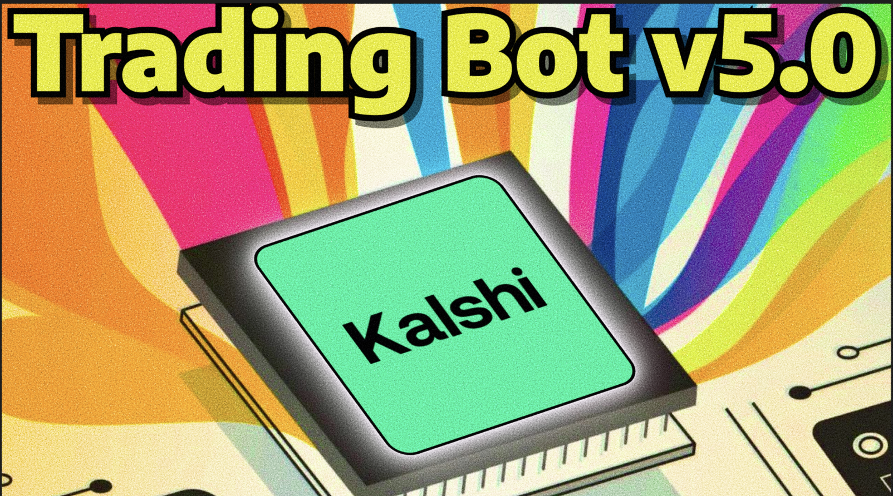

import CredentialCopyList from '@site/src/components/CredentialCopyList';

# Video 14: Kalshi Trading Bot Version 5

Kalshi Trading Bot v5 is the next iteration of [Kalshi Trading Bot v4](/docs/youtube-code/video-10-kalshi-v4). It keeps the Version 4 backend API execution, multi-asset support, entry window, and delta filter, then adds tighter entry and risk controls for Kalshi's 15-minute crypto markets.

Version 5 includes separate **paper-trading** and **live-trading** scripts. Start with paper mode and confirm that the settings and behavior match your plan before using real funds.

:::tip Latest Nightshark Version Required
This code requires <mark className="text-highlight-yellow"><strong>July 27, 2026 or newer version of Nightshark</strong></mark>. If you downloaded Nightshark before July 27, 2026, you need to re-download it from the website and follow this tutorial.

<a className="btn-nightshark-small" href="https://nightshark.io" target="_blank" rel="noopener noreferrer">
  <span>Download Latest Nightshark</span>
</a>
:::



## <span style={{color: '#FFD700'}}>Paper-Trading Code</span>

Paper mode reads live Kalshi market data but does not submit orders. It simulates fills at the observed entry and exit prices, updates balance and PnL streams, and records settlement when a position is held through the end of its market.

```javascript
; ======================================
; KALSHI v5 PAPER TRADING CONFIGURATION
; ======================================
initialBalance := 1000        ; paper trading starting balance (USD)
timeDelay := 8                ; activation window in remaining minutes (max 15)
EntryRange := [0.75, 0.85]    ; inclusive entry range: [Min, Max]
Exit := 0.40                  ; stop loss when entered side price < this value
TakeProfitPts := 0.10         ; take profit at paper fill price + these points; 1 holds winners to resolution
Delta := 0                    ; min |open15m - live price| required alongside EntryRange
assets := ["BTC"]             ; Options ["ETH"], ["SOL"], ["XRP"], ["DOGE"], ["HYPE"], ["BNB"]
orderSize := 1                ; exact number of paper contracts per entry
Pings := 1                    ; one-second stop-loss confirmation checks; 0 exits immediately

;=================
;DAILY TARGETS
;=================
Daily_Profit_Target := 400      ; stop after closed-trade PnL is greater than this; 0 disables
Daily_Loss_Target := -600        ; stop after closed-trade PnL is less than this negative value; 0 disables

; =============================================================
; Kalshi Market Data Config (paper trading — no live orders)
; DO NOT TOUCH BELOW VALUES UNLESS YOU KNOW WHAT YOU ARE DOING
; =============================================================
pollIntervalMs := 700
pollJitterMaxMs := 250
marketRefreshMs := 5000       ; refresh market/session metadata less often; orderbook still refreshes every loop
priceRefreshMs := 1500        ; throttle live underlying-price calls used by LogStream
kalshiApiBase := "https://api.elections.kalshi.com"
assetSeriesMap := { "BTC": "KXBTC15M", "ETH": "KXETH15M", "SOL": "KXSOL15M", "XRP": "KXXRP15M", "DOGE": "KXDOGE15M", "HYPE": "KXHYPE15M", "BNB": "KXBNB15M" }

settingsValid := true

initialBalanceValid := IsNumericStr(initialBalance) && (initialBalance + 0) > 0
if (!initialBalanceValid) {
    Log("ERROR: initialBalance is '" initialBalance "'. It needs to be a number greater than zero, for example 1000.")
    settingsValid := false
}

EntryMin := ""
EntryMax := ""
entryRangeShapeValid := (IsObject(EntryRange) && EntryRange.Length() = 2)
if (!entryRangeShapeValid) {
    Log("ERROR: EntryRange must be [Min, Max], for example [0.60, 0.70]. Both values need to be decimals between 0 and 1.")
    settingsValid := false
} else {
    entryMinRaw := EntryRange[1]
    entryMaxRaw := EntryRange[2]
    entryMinValid := IsNumericStr(entryMinRaw) && (entryMinRaw + 0) > 0 && (entryMinRaw + 0) < 1
    entryMaxValid := IsNumericStr(entryMaxRaw) && (entryMaxRaw + 0) > 0 && (entryMaxRaw + 0) < 1

    if (!entryMinValid) {
        Log("ERROR: EntryRange Min is '" entryMinRaw "'. It needs to be a decimal between 0 and 1, for example 0.60.")
        settingsValid := false
    } else {
        EntryMin := entryMinRaw + 0
    }
    if (!entryMaxValid) {
        Log("ERROR: EntryRange Max is '" entryMaxRaw "'. It needs to be a decimal between 0 and 1, for example 0.70.")
        settingsValid := false
    } else {
        EntryMax := entryMaxRaw + 0
    }
    if (entryMinValid && entryMaxValid && EntryMin > EntryMax) {
        Log("ERROR: EntryRange Min " EntryMin " is greater than Max " EntryMax ". Put the smaller decimal first, for example [0.60, 0.70].")
        settingsValid := false
    }
}

exitValid := IsNumericStr(Exit) && (Exit + 0) > 0 && (Exit + 0) < 1
if (!exitValid) {
    Log("ERROR: Exit is '" Exit "'. It needs to be a decimal between 0 and 1, for example 0.40.")
    settingsValid := false
}

takeProfitPtsValid := IsNumericStr(TakeProfitPts) && (TakeProfitPts + 0) > 0 && (TakeProfitPts + 0) <= 1
if (!takeProfitPtsValid) {
    Log("ERROR: TakeProfitPts is '" TakeProfitPts "'. It needs to be greater than 0 and no more than 1, for example 0.10 or 1.")
    settingsValid := false
}

timeDelayValid := IsNumericStr(timeDelay) && (timeDelay + 0) > 0 && (timeDelay + 0) <= 15
if (!timeDelayValid) {
    Log("ERROR: timeDelay is '" timeDelay "'. It needs to be greater than zero and no more than 15 minutes.")
    settingsValid := false
}

orderSizeText := Trim(orderSize)
orderSizeValid := RegExMatch(orderSizeText, "^\d+(\.\d{1,2})?$") && (orderSize + 0) > 0
if (!orderSizeValid) {
    Log("ERROR: orderSize is '" orderSize "'. Set it to a positive contract count with no more than two decimal places, for example 1 or 5.50.")
    settingsValid := false
}

dailyProfitTargetValid := IsNumericStr(Daily_Profit_Target) && (Daily_Profit_Target + 0) >= 0
if (!dailyProfitTargetValid) {
    Log("ERROR: Daily_Profit_Target is '" Daily_Profit_Target "'. Use a positive dollar amount, or 0 to disable it.")
    settingsValid := false
}

dailyLossTargetValid := IsNumericStr(Daily_Loss_Target) && (Daily_Loss_Target + 0) <= 0
if (!dailyLossTargetValid) {
    Log("ERROR: Daily_Loss_Target is '" Daily_Loss_Target "'. Use a negative dollar amount, or 0 to disable it.")
    settingsValid := false
}

pingsText := Trim(Pings)
pingsValid := RegExMatch(pingsText, "^\d+$")
if (!pingsValid) {
    Log("ERROR: Pings is '" Pings "'. Use a whole number of confirmation checks, for example 0, 1, or 2.")
    settingsValid := false
}

if (!settingsValid) {
    Log("ERROR: Fix the settings listed above and restart the script. Stopping now.")
    stopCode()
    return
}
if ((TakeProfitPts + 0) = 1)
    Log("TakeProfitPts = 1, winners will be held to resolution")

; Strategy state.
positions := {}
assetPhase := {}                    ; WAIT_WINDOW | MONITORING | IN_POSITION | STOPPED_OUT | TOOK_PROFIT
assetSessionQuarter := {}
assetLastPriceLogTick := {}
assetSnapshotCache := {}
assetMarketRefreshTick := {}
assetPriceCache := {}
assetPriceRefreshTick := {}
assetMarketLogStreamVisible := {}
paperSettlementLastCheckTick := {}
pendingPaperSettlements := {}

; Paper account state.
paperBalance := initialBalance + 0
paperWins := 0
paperLosses := 0
paperGrossProfit := 0
paperGrossLoss := 0
paperTradeCount := 0

Log("Kalshi PAPER TRADING Started | EntryRange: [" EntryMin ", " EntryMax "] | Contracts: " PaperFormatSize(orderSize) " | Exit: " Exit " | TakeProfitPts: " TakeProfitPts " | Pings: " Pings " | Daily targets: " Daily_Profit_Target "/" Daily_Loss_Target " | Delta: " Delta " | Window: last " timeDelay "m | InitialBalance: " Fmt2(initialBalance))
UpdatePaperAccountLogStream()

loop {
    for _, asset in assets {
        snapshot := GetKalshiMarketSnapshot(asset)
        if !IsObject(snapshot) {
            HideKalshiMarketLogStream(asset)
            if (PositionSessionEnded(asset))
                MarkHeldToResolution(asset)
            noDataKey := asset "|NO_DATA_" CurrentQuarterIndex()
            if !IsObject(logOnceKeys)
                logOnceKeys := {}
            if !logOnceKeys.HasKey(noDataKey) {
                logOnceKeys[noDataKey] := true
                Log(asset " Waiting for Kalshi market data")
            }
            continue
        }

        up := snapshot.up
        down := snapshot.down
        minsLeft := SnapshotMinutesLeft(snapshot)
        if (minsLeft = "")
            minsLeft := MinutesRemainingInQuarter()
        inEntryWindow := (minsLeft > 0 && minsLeft <= timeDelay)
        sessionKey := (snapshot.marketTicker != "") ? snapshot.marketTicker : ((snapshot.closeTime != "") ? snapshot.closeTime : CurrentQuarterIndex())

        if (PositionSessionEnded(asset, snapshot)) {
            HideKalshiMarketLogStream(asset)
            MarkHeldToResolution(asset)
            continue
        }

        if (!assetSessionQuarter.HasKey(asset) || assetSessionQuarter[asset] != sessionKey) {
            HideKalshiMarketLogStream(asset)
            assetSessionQuarter[asset] := sessionKey
            assetPhase[asset] := "WAIT_WINDOW"
            assetLastPriceLogTick[asset] := 0
            LogOnceReset(asset)
            Log(asset " New Kalshi paper session (" snapshot.marketTicker ")")
            continue
        }

        if IsObject(positions[asset]) {
            pos := positions[asset]
            current := (pos.side = "UP") ? up : down
            positions[asset].lastMark := current + 0
            assetPhase[asset] := "IN_POSITION"
            UpdateKalshiLogStream(asset, snapshot)

            exitReason := ""
            exitPhase := ""
            exitWaitMessage := ""
            takeProfitTarget := pos.HasKey("takeProfitTarget") ? pos.takeProfitTarget + 0 : (pos.entry + TakeProfitPts)
            if (current < Exit) {
                confirmedStopPrice := current
                if (ConfirmKalshiPaperStopLoss(asset, pos, confirmedStopPrice)) {
                    current := confirmedStopPrice
                    exitReason := "exit_below_" Exit
                    exitPhase := "STOPPED_OUT"
                    exitWaitMessage := asset " Stopped out, waiting for next session"
                    Log(asset " Stop-loss confirmed @ " Fmt(current) " < " Fmt(Exit))
                }
            } else if (takeProfitTarget <= 1 && current >= takeProfitTarget) {
                exitReason := "take_profit_at_" takeProfitTarget
                exitPhase := "TOOK_PROFIT"
                exitWaitMessage := asset " Take profit completed, waiting for next session"
                Log(asset " Take-profit triggered @ " Fmt(current) " >= " Fmt(takeProfitTarget) " (fill " Fmt(pos.entry) " + " Fmt(TakeProfitPts) ")")
            }

            if (exitReason != "") {
                RecordPaperTrade(asset, pos.side, pos.entry, current, pos.size, exitReason)
                Log(asset " Paper position closed")
                positions.Delete(asset)
                assetPhase[asset] := exitPhase
                HideKalshiMarketLogStream(asset)
                LogOnce(asset, exitPhase, exitWaitMessage)
                CheckPaperDailyPnlTargets()
            }
            continue
        }

        if (assetPhase[asset] = "STOPPED_OUT") {
            HideKalshiMarketLogStream(asset)
            LogOnce(asset, "STOPPED_OUT", asset " Stopped out, waiting for next session")
            continue
        }

        if (assetPhase[asset] = "TOOK_PROFIT") {
            HideKalshiMarketLogStream(asset)
            LogOnce(asset, "TOOK_PROFIT", asset " Take profit completed, waiting for next session")
            continue
        }

        if (assetPhase[asset] = "BUY_FAILED") {
            HideKalshiMarketLogStream(asset)
            LogOnce(asset, "BUY_FAILED", asset " Paper buy failed earlier, waiting for next session")
            continue
        }

        if (!inEntryWindow) {
            HideKalshiMarketLogStream(asset)
            if (minsLeft <= 0)
                LogOnce(asset, "SESSION_ENDED", asset " End of session, waiting for new Kalshi market")
            else
                LogOnce(asset, "WAIT_WINDOW", asset " Waiting for last " timeDelay " minutes")
            assetPhase[asset] := "WAIT_WINDOW"
            continue
        }

        if (!assetPhase.HasKey(asset) || assetPhase[asset] != "MONITORING") {
            assetPhase[asset] := "MONITORING"
            Log(asset " Monitoring Kalshi paper entry range [" Fmt(EntryMin) ", " Fmt(EntryMax) "] | Delta >= " Delta)
        }

        LiveDelta := UpdateKalshiLogStream(asset, snapshot)

        side := ""
        entryPrice := ""
        upInEntryRange := (up >= EntryMin && up <= EntryMax)
        downInEntryRange := (down >= EntryMin && down <= EntryMax)
        if (upInEntryRange || downInEntryRange) {
            if (LiveDelta != "" && LiveDelta >= Delta) {
                if (upInEntryRange && (!downInEntryRange || up >= down)) {
                    side := "UP"
                    entryPrice := up
                } else {
                    side := "DOWN"
                    entryPrice := down
                }
            } else {
                LogOnce(asset, "DELTA_LOW", asset " LiveDelta " FmtOrNA(LiveDelta) " < Delta " Delta ", skipping entry")
            }
        } else {
            LogOnce(asset, "PRICE_OUT_OF_RANGE", asset " UP " Fmt(up) " / DOWN " Fmt(down) " outside entry range [" Fmt(EntryMin) ", " Fmt(EntryMax) "]")
        }

        if (side = "")
            continue

        Log(asset " " side " triggered @ " Fmt(entryPrice) " — placing paper order")
        if (!PaperBuyPosition(asset, side, entryPrice)) {
            assetPhase[asset] := "BUY_FAILED"
            HideKalshiMarketLogStream(asset)
            LogOnce(asset, "BUY_FAILED", asset " Paper buy failed, waiting for next session")
            continue
        }

        fillPrice := entryPrice + 0
        takeProfitTarget := fillPrice + (TakeProfitPts + 0)
        positions[asset] := { side: side, entry: fillPrice, takeProfitTarget: takeProfitTarget, ticker: snapshot.marketTicker, sessionKey: sessionKey, quarterIndex: CurrentQuarterIndex(), size: orderSize + 0, lastMark: fillPrice }
        assetPhase[asset] := "IN_POSITION"
        assetLastPriceLogTick[asset] := 0
        Log(asset " Paper position confirmed | fill: " Fmt(fillPrice) " | size: " PaperFormatSize(orderSize))
        if (takeProfitTarget > 1)
            Log(asset " TP target " Fmt(takeProfitTarget) " > 1; no TP exit—hold for resolution")
        else
            Log(asset " Monitoring stop-loss < " Fmt(Exit) " | take-profit >= " Fmt(takeProfitTarget) " (fill + " Fmt(TakeProfitPts) ")")
    }

    ProcessPendingPaperSettlements()
    UpdatePaperAccountLogStream()
    Random, pollJitterMs, 0, %pollJitterMaxMs%
    sleepMs := pollIntervalMs + pollJitterMs
    if (sleepMs > 0)
        Sleep %sleepMs%
}


LogOnce(asset, reason, msg) {
    global logOnceKeys
    if !IsObject(logOnceKeys)
        logOnceKeys := {}
    key := asset "|" reason
    if (logOnceKeys.HasKey(key))
        return
    logOnceKeys[key] := true
    Log(msg)
}

LogOnceReset(asset) {
    global logOnceKeys
    if !IsObject(logOnceKeys)
        return
    toRemove := []
    for k, _ in logOnceKeys {
        if (InStr(k, asset "|") = 1)
            toRemove.Push(k)
    }
    for _, k in toRemove
        logOnceKeys.Delete(k)
}

PositionSessionEnded(asset, snapshot := "") {
    global positions
    if !IsObject(positions[asset])
        return false

    pos := positions[asset]
    if (IsObject(snapshot) && snapshot.marketTicker != "" && pos.HasKey("ticker") && pos.ticker != "" && snapshot.marketTicker != pos.ticker)
        return true
    if (pos.HasKey("quarterIndex") && CurrentQuarterIndex() != pos.quarterIndex)
        return true
    return false
}

MarkHeldToResolution(asset) {
    global positions, assetPhase, pendingPaperSettlements
    if !IsObject(positions[asset])
        return true

    pos := positions[asset]
    pos.asset := asset
    settlementKey := (pos.HasKey("ticker") && pos.ticker != "") ? pos.ticker : asset "|" A_TickCount
    pendingPaperSettlements[settlementKey] := pos
    Log(asset " " pos.side " held to resolution | settlement pending")
    positions.Delete(asset)
    ClearKalshiMarketCache(asset)
    assetPhase[asset] := "WAIT_WINDOW"
    return true
}

ProcessPendingPaperSettlements() {
    global pendingPaperSettlements
    if !IsObject(pendingPaperSettlements)
        return

    resolvedKeys := []
    for settlementKey, pos in pendingPaperSettlements {
        if !IsObject(pos)
            continue
        settlePrice := GetKalshiPaperSettlementPrice(settlementKey, pos)
        if (settlePrice = "")
            continue

        asset := pos.HasKey("asset") ? pos.asset : "Kalshi"
        lastMark := pos.HasKey("lastMark") ? pos.lastMark + 0 : pos.entry + 0
        Log(asset " " pos.side " settlement confirmed @ " Fmt(settlePrice) " (last price " Fmt(lastMark) ")")
        RecordPaperTrade(asset, pos.side, pos.entry, settlePrice, pos.size, "held_to_resolution")
        resolvedKeys.Push(settlementKey)
    }

    for _, settlementKey in resolvedKeys
        pendingPaperSettlements.Delete(settlementKey)
    if (resolvedKeys.Length() > 0)
        CheckPaperDailyPnlTargets()
}

ConfirmKalshiPaperStopLoss(asset, pos, ByRef confirmedPrice) {
    global Pings, Exit, positions
    pingCount := Floor(Pings + 0)
    if (pingCount <= 0)
        return true

    Log(asset " Stop-loss candidate @ " Fmt(confirmedPrice) " | waiting for " pingCount " confirmation ping(s)")
    Loop, %pingCount% {
        Sleep 1000
        freshSnapshot := GetKalshiMarketSnapshot(asset)
        if (!IsObject(freshSnapshot) || (pos.HasKey("ticker") && freshSnapshot.marketTicker != pos.ticker)) {
            Log(asset " Stop-loss confirmation reset: fresh market price unavailable")
            return false
        }

        pingPrice := (pos.side = "UP") ? freshSnapshot.up : freshSnapshot.down
        if (pingPrice = "") {
            Log(asset " Stop-loss confirmation reset: fresh side price unavailable")
            return false
        }
        positions[asset].lastMark := pingPrice + 0
        confirmedPrice := pingPrice + 0
        if (confirmedPrice >= Exit) {
            Log("PING " A_Index " : " asset " Stop-loss reset: price rebounded to " Fmt(confirmedPrice))
            return false
        }
        Log("PING " A_Index " : " asset " Stop-loss remained below Exit @ " Fmt(confirmedPrice))
    }
    return true
}

PaperHasOpenExposure() {
    global positions, pendingPaperSettlements
    for _, pos in positions {
        if IsObject(pos)
            return true
    }
    for _, pos in pendingPaperSettlements {
        if IsObject(pos)
            return true
    }
    return false
}

CheckPaperDailyPnlTargets() {
    global Daily_Profit_Target, Daily_Loss_Target
    if (PaperHasOpenExposure())
        return false

    pnl := ComputePaperLivePnl()
    UpdatePaperAccountLogStream()
    if ((Daily_Profit_Target + 0) > 0 && pnl > (Daily_Profit_Target + 0)) {
        Log("Daily profit target reached | PnL " FmtPnl(pnl) " > " FmtPnl(Daily_Profit_Target) " | stopping bot")
        stopCode()
        return true
    }
    if ((Daily_Loss_Target + 0) < 0 && pnl < (Daily_Loss_Target + 0)) {
        Log("Daily loss target reached | PnL " FmtPnl(pnl) " < " FmtPnl(Daily_Loss_Target) " | stopping bot")
        stopCode()
        return true
    }
    return false
}

GetKalshiPaperSettlementPrice(settlementKey, pos) {
    global kalshiApiBase, paperSettlementLastCheckTick
    if !IsObject(pos) || !pos.HasKey("ticker") || pos.ticker = ""
        return ""

    nowTick := A_TickCount
    if (paperSettlementLastCheckTick.HasKey(settlementKey) && (nowTick - paperSettlementLastCheckTick[settlementKey]) < 2000)
        return ""
    paperSettlementLastCheckTick[settlementKey] := nowTick

    url := kalshiApiBase "/trade-api/v2/markets/" pos.ticker "?_=" nowTick
    body := HttpGet(url)
    if (body = "")
        return ""

    result := JsonField(body, "result")
    StringLower, result, result
    if (result = "yes")
        yesSettle := 1
    else if (result = "no")
        yesSettle := 0
    else
        return ""

    paperSettlementLastCheckTick.Delete(settlementKey)
    return (pos.side = "UP") ? yesSettle : 1 - yesSettle
}

UpdateKalshiLogStream(asset, snapshot) {
    if !IsObject(snapshot)
        return ""

    priceObj := GetCachedKalshiPriceObj(asset)
    livePrice := (IsObject(priceObj) && priceObj.HasKey("price") && priceObj.price > 0) ? priceObj.price : ""
    openPrice := (IsObject(priceObj) && priceObj.HasKey("open15m") && priceObj.open15m > 0) ? priceObj.open15m : ""
    LiveDelta := ""
    if (livePrice != "" && openPrice != "")
        LiveDelta := Abs(openPrice - livePrice)
    LogMonitoringStream(asset, snapshot, livePrice, openPrice, LiveDelta)
    return LiveDelta
}

LogMonitoringStream(asset, snapshot, livePrice := "", openPrice := "", LiveDelta := "") {
    global assetMarketLogStreamVisible
    if !IsObject(snapshot)
        return
    if (livePrice != "")
        LogStream(asset, FmtOrNA(livePrice))
    else
        LogStream(asset, "n/a")
    LogStream("OPEN PRICE", FmtOrNA(openPrice))
    LogStream("up", FmtOrNA(snapshot.up))
    LogStream("down", FmtOrNA(snapshot.down))
    LogStream("LIVE DELTA", FmtLiveDeltaOrNA(LiveDelta))
    assetMarketLogStreamVisible[asset] := true
}

UpdatePaperAccountLogStream() {
    global paperWins, paperLosses, paperGrossProfit, paperGrossLoss, paperTradeCount
    LogStream("LIVE PNL", FmtPnl(ComputePaperLivePnl()))
    LogStream("BALANCE", Fmt2(ComputePaperEquity()))
    LogStream("WINS", paperWins "/" paperTradeCount)
    LogStream("AVG PROFIT", (paperWins > 0) ? Fmt2(paperGrossProfit / paperWins) : "n/a")
    LogStream("AVG LOSS", (paperLosses > 0) ? Fmt2(paperGrossLoss / paperLosses) : "n/a")
}

HideKalshiMarketLogStream(asset) {
    global assetMarketLogStreamVisible
    if (!assetMarketLogStreamVisible.HasKey(asset) || !assetMarketLogStreamVisible[asset])
        return

    LogStreamRemove(asset)
    LogStreamRemove("OPEN PRICE")
    LogStreamRemove("up")
    LogStreamRemove("down")
    LogStreamRemove("LIVE DELTA")
    assetMarketLogStreamVisible[asset] := false
}

GetCachedKalshiPriceObj(asset) {
    global assetPriceCache, assetPriceRefreshTick, priceRefreshMs
    nowTick := A_TickCount

    if (assetPriceCache.HasKey(asset) && assetPriceRefreshTick.HasKey(asset)) {
        if ((nowTick - assetPriceRefreshTick[asset]) < priceRefreshMs)
            return assetPriceCache[asset]
    }

    priceObj := GetKalshiPrice(asset)
    assetPriceRefreshTick[asset] := nowTick
    if (IsObject(priceObj) && priceObj.HasKey("price") && priceObj.price > 0) {
        assetPriceCache[asset] := priceObj
        return priceObj
    }

    if (assetPriceCache.HasKey(asset))
        return assetPriceCache[asset]
    return ""
}

GetCachedKalshiAssetPrice(asset) {
    obj := GetCachedKalshiPriceObj(asset)
    if (IsObject(obj) && obj.HasKey("price"))
        return obj.price
    return ""
}

FmtOrNA(price) {
    if (price = "")
        return "n/a"
    return Fmt(price)
}

FmtLiveDeltaOrNA(value) {
    if (value = "")
        return "n/a"

    value := value + 0
    if (Abs(value) >= 1)
        return Round(value, 2)
    return Round(value, 4)
}

Fmt(price) {
    return Round(price + 0, 2)
}

Fmt2(value) {
    return Format("{:.2f}", value + 0)
}

FmtPnl(value) {
    if (value = "")
        return "n/a"
    value := Round(value + 0, 2)
    if (value > 0)
        return "+" Format("{:.2f}", value)
    return Format("{:.2f}", value)
}

PaperFormatSize(size) {
    value := Round((size + 0) * 100) / 100.0
    text := Format("{:.2f}", value)
    while (InStr(text, ".") && SubStr(text, StrLen(text), 1) = "0")
        text := SubStr(text, 1, StrLen(text) - 1)
    if (SubStr(text, StrLen(text), 1) = ".")
        text := SubStr(text, 1, StrLen(text) - 1)
    return text
}

PaperBuyPosition(asset, side, price) {
    global paperBalance, orderSize
    cost := (price + 0) * (orderSize + 0)
    if (cost > paperBalance) {
        Log(asset " Paper buy rejected: cost " Fmt2(cost) " exceeds cash balance " Fmt2(paperBalance))
        Log("Not enough paper balance left to place trades. Stopping script.")
        stopCode()
        return false
    }

    paperBalance -= cost
    Log(asset " Paper " side " filled @ " Fmt(price) " | size " PaperFormatSize(orderSize) " | cost " Fmt2(cost) " | cash " Fmt2(paperBalance))
    return true
}

RecordPaperTrade(asset, side, entryPrice, exitPrice, size, reason) {
    global paperBalance, paperWins, paperLosses, paperGrossProfit, paperGrossLoss, paperTradeCount
    proceeds := (exitPrice + 0) * (size + 0)
    pnl := ((exitPrice + 0) - (entryPrice + 0)) * (size + 0)
    paperBalance += proceeds
    paperTradeCount++

    if (pnl > 0) {
        paperWins++
        paperGrossProfit += pnl
    } else {
        paperLosses++
        paperGrossLoss += Abs(pnl)
    }

    Log(asset " Paper " side " closed @ " Fmt(exitPrice) " | entry " Fmt(entryPrice) " | size " PaperFormatSize(size) " | PnL " FmtPnl(pnl) " | cash " Fmt2(paperBalance) " | " reason)
}

ComputePaperEquity() {
    global paperBalance, positions, pendingPaperSettlements
    equity := paperBalance + 0
    for _, pos in positions {
        if !IsObject(pos)
            continue
        mark := pos.HasKey("lastMark") ? pos.lastMark + 0 : pos.entry + 0
        equity += mark * (pos.size + 0)
    }
    for _, pos in pendingPaperSettlements {
        if !IsObject(pos)
            continue
        mark := pos.HasKey("lastMark") ? pos.lastMark + 0 : pos.entry + 0
        equity += mark * (pos.size + 0)
    }
    return equity
}

ComputePaperLivePnl() {
    global initialBalance
    return ComputePaperEquity() - (initialBalance + 0)
}

CurrentUtcNowAhk() {
    nowUtc := A_NowUTC
    if (nowUtc != "")
        return nowUtc

    out := Trim(RunAndCapture("powershell -NoProfile -Command ""[DateTime]::UtcNow.ToString('yyyyMMddHHmmss')"""))
    if RegExMatch(out, "^\d{14}$")
        return out
    return ""
}

RunAndCapture(command) {
    return RunCMD(command, A_ScriptDir)
}


MinutesRemainingInQuarter() {
    utc := CurrentUtcNowAhk()
    if (utc = "") {
        ; Fallback to local clock if UTC unavailable
        currentMinute := A_Min + 0
        remaining := 15 - Mod(currentMinute, 15)
        remaining := remaining - ((A_Sec + 0) / 60.0)
        return remaining
    }
    mm := SubStr(utc, 11, 2) + 0
    ss := SubStr(utc, 13, 2) + 0
    remaining := 15 - Mod(mm, 15) - (ss / 60.0)
    return remaining
}

IsXMinRemaining(x) {
    return (MinutesRemainingInQuarter() <= x)
}

CurrentQuarterIndex() {
    utc := CurrentUtcNowAhk()
    if (utc = "") {
        totalMinutes := (A_Hour + 0) * 60 + (A_Min + 0)
        return Floor(totalMinutes / 15)
    }
    hh := SubStr(utc, 9, 2) + 0
    mm := SubStr(utc, 11, 2) + 0
    totalMinutes := hh * 60 + mm
    return Floor(totalMinutes / 15)
}

SnapshotMinutesLeft(snapshot) {
    if !IsObject(snapshot)
        return ""

    if (snapshot.HasKey("closeTime") && snapshot.closeTime != "") {
        minsLeft := MinutesUntilIsoUtc(snapshot.closeTime)
        if (minsLeft != "")
            return minsLeft
    }

    if (snapshot.HasKey("minutesLeft"))
        return snapshot.minutesLeft
    return ""
}

IsSnapshotExpired(snapshot, cutoffMinutes := 0) {
    minsLeft := SnapshotMinutesLeft(snapshot)
    return (minsLeft != "" && minsLeft <= cutoffMinutes)
}

ClearKalshiMarketCache(asset) {
    global assetSnapshotCache, assetMarketRefreshTick
    if (assetSnapshotCache.HasKey(asset))
        assetSnapshotCache.Delete(asset)
    if (assetMarketRefreshTick.HasKey(asset))
        assetMarketRefreshTick.Delete(asset)
}

GetKalshiMarketSnapshot(asset, maxRetries := 4) {
    global assetSeriesMap, assetSnapshotCache, assetMarketRefreshTick, marketRefreshMs
    if !assetSeriesMap.HasKey(asset)
        return false
    series := assetSeriesMap[asset]
    nowTick := A_TickCount

    if (assetSnapshotCache.HasKey(asset) && assetMarketRefreshTick.HasKey(asset)) {
        cached := assetSnapshotCache[asset]
        if (IsObject(cached) && (nowTick - assetMarketRefreshTick[asset]) < marketRefreshMs) {
            if (IsSnapshotExpired(cached, 0.5)) {
                ClearKalshiMarketCache(asset)
            } else {
                if (RefreshKalshiBestAsks(cached))
                    return cached
                return false
            }
        }
    }

    attempt := 1
    while (attempt <= maxRetries) {
        url := "https://api.elections.kalshi.com/trade-api/v2/markets?series_ticker=" series "&status=open&limit=1&_=" A_TickCount "-" attempt
        body := HttpGet(url)

        if (body != "") {
            marketTicker := GetFirstNonEmptyJsonField(body, ["ticker"])
            yesPrice := GetKalshiDollarPrice(body, "yes_ask_dollars", "yes_ask")
            noPrice  := GetKalshiDollarPrice(body, "no_ask_dollars", "no_ask")

            closeIso := GetFirstNonEmptyJsonField(body, ["close_time", "expected_expiration_time", "expiration_time", "settlement_time"])
            minsLeft := MinutesUntilIsoUtc(closeIso)

            ; Skip markets that already closed or close in < 30 seconds (stale/expired)
            if (minsLeft != "" && minsLeft < 0.5) {
                if (attempt < maxRetries) {
                    Sleep 200
                    attempt++
                    continue
                }
            }

            if (marketTicker != "") {
                obj := {}
                obj.up := (yesPrice != "") ? yesPrice + 0 : ""
                obj.down := (noPrice != "") ? noPrice + 0 : ""
                obj.minutesLeft := minsLeft
                obj.closeTime := closeIso
                obj.marketTicker := marketTicker
                assetSnapshotCache[asset] := obj
                assetMarketRefreshTick[asset] := nowTick
                if (RefreshKalshiBestAsks(obj) || (obj.up != "" && obj.down != ""))
                    return obj
            }
        }

        if (attempt < maxRetries)
            Sleep 200
        attempt++
    }

    if (assetSnapshotCache.HasKey(asset)) {
        cached := assetSnapshotCache[asset]
        if IsObject(cached) {
            if (IsSnapshotExpired(cached, 0.5)) {
                ClearKalshiMarketCache(asset)
                return false
            }
            if (RefreshKalshiBestAsks(cached))
                return cached
        }
    }
    return false
}

RefreshKalshiBestAsks(snapshot) {
    if !IsObject(snapshot) || snapshot.marketTicker = ""
        return false

    url := "https://api.elections.kalshi.com/trade-api/v2/markets/" snapshot.marketTicker "/orderbook?depth=1&_=" A_TickCount
    body := HttpGet(url)
    if (body = "")
        return false

    yesBid := GetOrderbookBestBid(body, "yes_dollars")
    noBid := GetOrderbookBestBid(body, "no_dollars")
    updated := false

    if (noBid != "") {
        snapshot.up := Round(1 - (noBid + 0), 4)
        updated := true
    }
    if (yesBid != "") {
        snapshot.down := Round(1 - (yesBid + 0), 4)
        updated := true
    }

    return updated
}

GetOrderbookBestBid(json, sideField) {
    pattern := """" sideField """\s*:\s*\[\s*\[\s*""?(-?\d+(?:\.\d+)?)"
    if RegExMatch(json, pattern, m)
        return m1
    return ""
}

GetKalshiDollarPrice(json, dollarField, centsField := "") {
    val := GetFirstNonEmptyJsonField(json, [dollarField])
    if (val != "")
        return val

    if (centsField != "") {
        val := GetFirstNonEmptyJsonField(json, [centsField])
        if (val != "" && IsNumericStr(val))
            return (val + 0) / 100.0
    }

    return ""
}

GetFirstNonEmptyJsonField(json, fields, skipZero := false) {
    for _, field in fields {
        val := JsonField(json, field)
        if (val != "") {
            if (skipZero && IsNumericStr(val) && (val + 0) = 0)
                continue
            return val
        }
    }
    return ""
}

IsNumericStr(s) {
    s := Trim(s)
    return RegExMatch(s, "^-?\d+(\.\d+)?$")
}

JsonField(json, field) {
    pattern := """" field """\s*:\s*(""([^""]*)""|[^,}\s][^,}\r\n]*)"
    result := ""
    pos := 1
    while (pos := RegExMatch(json, pattern, m, pos)) {
        val := Trim(m1)
        val := Trim(val, """")
        if (val != "")
            result := val
        pos += StrLen(m)
    }
    return result
}

MinutesUntilIsoUtc(iso) {
    ts := IsoUtcToAhk(iso)
    if (ts = "")
        return ""

    nowUtc := CurrentUtcNowAhk()
    if (nowUtc = "")
        return ""

    diff := ts
    EnvSub, diff, %nowUtc%, Seconds
    return diff / 60.0
}

IsoUtcToAhk(iso) {
    if (iso = "")
        return ""
    if !RegExMatch(iso, "O)^(\d{4})-(\d{2})-(\d{2})T(\d{2}):(\d{2}):(\d{2})", m)
        return ""
    return m1 m2 m3 m4 m5 m6
}
```

## Live-Trading Setup

**Credentials Filenames**

<CredentialCopyList
  items={[
    {label: 'API Key', value: 'apikey'},
    {label: 'Private Key', value: 'privatekey'}
  ]}
/>

## <span style={{color: '#00E676'}}>Live-Trading Code</span>

```javascript
; ====================================
; KALSHI v5 LIVE TRADING CONFIGURATION
; ====================================
timeDelay := 8               ; activation window in minutes
EntryRange := [0.80, 0.93]   ; inclusive entry range: [Min, Max]
Exit := 0.40                  ; stop/exit when entered side price < 40c
TakeProfitPts := 0.10         ; take profit at confirmed fill price + these points; 1 holds winners to resolution
Delta := 0                   ; min |open15m - price| required alongside EntryRange
assets := ["BTC"]            ; Options ["ETH"] ,["SOL"] ,["XRP"] , ["HYPE"] , ["BNB"] , ["DOGE"]
orderSize := 1               ; number of contracts for trade
Pings := 0                   ; one-second stop-loss confirmation checks; 0 exits immediately
;=================
;DAILY TARGETS
;=================
Daily_Profit_Target := 400     ; stop after closed-trade PnL is greater than this; 0 disables
Daily_Loss_Target := -200       ; stop after closed-trade PnL is less than this negative value; 0 disables


; =============================================================
; Kalshi Order API Config
; DO NOT TOUCH BELOW VALUES UNLESS YOU KNOW WHAT YOU ARE DOING
; =============================================================
settingsValid := true
EntryMin := ""
EntryMax := ""
entryRangeShapeValid := (IsObject(EntryRange) && EntryRange.Length() = 2)
if (!entryRangeShapeValid) {
    Log("ERROR: EntryRange must be [Min, Max], for example [0.60, 0.70]. Both values need to be decimals between 0 and 1.")
    settingsValid := false
} else {
    entryMinRaw := EntryRange[1]
    entryMaxRaw := EntryRange[2]
    entryMinValid := IsNumericStr(entryMinRaw) && (entryMinRaw + 0) > 0 && (entryMinRaw + 0) < 1
    entryMaxValid := IsNumericStr(entryMaxRaw) && (entryMaxRaw + 0) > 0 && (entryMaxRaw + 0) < 1

    if (!entryMinValid) {
        Log("ERROR: EntryRange Min is '" entryMinRaw "'. It needs to be a decimal between 0 and 1, for example 0.60.")
        settingsValid := false
    } else {
        EntryMin := entryMinRaw + 0
    }
    if (!entryMaxValid) {
        Log("ERROR: EntryRange Max is '" entryMaxRaw "'. It needs to be a decimal between 0 and 1, for example 0.70.")
        settingsValid := false
    } else {
        EntryMax := entryMaxRaw + 0
    }
    if (entryMinValid && entryMaxValid && EntryMin > EntryMax) {
        Log("ERROR: EntryRange Min " EntryMin " is greater than Max " EntryMax ". Put the smaller decimal first, for example [0.60, 0.70].")
        settingsValid := false
    }
}

exitValid := IsNumericStr(Exit) && (Exit + 0) > 0 && (Exit + 0) < 1
if (!exitValid) {
    Log("ERROR: Exit is '" Exit "'. It needs to be a decimal between 0 and 1, for example 0.40.")
    settingsValid := false
}

takeProfitPtsValid := IsNumericStr(TakeProfitPts) && (TakeProfitPts + 0) > 0 && (TakeProfitPts + 0) <= 1
if (!takeProfitPtsValid) {
    Log("ERROR: TakeProfitPts is '" TakeProfitPts "'. It needs to be greater than 0 and no more than 1, for example 0.10 or 1.")
    settingsValid := false
}

dailyProfitTargetValid := IsNumericStr(Daily_Profit_Target) && (Daily_Profit_Target + 0) >= 0
if (!dailyProfitTargetValid) {
    Log("ERROR: Daily_Profit_Target is '" Daily_Profit_Target "'. Use a positive dollar amount, or 0 to disable it.")
    settingsValid := false
}

dailyLossTargetValid := IsNumericStr(Daily_Loss_Target) && (Daily_Loss_Target + 0) <= 0
if (!dailyLossTargetValid) {
    Log("ERROR: Daily_Loss_Target is '" Daily_Loss_Target "'. Use a negative dollar amount, or 0 to disable it.")
    settingsValid := false
}

pingsText := Trim(Pings)
pingsValid := RegExMatch(pingsText, "^\d+$")
if (!pingsValid) {
    Log("ERROR: Pings is '" Pings "'. Use a whole number of confirmation checks, for example 0, 1, or 2.")
    settingsValid := false
}

if (!settingsValid) {
    Log("ERROR: Fix the settings listed above and restart the script. Stopping now.")
    stopCode()
    return
}
if ((TakeProfitPts + 0) = 1)
    Log("TakeProfitPts = 1, winners will be held to resolution")

enableLiveOrders := true
pollIntervalMs := 700
marketRefreshMs := 5000         ; refresh market/session metadata less often; orderbook still refreshes every loop
priceRefreshMs := 1500          ; throttle live asset price calls used only for LogStream
restDelay := 2000            ; ms to let order rest before checking position
entryDiff := 0.02           ; added to price on BUY orders (aggressive entry)
exitDiff := 0.02             ; subtracted from price on SELL orders (aggressive exit)
kalshiApiBase := "https://api.elections.kalshi.com"
assetSeriesMap := { "BTC": "KXBTC15M", "ETH": "KXETH15M", "SOL": "KXSOL15M", "XRP": "KXXRP15M", "DOGE": "KXDOGE15M", "HYPE": "KXHYPE15M", "BNB": "KXBNB15M" }
kalshiApiKeyId := ""
kalshiApiKeyFile := "reactions/apikey.json"
kalshiPrivateKeyFile := "reactions/privatekey.json"
kalshiPrivateKeyPath := ""
kalshiApiKeyResolvedPath := ""
kalshiPrivateKeyResolvedPath := ""
kalshiKeyPassphrase := ""
kalshiSignerPath := ""

; Track one open position per asset.
positions := {}
assetPhase := {}              ; WAIT_WINDOW | MONITORING | IN_POSITION | STOPPED_OUT | TOOK_PROFIT
assetSessionQuarter := {}     ; quarter index currently tracked per asset
assetLastPriceLogTick := {}   ; throttled logging control
assetSnapshotCache := {}
assetMarketRefreshTick := {}
assetPriceCache := {}
assetPriceRefreshTick := {}
kalshiLastOrderResult := {}

; Live PnL for trades opened by this script run.
kalshiRealizedPnl := 0
kalshiWins := 0
kalshiTradeCount := 0
kalshiHasUntrackedPosition := false
kalshiDailyTargetCheckPending := false
pendingKalshiSettlements := {}
pendingKalshiClosedTrades := {}
kalshiSettlementLastCheckTick := {}

LoadKalshiCredentialsFromFiles()
if (kalshiSignerPath = "")
    kalshiSignerPath := FindNightSharkSigner()
Log("Application Started | EntryRange: [" EntryMin ", " EntryMax "] | Exit: " Exit " | TakeProfitPts: " TakeProfitPts " | Pings: " Pings " | Daily targets: " Daily_Profit_Target "/" Daily_Loss_Target " | Delta: " Delta " | Window: last " timeDelay "m")
StartupCredentialCheck()
UpdateKalshiPnlLogStreams()

loop {
    for _, asset in assets {
        snapshot := GetKalshiMarketSnapshot(asset)
        if !IsObject(snapshot) {
            if (PositionSessionEnded(asset))
                MarkHeldToResolution(asset)
            else if IsObject(positions[asset])
                positions[asset].lastMark := ""
            noDataKey := asset "|NO_DATA_" CurrentQuarterIndex()
            if !IsObject(logOnceKeys)
                logOnceKeys := {}
            if !logOnceKeys.HasKey(noDataKey) {
                logOnceKeys[noDataKey] := true
                Log(asset " Waiting for market data")
            }
            continue
        }

        up := snapshot.up
        down := snapshot.down
        ; Recompute minsLeft live from closeTime so cached snapshots reflect real elapsed time
        minsLeft := SnapshotMinutesLeft(snapshot)
        if (minsLeft = "")
            minsLeft := MinutesRemainingInQuarter()
        inEntryWindow := (minsLeft > 0 && minsLeft <= timeDelay)
        sessionKey := (snapshot.marketTicker != "") ? snapshot.marketTicker : ((snapshot.closeTime != "") ? snapshot.closeTime : CurrentQuarterIndex())

        if (PositionSessionEnded(asset, snapshot)) {
            MarkHeldToResolution(asset)
            continue
        }

        if (!assetSessionQuarter.HasKey(asset) || assetSessionQuarter[asset] != sessionKey) {
            assetSessionQuarter[asset] := sessionKey
            assetPhase[asset] := "WAIT_WINDOW"
            assetLastPriceLogTick[asset] := 0
            LogOnceReset(asset)
            Log(asset " New session (" snapshot.marketTicker ")")
            kalshiHasUntrackedPosition := false

            if (snapshot.marketTicker != "" && HasExistingPosition(snapshot.marketTicker)) {
                assetPhase[asset] := "HAS_POSITION"
                kalshiHasUntrackedPosition := true
            }
            continue
        }

        if IsObject(positions[asset]) {
            TryReconcileKalshiEntry(asset)
            pos := positions[asset]
            current := (pos.side = "UP") ? up : down
            currentBid := KalshiSnapshotPositionBid(snapshot, pos.side, pos.size)
            positions[asset].lastMark := (currentBid != "") ? currentBid + 0 : ""
            assetPhase[asset] := "IN_POSITION"
            UpdateKalshiLogStream(asset, snapshot)

            exitReason := ""
            exitPhase := ""
            exitWaitMessage := ""
            takeProfitTarget := pos.HasKey("takeProfitTarget") ? pos.takeProfitTarget + 0 : (pos.entry + TakeProfitPts)
            if (current < Exit) {
                confirmedStopPrice := current
                if (ConfirmKalshiLiveStopLoss(asset, pos, confirmedStopPrice)) {
                    current := confirmedStopPrice
                    exitReason := "exit_below_" Exit
                    exitPhase := "STOPPED_OUT"
                    exitWaitMessage := asset " Stopped out, waiting for next session"
                    Log(asset " Stop-loss confirmed @ " Fmt(current) " < " Fmt(Exit))
                }
            } else if (KalshiPositionAccountingReady(pos) && takeProfitTarget <= 1 && current >= takeProfitTarget) {
                exitReason := "take_profit_at_" takeProfitTarget
                exitPhase := "TOOK_PROFIT"
                exitWaitMessage := asset " Take profit completed, waiting for next session"
                Log(asset " Take-profit triggered @ " Fmt(current) " >= " Fmt(takeProfitTarget) " (fill " Fmt(pos.entry) " + " Fmt(TakeProfitPts) ")")
            }

            if (exitReason != "") {
                sellConfirmed := false
                exitOrderIds := []
                exitResponseSummary := NewKalshiFillSummary()
                loop, 4 {
                    if (A_Index > 1) {
                        freshSnap := GetKalshiMarketSnapshot(asset)
                        if IsObject(freshSnap)
                            current := (pos.side = "UP") ? freshSnap.up : freshSnap.down
                    }
                    sellResult := SellPosition(asset, pos.side, current, exitReason)
                    AccumulateKalshiLastOrderFill(exitOrderIds, exitResponseSummary)
                    if (sellResult) {
                        Log(asset " Position closed")
                        sellConfirmed := true
                        break
                    }
                    if (A_Index < 4) {
                        Log(asset " Exit retry " A_Index "/3 | " KalshiLastOrderApiSummary())
                        Sleep 1000
                    }
                }
                if (!sellConfirmed) {
                    Log(asset " Exit order failed after 4 attempts | " KalshiLastOrderApiSummary())
                    assetPhase[asset] := "IN_POSITION"
                } else {
                    QueueOrRecordKalshiClosedTrade(asset, pos, exitOrderIds, exitResponseSummary, exitReason)
                    positions.Delete(asset)
                    assetPhase[asset] := exitPhase
                    LogOnce(asset, exitPhase, exitWaitMessage)
                }
            }
            continue
        }

        if (assetPhase[asset] = "STOPPED_OUT") {
            LogOnce(asset, "STOPPED_OUT", asset " Stopped out, waiting for next session")
            continue
        }

        if (assetPhase[asset] = "TOOK_PROFIT") {
            LogOnce(asset, "TOOK_PROFIT", asset " Take profit completed, waiting for next session")
            continue
        }

        if (assetPhase[asset] = "BUY_FAILED") {
            LogOnce(asset, "BUY_FAILED", asset " Buy failed earlier, waiting for next session")
            continue
        }

        if (assetPhase[asset] = "HAS_POSITION") {
            LogOnce(asset, "HAS_POSITION", asset " Existing position, waiting for next session")
            continue
        }

        ; --- Waiting for entry window ---
        if (!inEntryWindow) {
            if (minsLeft <= 0)
                LogOnce(asset, "SESSION_ENDED", asset " End of session, waiting for new market")
            else
                LogOnce(asset, "WAIT_WINDOW", asset " Waiting for last " timeDelay " minutes")
            assetPhase[asset] := "WAIT_WINDOW"
            continue
        }

        ; --- Entry window open: monitoring prices ---
        if (!assetPhase.HasKey(asset) || assetPhase[asset] != "MONITORING") {
            assetPhase[asset] := "MONITORING"
            Log(asset " Monitoring Kalshi entry range [" Fmt(EntryMin) ", " Fmt(EntryMax) "] | Delta >= " Delta)
        }

        ; Live price + LiveDelta (|open15m - price|) is only needed once a current session is ready to monitor.
        LiveDelta := UpdateKalshiLogStream(asset, snapshot)

        side := ""
        entryPrice := ""
        upInEntryRange := (up >= EntryMin && up <= EntryMax)
        downInEntryRange := (down >= EntryMin && down <= EntryMax)
        if (upInEntryRange || downInEntryRange) {
            if (LiveDelta != "" && LiveDelta >= Delta) {
                if (upInEntryRange && (!downInEntryRange || up >= down)) {
                    side := "UP"
                    entryPrice := up
                } else {
                    side := "DOWN"
                    entryPrice := down
                }
            } else {
                LogOnce(asset, "DELTA_LOW", asset " LiveDelta " FmtOrNA(LiveDelta) " < Delta " Delta ", skipping entry")
            }
        } else {
            LogOnce(asset, "PRICE_OUT_OF_RANGE", asset " UP " Fmt(up) " / DOWN " Fmt(down) " outside entry range [" Fmt(EntryMin) ", " Fmt(EntryMax) "]")
        }

        if (side = "")
            continue

        if !CanPlaceOrderNow(asset) {
            LogOnce(asset, "NO_CREDS", asset " Missing credentials, cannot place orders")
            continue
        }

        existingPositionSize := GetKalshiPositionSize(snapshot.marketTicker, 3)
        if (existingPositionSize = "") {
            LogOnce(asset, "POSITION_CHECK_FAILED", asset " Position check unavailable; entry paused")
            continue
        }
        if (existingPositionSize > 0) {
            assetPhase[asset] := "HAS_POSITION"
            kalshiHasUntrackedPosition := true
            Log(asset " Existing position found, waiting for next session")
            continue
        }

        Log(asset " " side " triggered @ " Fmt(entryPrice) " — placing order")
        buyConfirmed := false
        loop, 4 {
            if (A_Index > 1 && HasExistingPosition(snapshot.marketTicker)) {
                Log(asset " Position detected before retry " A_Index ", skipping")
                buyConfirmed := true
                break
            }
            if (A_Index > 1) {
                freshSnap := GetKalshiMarketSnapshot(asset)
                if IsObject(freshSnap)
                    entryPrice := (side = "UP") ? freshSnap.up : freshSnap.down
            }
            if (entryPrice < EntryMin || entryPrice > EntryMax) {
                Log(asset " Entry retry canceled: " side " price " Fmt(entryPrice) " outside [" Fmt(EntryMin) ", " Fmt(EntryMax) "]")
                break
            }
            if BuyPosition(asset, snapshot.marketTicker, side, entryPrice) {
                buyConfirmed := true
                break
            }
            if (KalshiResultValue(kalshiLastOrderResult, "fatal", false))
                break
            if (A_Index < 4) {
                Log(asset " Entry retry " A_Index "/3 | " KalshiLastOrderApiSummary())
                Sleep 1000
            }
        }

        if (buyConfirmed) {
            kalshiHasUntrackedPosition := false
            orderId := KalshiResultValue(kalshiLastOrderResult, "orderId", "")
            fillSummary := KalshiLastOrderFillSummary()
            accountingReady := KalshiFillSummaryReady(fillSummary)
            fillPrice := accountingReady ? fillSummary.price + 0 : ""
            fillPriceSource := accountingReady ? fillSummary.source : ""
            if (!accountingReady) {
                fillPrice := entryPrice + 0
                fillPriceSource := "detected price fallback"
                Log("WARN: " asset " Exact entry fills/fees are still pending; PnL and take-profit will wait for reconciliation")
            }
            confirmedPositionSize := KalshiResultValue(kalshiLastOrderResult, "positionSize", "")
            posSize := accountingReady ? fillSummary.size + 0 : confirmedPositionSize
            if (posSize = "" || posSize <= 0)
                posSize := GetKalshiPositionSize(snapshot.marketTicker, 3)
            if (posSize = "" || posSize <= 0)
                posSize := orderSize + 0
            entryFees := accountingReady ? fillSummary.fees + 0 : 0
            takeProfitTarget := (fillPrice + 0) + (TakeProfitPts + 0)
            initialMark := KalshiSnapshotPositionBid(snapshot, side, posSize)
            positions[asset] := { side: side, entry: fillPrice + 0, entryFees: entryFees, size: posSize, expectedSize: posSize, accountingReady: accountingReady, entryOrderId: orderId, takeProfitTarget: takeProfitTarget, ticker: snapshot.marketTicker, quarterIndex: CurrentQuarterIndex(), lastMark: initialMark }
            assetPhase[asset] := "IN_POSITION"
            assetLastPriceLogTick[asset] := 0
            if (accountingReady)
                Log(asset " Position confirmed | fill " Fmt(fillPrice) " | size " KalshiFormatSize(posSize) " | entry fees " FmtMoney(entryFees) " (" fillPriceSource ")")
            else
                Log(asset " Position confirmed | exact fill accounting pending")
            if (!accountingReady)
                Log(asset " Waiting for exact entry accounting before enabling take-profit")
            else if (takeProfitTarget > 1)
                Log(asset " TP target " Fmt(takeProfitTarget) " > 1; no TP exit—hold for resolution")
            else
                Log(asset " Monitoring stop-loss < " Fmt(Exit) " | take-profit >= " Fmt(takeProfitTarget) " (fill + " Fmt(TakeProfitPts) ")")
        } else if (!KalshiResultValue(kalshiLastOrderResult, "fatal", false)) {
            assetPhase[asset] := "BUY_FAILED"
            Log(asset " Entry order not filled after 4 attempts, skipping session | " KalshiLastOrderApiSummary())
        }
    }

    ProcessPendingKalshiAccounting()
    if (kalshiDailyTargetCheckPending)
        RunPendingKalshiDailyTargetCheck()
    UpdateKalshiPnlLogStreams()
    Random, pollJitterMs, 0, 250
    sleepMs := pollIntervalMs + pollJitterMs
    Sleep %sleepMs%
}

LogOnce(asset, reason, msg) {
    global logOnceKeys
    if !IsObject(logOnceKeys)
        logOnceKeys := {}
    key := asset "|" reason
    if (logOnceKeys.HasKey(key))
        return
    logOnceKeys[key] := true
    Log(msg)
}

LogOnceReset(asset) {
    global logOnceKeys
    if !IsObject(logOnceKeys)
        return
    toRemove := []
    for k, _ in logOnceKeys {
        if (InStr(k, asset "|") = 1)
            toRemove.Push(k)
    }
    for _, k in toRemove
        logOnceKeys.Delete(k)
}

PositionSessionEnded(asset, snapshot := "") {
    global positions
    if !IsObject(positions[asset])
        return false

    pos := positions[asset]
    if (IsObject(snapshot) && snapshot.marketTicker != "" && pos.HasKey("ticker") && pos.ticker != "" && snapshot.marketTicker != pos.ticker)
        return true
    if (pos.HasKey("quarterIndex") && CurrentQuarterIndex() != pos.quarterIndex)
        return true
    return false
}

MarkHeldToResolution(asset) {
    global positions, assetPhase, pendingKalshiSettlements
    if !IsObject(positions[asset])
        return

    pos := positions[asset]
    pos.asset := asset
    pos.lastMark := ""
    settlementKey := (pos.HasKey("ticker") && pos.ticker != "") ? pos.ticker : asset "|" A_TickCount
    pendingKalshiSettlements[settlementKey] := pos
    Log(asset " " pos.side " held to resolution | PnL settlement pending")
    positions.Delete(asset)
    ClearKalshiMarketCache(asset)
    assetPhase[asset] := "WAIT_WINDOW"
}

ConfirmKalshiLiveStopLoss(asset, pos, ByRef confirmedPrice) {
    global Pings, Exit, positions
    pingCount := Floor(Pings + 0)
    if (pingCount <= 0)
        return true

    Log(asset " Stop-loss candidate @ " Fmt(confirmedPrice) " | waiting for " pingCount " confirmation ping(s)")
    Loop, %pingCount% {
        Sleep 1000
        freshSnapshot := GetKalshiMarketSnapshot(asset)
        if (!IsObject(freshSnapshot) || (pos.HasKey("ticker") && freshSnapshot.marketTicker != pos.ticker)) {
            Log(asset " Stop-loss confirmation reset: fresh market price unavailable")
            return false
        }

        pingPrice := (pos.side = "UP") ? freshSnapshot.up : freshSnapshot.down
        if (pingPrice = "") {
            Log(asset " Stop-loss confirmation reset: fresh side price unavailable")
            return false
        }
        confirmedPrice := pingPrice + 0
        currentBid := KalshiSnapshotPositionBid(freshSnapshot, pos.side, pos.size)
        if IsObject(positions[asset])
            positions[asset].lastMark := (currentBid != "") ? currentBid + 0 : ""
        if (confirmedPrice >= Exit) {
            Log("PING " A_Index " : " asset " Stop-loss reset: price rebounded to " Fmt(confirmedPrice))
            return false
        }
        Log("PING " A_Index " : " asset " Stop-loss remained below Exit @ " Fmt(confirmedPrice))
    }
    return true
}

UpdateKalshiLogStream(asset, snapshot) {
    if !IsObject(snapshot)
        return ""

    priceObj := GetCachedKalshiPriceObj(asset)
    livePrice := (IsObject(priceObj) && priceObj.HasKey("price") && priceObj.price > 0) ? priceObj.price : ""
    LiveDelta := ""
    if (livePrice != "" && IsObject(priceObj) && priceObj.HasKey("open15m") && priceObj.open15m > 0)
        LiveDelta := Abs(priceObj.open15m - livePrice)
    LogMonitoringStream(asset, snapshot, livePrice, LiveDelta)
    return LiveDelta
}

LogMonitoringStream(asset, snapshot, livePrice := "", LiveDelta := "") {
    if !IsObject(snapshot)
        return
    if (livePrice != "")
        LogStream(asset, FmtOrNA(livePrice))
    else
        LogStream(asset, "n/a")
    LogStream("up", FmtOrNA(snapshot.up))
    LogStream("down", FmtOrNA(snapshot.down))
    LogStream("LIVE DELTA", FmtLiveDeltaOrNA(LiveDelta))
}

GetCachedKalshiPriceObj(asset) {
    global assetPriceCache, assetPriceRefreshTick, priceRefreshMs
    nowTick := A_TickCount

    if (assetPriceCache.HasKey(asset) && assetPriceRefreshTick.HasKey(asset)) {
        if ((nowTick - assetPriceRefreshTick[asset]) < priceRefreshMs)
            return assetPriceCache[asset]
    }

    priceObj := GetKalshiPrice(asset)
    assetPriceRefreshTick[asset] := nowTick
    if (IsObject(priceObj) && priceObj.HasKey("price") && priceObj.price > 0) {
        assetPriceCache[asset] := priceObj
        return priceObj
    }

    if (assetPriceCache.HasKey(asset))
        return assetPriceCache[asset]
    return ""
}

GetCachedKalshiAssetPrice(asset) {
    obj := GetCachedKalshiPriceObj(asset)
    if (IsObject(obj) && obj.HasKey("price"))
        return obj.price
    return ""
}

FmtOrNA(price) {
    if (price = "")
        return "n/a"
    return Fmt(price)
}

FmtLiveDeltaOrNA(value) {
    if (value = "")
        return "n/a"

    value := value + 0
    if (Abs(value) >= 1)
        return Round(value, 2)
    return Round(value, 4)
}

Fmt(price) {
    return Round(price + 0, 2)
}

FmtMoney(value) {
    return Format("{:.4f}", value + 0)
}

FmtPnl(value) {
    if (value = "")
        return "n/a"
    value := Round(value + 0, 4)
    if (value > 0)
        return "+" Format("{:.4f}", value)
    return Format("{:.4f}", value)
}

KalshiFormatSize(size) {
    value := Round((size + 0) * 100) / 100.0
    text := Format("{:.2f}", value)
    while (InStr(text, ".") && SubStr(text, StrLen(text), 1) = "0")
        text := SubStr(text, 1, StrLen(text) - 1)
    if (SubStr(text, StrLen(text), 1) = ".")
        text := SubStr(text, 1, StrLen(text) - 1)
    return text
}

BuyPosition(asset, marketTicker, side, price) {
    global orderSize
    return PlaceKalshiOrder("BUY", marketTicker, side, price, orderSize)
}

SellPosition(asset, side, price, reason, clientOrderId := "") {
    global positions, orderSize
    if !IsObject(positions[asset]) || !positions[asset].HasKey("ticker")
        return true
    size := positions[asset].HasKey("size") ? positions[asset].size + 0 : orderSize
    return PlaceKalshiOrder("SELL", positions[asset].ticker, side, price, size, clientOrderId)
}

HasExistingPosition(marketTicker) {
    size := GetKalshiPositionSize(marketTicker)
    return (size != "" && size > 0)
}

GetKalshiPositionSize(marketTicker, maxAttempts := 1) {
    if (marketTicker = "")
        return ""

    attempt := 1
    while (attempt <= maxAttempts) {
        res := KalshiSignedRequest("GET", "/trade-api/v2/portfolio/positions?ticker=" marketTicker)
        if IsObject(res) && (res.status = 200) {
            qty := JsonField(res.body, "position_fp")
            if (qty = "")
                return 0
            return Abs(qty + 0)
        }
        if (attempt < maxAttempts)
            Sleep 150
        attempt++
    }
    return ""
}

GetKalshiAverageFillPrice(marketTicker, contractSide, orderId := "") {
    summary := GetKalshiOrderFillSummary(orderId, contractSide)
    if (!KalshiFillSummaryReady(summary))
        return ""
    return summary.price + 0
}

NewKalshiFillSummary() {
    return { size: 0, notional: 0, price: "", fees: 0, feesKnown: true, source: "" }
}

GetKalshiOrderFillSummary(orderId, contractSide, maxAttempts := 1) {
    if (orderId = "")
        return NewKalshiFillSummary()

    attempt := 1
    while (attempt <= maxAttempts) {
        summary := NewKalshiFillSummary()
        cursor := ""
        page := 1
        pagesComplete := true
        while (page <= 100) {
            endpoint := "/trade-api/v2/portfolio/fills?limit=1000&order_id=" orderId
            if (cursor != "")
                endpoint .= "&cursor=" KalshiQueryEncode(cursor)
            res := KalshiSignedRequest("GET", endpoint)
            if !IsObject(res) || (res.status != 200) {
                pagesComplete := false
                break
            }

            pageSummary := ExtractKalshiFillSummary(res.body, contractSide, orderId)
            AccumulateKalshiFillSummary(summary, pageSummary)
            nextCursor := JsonField(res.body, "cursor")
            if (nextCursor = "")
                break
            if (nextCursor = cursor) {
                pagesComplete := false
                break
            }
            cursor := nextCursor
            page++
        }
        if (page > 100)
            pagesComplete := false
        if (pagesComplete && summary.size > 0)
            return summary
        if (attempt < maxAttempts)
            Sleep 150
        attempt++
    }
    return NewKalshiFillSummary()
}

ExtractKalshiFillSummary(json, contractSide, orderId := "") {
    summary := NewKalshiFillSummary()
    sawFeeField := false
    scanPos := 1
    while (matchPos := RegExMatch(json, "\{[^{}]*\}", fillJson, scanPos)) {
        scanPos := matchPos + StrLen(fillJson)
        if (JsonField(fillJson, "fill_id") = "")
            continue
        if (orderId != "" && JsonField(fillJson, "order_id") != orderId)
            continue
        count := GetFirstNonEmptyJsonField(fillJson, ["count_fp", "count"])
        if (!IsNumericStr(count) || (count + 0) <= 0)
            continue

        if (contractSide = "UP")
            fillPrice := GetKalshiDollarPrice(fillJson, "yes_price_dollars", "yes_price")
        else
            fillPrice := GetKalshiDollarPrice(fillJson, "no_price_dollars", "no_price")
        if (fillPrice = "") {
            legacyPriceField := (contractSide = "UP") ? "yes_price_fixed" : "no_price_fixed"
            fillPrice := GetFirstNonEmptyJsonField(fillJson, [legacyPriceField])
        }
        if (!IsNumericStr(fillPrice) || (fillPrice + 0) <= 0)
            continue

        fee := JsonField(fillJson, "fee_cost")
        if (IsNumericStr(fee)) {
            sawFeeField := true
            summary.fees += fee + 0
        }
        summary.notional += (fillPrice + 0) * (count + 0)
        summary.size += count + 0
    }

    if (summary.size > 0) {
        summary.price := summary.notional / summary.size
        summary.feesKnown := sawFeeField
        summary.source := "Kalshi fills API"
    }
    return summary
}

KalshiFillSummaryReady(summary) {
    return IsObject(summary) && summary.size > 0 && summary.price != "" && summary.feesKnown
}

AccumulateKalshiFillSummary(target, source) {
    if !IsObject(target) || !IsObject(source) || source.size <= 0
        return
    target.size += source.size + 0
    target.notional += source.notional + 0
    target.fees += source.fees + 0
    target.feesKnown := target.feesKnown && source.feesKnown
    target.price := target.notional / target.size
    if (target.source = "")
        target.source := source.source
}

KalshiLastOrderFillSummary() {
    global kalshiLastOrderResult
    if IsObject(kalshiLastOrderResult) && kalshiLastOrderResult.HasKey("fillSummary") && IsObject(kalshiLastOrderResult.fillSummary)
        return kalshiLastOrderResult.fillSummary
    return NewKalshiFillSummary()
}

AccumulateKalshiLastOrderFill(orderIds, targetSummary) {
    global kalshiLastOrderResult
    orderId := KalshiResultValue(kalshiLastOrderResult, "orderId", "")
    if (orderId != "") {
        for _, existingId in orderIds {
            if (existingId = orderId)
                return
        }
        orderIds.Push(orderId)
    }
    AccumulateKalshiFillSummary(targetSummary, KalshiLastOrderFillSummary())
}

KalshiPositionAccountingReady(pos) {
    return IsObject(pos) && pos.HasKey("accountingReady") && pos.accountingReady
        && pos.HasKey("entry") && pos.HasKey("entryFees") && pos.HasKey("size") && pos.size > 0
}

ReconcileKalshiPositionObject(pos, force := false) {
    global TakeProfitPts
    if (KalshiPositionAccountingReady(pos))
        return true
    if !IsObject(pos) || !pos.HasKey("entryOrderId") || pos.entryOrderId = ""
        return false

    nowTick := A_TickCount
    if (!force && pos.HasKey("accountingLastCheckTick") && (nowTick - pos.accountingLastCheckTick) < 2000)
        return false
    pos.accountingLastCheckTick := nowTick

    summary := GetKalshiOrderFillSummary(pos.entryOrderId, pos.side, force ? 3 : 1)
    if (!KalshiFillSummaryReady(summary))
        return false
    expectedSize := pos.HasKey("expectedSize") ? pos.expectedSize + 0 : pos.size + 0
    if (summary.size < (expectedSize - 0.000001))
        return false

    pos.entry := summary.price + 0
    pos.entryFees := summary.fees + 0
    pos.size := summary.size + 0
    pos.takeProfitTarget := pos.entry + (TakeProfitPts + 0)
    pos.accountingReady := true
    return true
}

TryReconcileKalshiEntry(asset) {
    global positions
    if !IsObject(positions[asset]) || KalshiPositionAccountingReady(positions[asset])
        return true
    if (ReconcileKalshiPositionObject(positions[asset])) {
        Log(asset " Exact entry accounting confirmed | fill " Fmt(positions[asset].entry) " | size " KalshiFormatSize(positions[asset].size) " | fees " FmtMoney(positions[asset].entryFees))
        return true
    }
    return false
}

GetKalshiOrdersFillSummary(orderIds, contractSide, fallbackSummary := "") {
    apiSummary := NewKalshiFillSummary()
    for _, orderId in orderIds {
        orderSummary := GetKalshiOrderFillSummary(orderId, contractSide, 2)
        AccumulateKalshiFillSummary(apiSummary, orderSummary)
    }

    if (KalshiFillSummaryReady(apiSummary) && (!KalshiFillSummaryReady(fallbackSummary) || apiSummary.size >= (fallbackSummary.size - 0.000001)))
        return apiSummary
    if (KalshiFillSummaryReady(fallbackSummary))
        return fallbackSummary
    if (apiSummary.size > 0)
        return apiSummary
    return IsObject(fallbackSummary) ? fallbackSummary : NewKalshiFillSummary()
}

KalshiClosedFillSummaryReady(pos, exitSummary) {
    if (!KalshiPositionAccountingReady(pos) || !KalshiFillSummaryReady(exitSummary))
        return false
    return (exitSummary.size + 0) >= ((pos.size + 0) - 0.000001)
}

QueueOrRecordKalshiClosedTrade(asset, pos, orderIds, responseSummary, reason) {
    global pendingKalshiClosedTrades
    ReconcileKalshiPositionObject(pos, true)
    exitSummary := GetKalshiOrdersFillSummary(orderIds, pos.side, responseSummary)
    if (KalshiClosedFillSummaryReady(pos, exitSummary)) {
        RecordKalshiClosedTrade(asset, pos, exitSummary, reason)
        return true
    }

    pendingKey := (pos.HasKey("ticker") ? pos.ticker : asset) "|" A_TickCount
    pendingKalshiClosedTrades[pendingKey] := { asset: asset, pos: pos, orderIds: orderIds, responseSummary: responseSummary, reason: reason }
    Log(asset " Position is closed; exact exit fills/fees are pending before PnL is booked")
    return false
}

RecordKalshiClosedTrade(asset, pos, exitSummary, reason) {
    global kalshiRealizedPnl, kalshiWins, kalshiTradeCount, kalshiDailyTargetCheckPending
    size := pos.size + 0
    exitPrice := exitSummary.price + 0
    entryFees := pos.entryFees + 0
    exitFees := exitSummary.fees + 0
    pnl := (exitPrice - (pos.entry + 0)) * size - entryFees - exitFees

    kalshiRealizedPnl += pnl
    kalshiTradeCount++
    if (pnl > 0)
        kalshiWins++
    kalshiDailyTargetCheckPending := true

    Log(asset " Live " pos.side " closed | entry " Fmt(pos.entry) " | exit fill " Fmt(exitPrice) " | size " KalshiFormatSize(size) " | fees " FmtMoney(entryFees + exitFees) " | net PnL " FmtPnl(pnl) " | " reason)
}

ProcessPendingKalshiClosedTrades() {
    global pendingKalshiClosedTrades
    resolvedKeys := []
    for pendingKey, pending in pendingKalshiClosedTrades {
        if !IsObject(pending) || !IsObject(pending.pos)
            continue
        pos := pending.pos
        if (!ReconcileKalshiPositionObject(pos))
            continue
        exitSummary := GetKalshiOrdersFillSummary(pending.orderIds, pos.side, pending.responseSummary)
        if (!KalshiClosedFillSummaryReady(pos, exitSummary))
            continue
        RecordKalshiClosedTrade(pending.asset, pos, exitSummary, pending.reason)
        resolvedKeys.Push(pendingKey)
    }
    for _, pendingKey in resolvedKeys
        pendingKalshiClosedTrades.Delete(pendingKey)
}

ProcessPendingKalshiSettlements() {
    global pendingKalshiSettlements, kalshiApiBase, kalshiSettlementLastCheckTick
    resolvedKeys := []
    for settlementKey, pos in pendingKalshiSettlements {
        if !IsObject(pos) || !ReconcileKalshiPositionObject(pos)
            continue

        nowTick := A_TickCount
        if (kalshiSettlementLastCheckTick.HasKey(settlementKey) && (nowTick - kalshiSettlementLastCheckTick[settlementKey]) < 2000)
            continue
        kalshiSettlementLastCheckTick[settlementKey] := nowTick

        body := HttpGet(kalshiApiBase "/trade-api/v2/markets/" pos.ticker "?_=" nowTick)
        result := JsonField(body, "result")
        StringLower, result, result
        if (result != "yes" && result != "no")
            continue

        yesSettle := (result = "yes") ? 1 : 0
        settlePrice := (pos.side = "UP") ? yesSettle : 1 - yesSettle
        settleSummary := NewKalshiFillSummary()
        settleSummary.size := pos.size + 0
        settleSummary.price := settlePrice
        settleSummary.notional := settlePrice * settleSummary.size
        settleSummary.fees := 0
        settleSummary.feesKnown := true
        settleSummary.source := "Kalshi settlement result"
        RecordKalshiClosedTrade(pos.asset, pos, settleSummary, "held_to_resolution")
        resolvedKeys.Push(settlementKey)
        kalshiSettlementLastCheckTick.Delete(settlementKey)
    }
    for _, settlementKey in resolvedKeys
        pendingKalshiSettlements.Delete(settlementKey)
}

ProcessPendingKalshiAccounting() {
    ProcessPendingKalshiClosedTrades()
    ProcessPendingKalshiSettlements()
}

KalshiSnapshotPositionBid(snapshot, side, size := "") {
    if !IsObject(snapshot)
        return ""
    bidField := (side = "UP") ? "upBid" : "downBid"
    bidSizeField := (side = "UP") ? "upBidSize" : "downBidSize"
    if (!snapshot.HasKey(bidField) || snapshot[bidField] = "")
        return ""
    if (size != "") {
        if (!snapshot.HasKey(bidSizeField) || snapshot[bidSizeField] = "" || snapshot[bidSizeField] < ((size + 0) - 0.000001))
            return ""
    }
    if (snapshot[bidField] != "")
        return snapshot[bidField] + 0
    return ""
}

ComputeKalshiLivePnl() {
    global kalshiRealizedPnl, positions, pendingKalshiSettlements, pendingKalshiClosedTrades, kalshiHasUntrackedPosition
    if (kalshiHasUntrackedPosition)
        return ""
    if (IsObject(pendingKalshiClosedTrades) && pendingKalshiClosedTrades.Count() > 0)
        return ""

    ; Open trades are marked at the executable bid and include fees already charged.
    ; An exit fee is not estimated; it is booked from the actual exit fills once paid.
    pnl := kalshiRealizedPnl + 0
    for _, pos in positions {
        if !IsObject(pos) || !KalshiPositionAccountingReady(pos)
            return ""
        mark := pos.HasKey("lastMark") ? pos.lastMark : ""
        if (mark = "")
            return ""
        pnl += ((mark + 0) - (pos.entry + 0)) * (pos.size + 0) - (pos.entryFees + 0)
    }
    for _, pos in pendingKalshiSettlements {
        if !IsObject(pos) || !KalshiPositionAccountingReady(pos)
            return ""
        mark := pos.HasKey("lastMark") ? pos.lastMark : ""
        if (mark = "")
            return ""
        pnl += ((mark + 0) - (pos.entry + 0)) * (pos.size + 0) - (pos.entryFees + 0)
    }
    return pnl
}

UpdateKalshiPnlLogStreams() {
    global kalshiWins, kalshiTradeCount
    LogStream("LIVE PNL", FmtPnl(ComputeKalshiLivePnl()))
    LogStream("WINS", kalshiWins "/" kalshiTradeCount)
}

KalshiHasOpenExposure() {
    global positions, pendingKalshiSettlements, pendingKalshiClosedTrades
    for _, pos in positions {
        if IsObject(pos)
            return true
    }
    for _, pos in pendingKalshiSettlements {
        if IsObject(pos)
            return true
    }
    for _, pending in pendingKalshiClosedTrades {
        if IsObject(pending)
            return true
    }
    return false
}

RunPendingKalshiDailyTargetCheck() {
    global kalshiDailyTargetCheckPending, Daily_Profit_Target, Daily_Loss_Target
    if (!kalshiDailyTargetCheckPending || KalshiHasOpenExposure())
        return false

    pnl := ComputeKalshiLivePnl()
    if (pnl = "") {
        kalshiDailyTargetCheckPending := false
        return false
    }

    kalshiDailyTargetCheckPending := false
    UpdateKalshiPnlLogStreams()
    if ((Daily_Profit_Target + 0) > 0 && pnl > (Daily_Profit_Target + 0)) {
        Log("Daily profit target reached | PnL " FmtPnl(pnl) " > " FmtPnl(Daily_Profit_Target) " | stopping bot")
        stopCode()
        return true
    }
    if ((Daily_Loss_Target + 0) < 0 && pnl < (Daily_Loss_Target + 0)) {
        Log("Daily loss target reached | PnL " FmtPnl(pnl) " < " FmtPnl(Daily_Loss_Target) " | stopping bot")
        stopCode()
        return true
    }
    return false
}

PlaceKalshiOrder(action, marketTicker, side, price, size, clientOrderId := "") {
    global enableLiveOrders, kalshiApiKeyId, kalshiPrivateKeyPath, restDelay, entryDiff, exitDiff, kalshiLastOrderResult
    kalshiLastOrderResult := { action: action, ticker: marketTicker, side: side, apiAction: "", apiSide: "", cents: "", price: "", contractCents: "", fillPrice: "", fillSummary: NewKalshiFillSummary(), positionSize: "", timeInForce: "", size: size, status: "", body: "", orderId: "", clientOrderId: clientOrderId, reason: "not submitted" }

    if (!enableLiveOrders) {
        kalshiLastOrderResult.reason := "live orders disabled"
        return true
    }

    if (kalshiApiKeyId = "" || kalshiPrivateKeyPath = "") {
        kalshiLastOrderResult.reason := "missing API credentials"
        return false
    }

    if (marketTicker = "") {
        kalshiLastOrderResult.reason := "missing market ticker"
        return false
    }

    isBuy := (ToLower(action) = "buy")
    contractPrice := price + 0
    if (isBuy)
        contractPrice := contractPrice + entryDiff
    else
        contractPrice := 0.01  ; IoC+reduce_only: sell at any price, exchange fills at best bid
    contractCents := KalshiClampCents(Round(contractPrice * 100))
    apiAction := ToLower(action)
    apiSide := KalshiEventOrderSide(apiAction, side)
    apiCents := KalshiEventOrderCents(apiAction, side, contractCents)
    priceText := KalshiFixedPriceFromCents(apiCents)
    countText := KalshiFixedCount(size)
    timeInForce := isBuy ? "good_till_canceled" : "immediate_or_cancel"
    reduceOnly := isBuy ? "false" : "true"
    if (clientOrderId = "")
        clientOrderId := BuildClientOrderId(marketTicker, apiAction, apiSide)
    kalshiLastOrderResult.apiAction := apiAction
    kalshiLastOrderResult.apiSide := apiSide
    kalshiLastOrderResult.cents := apiCents
    kalshiLastOrderResult.price := priceText
    kalshiLastOrderResult.contractCents := contractCents
    kalshiLastOrderResult.timeInForce := timeInForce
    kalshiLastOrderResult.clientOrderId := clientOrderId

    payload := "{"
        . """ticker"":""" marketTicker ""","
        . """side"":""" apiSide ""","
        . """count"":""" countText ""","
        . """price"":""" priceText ""","
        . """time_in_force"":""" timeInForce ""","
        . """self_trade_prevention_type"":""taker_at_cross"","
        . """post_only"":false,"
        . """cancel_order_on_pause"":false,"
        . """reduce_only"":" reduceOnly ","
        . """client_order_id"":""" clientOrderId """"
        . "}"

    res := KalshiSignedRequest("POST", "/trade-api/v2/portfolio/events/orders", payload)
    if !IsObject(res) {
        kalshiLastOrderResult.fatal := true
        kalshiLastOrderResult.reason := "order submission outcome unknown"
        Log("ERROR: " marketTicker " Order submission returned no response. Stopping to prevent an ambiguous order from being duplicated.")
        stopCode()
        return false
    }

    kalshiLastOrderResult.status := res.status
    kalshiLastOrderResult.body := res.body

    orderId := JsonField(res.body, "order_id")
    kalshiLastOrderResult.orderId := orderId
    responseFillCount := JsonField(res.body, "fill_count")
    responseAverageFillPrice := JsonField(res.body, "average_fill_price")
    if (IsNumericStr(responseFillCount) && (responseFillCount + 0) > 0 && IsNumericStr(responseAverageFillPrice)) {
        ; V2 orders quote the YES book. DOWN/NO contract prices are complementary.
        contractFillPrice := (side = "UP") ? responseAverageFillPrice + 0 : 1 - (responseAverageFillPrice + 0)
        if (contractFillPrice > 0 && contractFillPrice < 1) {
            kalshiLastOrderResult.fillPrice := contractFillPrice
            responseSummary := NewKalshiFillSummary()
            responseSummary.size := responseFillCount + 0
            responseSummary.price := contractFillPrice
            responseSummary.notional := contractFillPrice * responseSummary.size
            responseAverageFee := JsonField(res.body, "average_fee_paid")
            responseSummary.feesKnown := IsNumericStr(responseAverageFee)
            responseSummary.fees := responseSummary.feesKnown ? (responseAverageFee + 0) * responseSummary.size : 0
            responseSummary.source := "Kalshi order response"
            kalshiLastOrderResult.fillSummary := responseSummary
        }
    }


    if (res.status = 401 || res.status = 403) {
        kalshiLastOrderResult.reason := "auth rejected"
        return false
    }

    if (res.status != 201 && res.status != 200) {
        if (res.status >= 500) {
            kalshiLastOrderResult.fatal := true
            kalshiLastOrderResult.reason := "order submission outcome ambiguous (HTTP " res.status ")"
            Log("ERROR: " marketTicker " Kalshi returned HTTP " res.status " for order submission. Stopping because execution status is ambiguous.")
            stopCode()
            return false
        }
        kalshiLastOrderResult.reason := "order rejected"
        return false
    }

    if (orderId = "") {
        kalshiLastOrderResult.fatal := true
        kalshiLastOrderResult.reason := "accepted order response missing order ID"
        Log("ERROR: " marketTicker " Kalshi accepted an order without returning an order ID. Stopping because fills cannot be reconciled safely.")
        stopCode()
        return false
    }

    kalshiLastOrderResult.reason := "order accepted"

    if (isBuy)
        Sleep %restDelay%
    else
        Sleep 150

    ; A GTC entry may be only partly filled. Freeze the executed quantity by
    ; canceling every remaining contract before accepting its cost basis.
    if (isBuy && orderId != "") {
        remainingBefore := GetKalshiOrderRemainingCount(orderId, remainingQueryOk)
        cancelNeeded := !remainingQueryOk || remainingBefore > 0.000001
        if (cancelNeeded) {
            cancelConfirmed := CancelKalshiOrder(orderId)
            Sleep 500
            remainingAfter := GetKalshiOrderRemainingCount(orderId, remainingAfterQueryOk)
            remainderClosed := (remainingAfterQueryOk && remainingAfter <= 0.000001) || cancelConfirmed
            if (!remainderClosed) {
                kalshiLastOrderResult.fatal := true
                kalshiLastOrderResult.reason := "entry remainder cancellation could not be verified"
                Log("ERROR: " marketTicker " Entry order may still be resting. PnL accounting cannot safely continue; verify/cancel order " orderId " in Kalshi.")
                stopCode()
                return false
            }
        }
    }

    positionSize := GetKalshiPositionSize(marketTicker, 3)
    if (positionSize = "") {
        kalshiLastOrderResult.fatal := true
        kalshiLastOrderResult.reason := "position confirmation unavailable"
        Log("ERROR: " marketTicker " Position could not be verified after order " orderId ". Stopping to prevent duplicate orders and inaccurate PnL.")
        stopCode()
        return false
    }
    responseFillSummary := kalshiLastOrderResult.fillSummary
    if (isBuy && positionSize <= 0 && IsObject(responseFillSummary) && responseFillSummary.size > 0) {
        Loop, 3 {
            Log("WARN: " marketTicker " Entry fills reported but position is not visible; retry " A_Index "/3 in 2 seconds")
            Sleep 2000
            positionSize := GetKalshiPositionSize(marketTicker, 3)
            if (positionSize != "" && positionSize > 0) {
                Log(marketTicker " Position verified on retry " A_Index "/3 | size " KalshiFormatSize(positionSize))
                break
            }
        }
        if (positionSize = "" || positionSize <= 0) {
            kalshiLastOrderResult.fatal := true
            kalshiLastOrderResult.reason := "reported entry fills not visible in position"
            Log("ERROR: " marketTicker " Kalshi reported entry fills, but the resulting position could not be verified. Stopping to prevent duplicate orders and inaccurate PnL.")
            stopCode()
            return false
        }
    }
    hasPos := positionSize > 0
    kalshiLastOrderResult.positionSize := positionSize
    kalshiLastOrderResult.positionOpen := hasPos ? "yes" : "no"

    if (isBuy && !hasPos && orderId != "") {
        kalshiLastOrderResult.reason := "not filled; resting order closed"
    }

    if (isBuy) {
        if (hasPos && kalshiLastOrderResult.reason = "order accepted")
            kalshiLastOrderResult.reason := "position confirmed"
        else if (!hasPos && kalshiLastOrderResult.reason = "order accepted")
            kalshiLastOrderResult.reason := "position not confirmed"
    } else {
        if (hasPos)
            kalshiLastOrderResult.reason := "position still open after IoC sell"
        else
            kalshiLastOrderResult.reason := "position closed"
    }

    if (orderId != "") {
        apiFillSummary := GetKalshiOrderFillSummary(orderId, side, 2)
        currentFillSummary := kalshiLastOrderResult.fillSummary
        if (KalshiFillSummaryReady(apiFillSummary) && (!KalshiFillSummaryReady(currentFillSummary) || apiFillSummary.size >= (currentFillSummary.size - 0.000001)))
            kalshiLastOrderResult.fillSummary := apiFillSummary
    }

    if (isBuy && hasPos) {
        currentFillSummary := kalshiLastOrderResult.fillSummary
        if (!IsObject(currentFillSummary) || currentFillSummary.size < (positionSize - 0.000001)) {
            if !IsObject(currentFillSummary)
                currentFillSummary := NewKalshiFillSummary()
            currentFillSummary.feesKnown := false
            currentFillSummary.source := "incomplete entry fills"
            kalshiLastOrderResult.fillSummary := currentFillSummary
        }
    }

    return (isBuy ? hasPos : !hasPos)
}

KalshiEventOrderSide(apiAction, contractSide) {
    ; V2 quotes everything from the YES book: bid=buy YES, ask=sell YES.
    if (apiAction = "buy")
        return (contractSide = "UP") ? "bid" : "ask"
    return (contractSide = "UP") ? "ask" : "bid"
}

KalshiEventOrderCents(apiAction, contractSide, contractCents) {
    contractCents := KalshiClampCents(contractCents)
    if (contractSide = "UP")
        return contractCents
    return KalshiClampCents(100 - contractCents)
}

KalshiClampCents(cents) {
    cents := Round(cents + 0)
    if (cents < 1)
        return 1
    if (cents > 99)
        return 99
    return cents
}

KalshiFixedPriceFromCents(cents) {
    cents := KalshiClampCents(cents)
    return "0." KalshiPad2(cents) "00"
}

KalshiFixedCount(size) {
    countCents := Round((size + 0) * 100)
    whole := Floor(countCents / 100)
    frac := Mod(countCents, 100)
    return whole "." KalshiPad2(frac)
}

KalshiPad2(n) {
    n := Round(n + 0)
    if (n < 10)
        return "0" n
    return n
}

KalshiLastOrderApiSummary() {
    global kalshiLastOrderResult
    if !IsObject(kalshiLastOrderResult)
        return "API no order attempt recorded"

    action := KalshiResultValue(kalshiLastOrderResult, "action", "ORDER")
    side := KalshiResultValue(kalshiLastOrderResult, "side", "")
    apiSide := KalshiResultValue(kalshiLastOrderResult, "apiSide", "")
    ticker := KalshiResultValue(kalshiLastOrderResult, "ticker", "")
    cents := KalshiResultValue(kalshiLastOrderResult, "cents", "")
    price := KalshiResultValue(kalshiLastOrderResult, "price", "")
    contractCents := KalshiResultValue(kalshiLastOrderResult, "contractCents", "")
    timeInForce := KalshiResultValue(kalshiLastOrderResult, "timeInForce", "")
    size := KalshiResultValue(kalshiLastOrderResult, "size", "")
    status := KalshiResultValue(kalshiLastOrderResult, "status", "")
    body := KalshiResultValue(kalshiLastOrderResult, "body", "")
    orderId := KalshiResultValue(kalshiLastOrderResult, "orderId", "")
    clientOrderId := KalshiResultValue(kalshiLastOrderResult, "clientOrderId", "")
    reason := KalshiResultValue(kalshiLastOrderResult, "reason", "")

    orderText := action
    if (side != "")
        orderText .= " " side
    if (apiSide != "")
        orderText .= " -> " apiSide
    if (ticker != "")
        orderText .= " " ticker
    if (price != "")
        orderText .= " @" price
    else if (cents != "")
        orderText .= " @" cents "c"
    if (size != "")
        orderText .= " x" size
    if (timeInForce != "")
        orderText .= " " timeInForce
    if (contractCents != "" && contractCents != cents)
        orderText .= " contract@" contractCents "c"

    if (status = "")
        apiText := "API no response"
    else
        apiText := "API HTTP " status

    includeBody := (status != 200 && status != 201)
    apiMessage := KalshiApiMessage(body, includeBody)
    if (apiMessage != "")
        apiText .= " " apiMessage
    if (orderId != "")
        apiText .= " order_id=" KalshiShortLogText(orderId, 28)
    if (reason != "")
        apiText .= " | " reason
    if (clientOrderId != "")
        apiText .= " | cid=" KalshiShortLogText(clientOrderId, 36)

    return orderText " | " apiText
}

KalshiApiMessage(body, includeBodyFallback := true) {
    body := Trim(body)
    if (body = "")
        return ""

    code := JsonField(body, "code")
    message := JsonField(body, "message")
    detail := JsonField(body, "detail")
    errorText := JsonField(body, "error")

    if (code != "" && message != "")
        return "code=" KalshiCompactLogText(code, 40) " msg=" KalshiCompactLogText(message, 140)
    if (message != "")
        return "msg=" KalshiCompactLogText(message, 160)
    if (detail != "")
        return "detail=" KalshiCompactLogText(detail, 160)
    if (errorText != "")
        return "error=" KalshiCompactLogText(errorText, 160)
    if (includeBodyFallback)
        return "body=" KalshiCompactLogText(body, 180)
    return ""
}

KalshiResultValue(result, key, fallback := "") {
    if IsObject(result) && result.HasKey(key)
        return result[key]
    return fallback
}

KalshiShortLogText(s, maxLen := 36) {
    return KalshiCompactLogText(s, maxLen)
}

KalshiCompactLogText(s, maxLen := 160) {
    s := Trim(JsonUnescape(s))
    s := StrReplace(s, "`r", " ")
    s := StrReplace(s, "`n", " ")
    s := StrReplace(s, A_Tab, " ")
    s := RegExReplace(s, "\s+", " ")
    if (StrLen(s) > maxLen)
        return SubStr(s, 1, maxLen - 3) "..."
    return s
}

CancelKalshiOrder(orderId) {
    if (orderId = "")
        return false
    res := KalshiSignedRequest("DELETE", "/trade-api/v2/portfolio/events/orders/" orderId)
    return IsObject(res) && (res.status = 200 || res.status = 204)
}

GetKalshiOrderRemainingCount(orderId, ByRef queryOk) {
    queryOk := false
    if (orderId = "")
        return ""

    ; Kalshi's read endpoint still uses /portfolio/orders for V2-created orders.
    res := KalshiSignedRequest("GET", "/trade-api/v2/portfolio/orders/" orderId)
    if !IsObject(res) || (res.status != 200)
        return ""

    remaining := GetFirstNonEmptyJsonField(res.body, ["remaining_count_fp", "remaining_count"])
    if (!IsNumericStr(remaining))
        return ""
    queryOk := true
    return remaining + 0
}

LoadKalshiCredentialsFromFiles() {
    global kalshiApiKeyId, kalshiApiKeyFile, kalshiPrivateKeyPath, kalshiPrivateKeyFile, kalshiApiKeyResolvedPath, kalshiPrivateKeyResolvedPath

    kalshiApiKeyId := ""
    kalshiApiKeyResolvedPath := ResolveCredentialPath(kalshiApiKeyFile)
    if (kalshiApiKeyResolvedPath != "") {
        FileRead, apiRaw, %kalshiApiKeyResolvedPath%
        apiCode := JsonField(apiRaw, "code")
        if (apiCode != "")
            kalshiApiKeyId := Trim(JsonUnescape(apiCode))
    }

    kalshiPrivateKeyPath := ""
    kalshiPrivateKeyResolvedPath := ResolveCredentialPath(kalshiPrivateKeyFile)
    if (kalshiPrivateKeyResolvedPath != "") {
        FileRead, keyRaw, %kalshiPrivateKeyResolvedPath%
        keyCode := JsonField(keyRaw, "code")
        if (keyCode != "") {
            pemText := JsonUnescape(keyCode)
            tempBase := A_Temp
            if (tempBase = "")
                tempBase := A_ScriptDir
            tempPem := tempBase "\kalshi_ahk\privatekey_runtime.pem"
            FileCreateDir, % tempBase "\kalshi_ahk"
            FileDelete, %tempPem%
            FileAppend, %pemText%, %tempPem%
            kalshiPrivateKeyPath := tempPem
        }
    }
}

StartupCredentialCheck() {
    global enableLiveOrders, kalshiApiKeyId, kalshiPrivateKeyPath, kalshiSignerPath

    apiReady := (kalshiApiKeyId != "")
    keyReady := (kalshiPrivateKeyPath != "" && FileExist(kalshiPrivateKeyPath))
    signerOut := RunAndCapture(QuoteForCmd(kalshiSignerPath) " version")
    signerReady := InStr(signerOut, "NightShark Signer")

    if (apiReady && keyReady && signerReady) {
        res := KalshiSignedRequest("GET", "/trade-api/v2/portfolio/balance")
        if IsObject(res) && (res.status = 200) {
            Log("Credentials processed successfully")
            return
        }
        if IsObject(res) && (res.status = 401 || res.status = 403) {
            Log("ERROR: API key or private key is incorrect (HTTP " res.status ")")
            Log("Please fix your API key / private key and restart.")
            stopCode()
        }
        Log("WARNING: Could not verify credentials (HTTP " (IsObject(res) ? res.status : "no response") ")")
        Log("Please paste below link in browser to watch fix video")
        Log("https://youtu.be/Es0vvpzyND4")
        stopCode()
    }

    if (!apiReady)
        Log("ERROR: API key not loaded")
    if (!keyReady)
        Log("ERROR: Private key not loaded")
    if (!signerReady)
        Log("ERROR: NightShark signer not found")
    Log("Please fix API credentials. Stopping script.")
    stopCode()
}

ResolveCredentialPath(pathSpec) {
    if (pathSpec = "")
        return ""

    if FileExist(pathSpec)
        return pathSpec

    normalized := StrReplace(pathSpec, "\", "/")
    if FileExist(normalized)
        return normalized

    relative := normalized
    while (SubStr(relative, 1, 1) = "/" || SubStr(relative, 1, 1) = "\")
        relative := SubStr(relative, 2)

    fromScriptDir := A_ScriptDir "/" relative
    if FileExist(fromScriptDir)
        return fromScriptDir

    fromScriptDirBackslash := StrReplace(fromScriptDir, "/", "\")
    if FileExist(fromScriptDirBackslash)
        return fromScriptDirBackslash

    return ""
}

JsonUnescape(s) {
    s := StrReplace(s, "\/", "/")
    s := StrReplace(s, "\n", "`n")
    s := StrReplace(s, "\r", "`r")
    s := StrReplace(s, "\t", A_Tab)
    s := StrReplace(s, Chr(92) Chr(34), Chr(34))
    s := StrReplace(s, Chr(92) Chr(92), Chr(92))
    return s
}

KalshiSignedRequest(method, endpointPath, bodyJson := "") {
    global kalshiApiBase, kalshiApiKeyId
    timestamp := CurrentTimeMillis()
    signPath := endpointPath
    if InStr(signPath, "?")
        signPath := SubStr(signPath, 1, InStr(signPath, "?") - 1)

    signature := SignKalshiMessage(timestamp method signPath)
    if (signature = "")
        return false

    url := kalshiApiBase endpointPath
    global httpSignedObj
    if !IsObject(httpSignedObj)
        httpSignedObj := ComObjCreate("WinHttp.WinHttpRequest.5.1")
    http := httpSignedObj
    http.Option(9) := 2048 | 8192
    http.Open(method, url, false)
    http.SetTimeouts(1000, 1000, 3000, 5000)
    http.SetRequestHeader("User-Agent", "Mozilla/5.0")
    http.SetRequestHeader("Cache-Control", "no-cache, no-store")
    http.SetRequestHeader("Pragma", "no-cache")
    http.SetRequestHeader("KALSHI-ACCESS-KEY", kalshiApiKeyId)
    http.SetRequestHeader("KALSHI-ACCESS-TIMESTAMP", timestamp)
    http.SetRequestHeader("KALSHI-ACCESS-SIGNATURE", signature)
    http.SetRequestHeader("Content-Type", "application/json")

    try {
        if (bodyJson != "")
            http.Send(bodyJson)
        else
            http.Send()
    } catch e {
        httpSignedObj := ""
        return false
    }

    obj := {}
    obj.status := http.Status
    obj.body := http.ResponseText
    return obj
}

SignKalshiMessage(message) {
    global kalshiPrivateKeyPath, kalshiKeyPassphrase, kalshiSignerPath
    if (kalshiPrivateKeyPath = "" || !FileExist(kalshiPrivateKeyPath))
        return ""

    passArg := ""
    if (kalshiKeyPassphrase != "")
        passArg := " --passphrase " QuoteForCmd(kalshiKeyPassphrase)

    signCmd := QuoteForCmd(kalshiSignerPath)
        . " sign --key "
        . QuoteForCmd(kalshiPrivateKeyPath)
        . " --message "
        . QuoteForCmd(message)
        . passArg

    out := Trim(RunAndCapture(signCmd))
    if (SubStr(out, 1, 6) = "ERROR:")
        return ""
    return out
}

BuildClientOrderId(ticker, action, side) {
    nowUtc := CurrentUtcNowAhk()
    if (nowUtc = "")
        nowUtc := A_Now
    Random, r, 100000, 999999
    marketToken := RegExReplace(ticker, "^KX([A-Z0-9]+)15M.*$", "$1")
    if (marketToken = ticker || marketToken = "")
        marketToken := SubStr(RegExReplace(ticker, "[^A-Za-z0-9]", ""), 1, 12)
    clientOrderId := marketToken "-" action "-" side "-" nowUtc "-" A_TickCount "-" r
    return SubStr(clientOrderId, 1, 64)
}

CurrentTimeMillis() {
    epoch := CurrentUtcNowAhk()
    if (epoch = "")
        return ""
    EnvSub, epoch, 19700101000000, Seconds
    return epoch * 1000
}

CurrentUtcNowAhk() {
    nowUtc := A_NowUTC
    if (nowUtc != "")
        return nowUtc

    out := Trim(RunAndCapture("powershell -NoProfile -Command ""[DateTime]::UtcNow.ToString('yyyyMMddHHmmss')"""))
    if RegExMatch(out, "^\d{14}$")
        return out
    return ""
}

QuoteForCmd(s) {
    s := StrReplace(s, """", "\""")
    return """" s """"
}

RunAndCapture(command) {
    return RunCMD(command, A_ScriptDir)
}

ToLower(s) {
    StringLower, out, s
    return out
}

FindNightSharkSigner() {
    candidates := [ A_ScriptDir "\nightshark-signer.exe"
        , A_ScriptDir "/nightshark-signer.exe"
        , A_WorkingDir "\nightshark-signer.exe"
        , A_WorkingDir "/nightshark-signer.exe" ]

    for _, p in candidates {
        if FileExist(p)
            return p
    }

    return A_ScriptDir "\nightshark-signer.exe"
}

CanPlaceOrderNow(asset) {
    global enableLiveOrders, kalshiApiKeyId, kalshiPrivateKeyPath
    if (!enableLiveOrders)
        return true
    if (kalshiApiKeyId != "" && kalshiPrivateKeyPath != "" && FileExist(kalshiPrivateKeyPath))
        return true
    return false
}

ShouldLogPrice(asset, minIntervalMs) {
    global assetLastPriceLogTick
    nowTick := A_TickCount
    if !assetLastPriceLogTick.HasKey(asset) {
        assetLastPriceLogTick[asset] := nowTick
        return true
    }
    if ((nowTick - assetLastPriceLogTick[asset]) >= minIntervalMs) {
        assetLastPriceLogTick[asset] := nowTick
        return true
    }
    return false
}

MinutesRemainingInQuarter() {
    utc := CurrentUtcNowAhk()
    if (utc = "") {
        ; Fallback to local clock if UTC unavailable
        currentMinute := A_Min + 0
        remaining := 15 - Mod(currentMinute, 15)
        remaining := remaining - ((A_Sec + 0) / 60.0)
        return remaining
    }
    mm := SubStr(utc, 11, 2) + 0
    ss := SubStr(utc, 13, 2) + 0
    remaining := 15 - Mod(mm, 15) - (ss / 60.0)
    return remaining
}

IsXMinRemaining(x) {
    return (MinutesRemainingInQuarter() <= x)
}

CurrentQuarterIndex() {
    utc := CurrentUtcNowAhk()
    if (utc = "") {
        totalMinutes := (A_Hour + 0) * 60 + (A_Min + 0)
        return Floor(totalMinutes / 15)
    }
    hh := SubStr(utc, 9, 2) + 0
    mm := SubStr(utc, 11, 2) + 0
    totalMinutes := hh * 60 + mm
    return Floor(totalMinutes / 15)
}

SnapshotMinutesLeft(snapshot) {
    if !IsObject(snapshot)
        return ""

    if (snapshot.HasKey("closeTime") && snapshot.closeTime != "") {
        minsLeft := MinutesUntilIsoUtc(snapshot.closeTime)
        if (minsLeft != "")
            return minsLeft
    }

    if (snapshot.HasKey("minutesLeft"))
        return snapshot.minutesLeft
    return ""
}

IsSnapshotExpired(snapshot, cutoffMinutes := 0) {
    minsLeft := SnapshotMinutesLeft(snapshot)
    return (minsLeft != "" && minsLeft <= cutoffMinutes)
}

ClearKalshiMarketCache(asset) {
    global assetSnapshotCache, assetMarketRefreshTick
    if (assetSnapshotCache.HasKey(asset))
        assetSnapshotCache.Delete(asset)
    if (assetMarketRefreshTick.HasKey(asset))
        assetMarketRefreshTick.Delete(asset)
}

GetKalshiMarketSnapshot(asset, maxRetries := 4) {
    global assetSeriesMap, assetSnapshotCache, assetMarketRefreshTick, marketRefreshMs
    if !assetSeriesMap.HasKey(asset)
        return false
    series := assetSeriesMap[asset]
    nowTick := A_TickCount

    if (assetSnapshotCache.HasKey(asset) && assetMarketRefreshTick.HasKey(asset)) {
        cached := assetSnapshotCache[asset]
        if (IsObject(cached) && (nowTick - assetMarketRefreshTick[asset]) < marketRefreshMs) {
            if (IsSnapshotExpired(cached, 0.5)) {
                ClearKalshiMarketCache(asset)
            } else {
                if (RefreshKalshiBestAsks(cached))
                    return cached
                return false
            }
        }
    }

    attempt := 1
    while (attempt <= maxRetries) {
        url := "https://api.elections.kalshi.com/trade-api/v2/markets?series_ticker=" series "&status=open&limit=1&_=" A_TickCount "-" attempt
        body := HttpGet(url)

        if (body != "") {
            marketTicker := GetFirstNonEmptyJsonField(body, ["ticker"])
            yesPrice := GetKalshiDollarPrice(body, "yes_ask_dollars", "yes_ask")
            noPrice  := GetKalshiDollarPrice(body, "no_ask_dollars", "no_ask")
            yesBidPrice := GetKalshiDollarPrice(body, "yes_bid_dollars", "yes_bid")
            noBidPrice  := GetKalshiDollarPrice(body, "no_bid_dollars", "no_bid")
            yesBidSize := GetFirstNonEmptyJsonField(body, ["yes_bid_size_fp"])
            noBidSize  := GetFirstNonEmptyJsonField(body, ["no_bid_size_fp"])

            closeIso := GetFirstNonEmptyJsonField(body, ["close_time", "expected_expiration_time", "expiration_time", "settlement_time"])
            minsLeft := MinutesUntilIsoUtc(closeIso)

            ; Skip markets that already closed or close in < 30 seconds (stale/expired)
            if (minsLeft != "" && minsLeft < 0.5) {
                if (attempt < maxRetries) {
                    Sleep 200
                    attempt++
                    continue
                }
            }

            if (marketTicker != "") {
                obj := {}
                obj.up := (yesPrice != "") ? yesPrice + 0 : ""
                obj.down := (noPrice != "") ? noPrice + 0 : ""
                obj.upBid := (yesBidPrice != "") ? yesBidPrice + 0 : ""
                obj.downBid := (noBidPrice != "") ? noBidPrice + 0 : ""
                obj.upBidSize := IsNumericStr(yesBidSize) ? yesBidSize + 0 : ""
                obj.downBidSize := IsNumericStr(noBidSize) ? noBidSize + 0 : ""
                obj.minutesLeft := minsLeft
                obj.closeTime := closeIso
                obj.marketTicker := marketTicker
                assetSnapshotCache[asset] := obj
                assetMarketRefreshTick[asset] := nowTick
                if (RefreshKalshiBestAsks(obj) || (obj.up != "" && obj.down != ""))
                    return obj
            }
        }

        if (attempt < maxRetries)
            Sleep 200
        attempt++
    }

    if (assetSnapshotCache.HasKey(asset)) {
        cached := assetSnapshotCache[asset]
        if IsObject(cached) {
            if (IsSnapshotExpired(cached, 0.5)) {
                ClearKalshiMarketCache(asset)
                return false
            }
            if (RefreshKalshiBestAsks(cached))
                return cached
        }
    }
    return false
}

RefreshKalshiBestAsks(snapshot) {
    if !IsObject(snapshot) || snapshot.marketTicker = ""
        return false

    url := "https://api.elections.kalshi.com/trade-api/v2/markets/" snapshot.marketTicker "/orderbook?depth=1&_=" A_TickCount
    body := HttpGet(url)
    if (body = "")
        return false

    yesLevel := GetOrderbookBestLevel(body, "yes_dollars")
    noLevel := GetOrderbookBestLevel(body, "no_dollars")
    yesBid := IsObject(yesLevel) ? yesLevel.price : ""
    noBid := IsObject(noLevel) ? noLevel.price : ""
    updated := false
    ; Do not carry a stale liquidation mark when one side has no current bid.
    snapshot.upBid := ""
    snapshot.downBid := ""
    snapshot.upBidSize := ""
    snapshot.downBidSize := ""

    if (noBid != "") {
        snapshot.up := Round(1 - (noBid + 0), 4)
        snapshot.downBid := noBid + 0
        snapshot.downBidSize := noLevel.size + 0
        updated := true
    }
    if (yesBid != "") {
        snapshot.down := Round(1 - (yesBid + 0), 4)
        snapshot.upBid := yesBid + 0
        snapshot.upBidSize := yesLevel.size + 0
        updated := true
    }

    return updated
}

GetOrderbookBestBid(json, sideField) {
    level := GetOrderbookBestLevel(json, sideField)
    if IsObject(level)
        return level.price
    return ""
}

GetOrderbookBestLevel(json, sideField) {
    ; The request uses depth=1, so the sole returned pair is the executable top level.
    pattern := """" sideField """\s*:\s*\[\s*\[\s*""?(-?\d+(?:\.\d+)?)""?\s*,\s*""?(-?\d+(?:\.\d+)?)"
    if RegExMatch(json, pattern, m)
        return { price: m1 + 0, size: m2 + 0 }
    return ""
}

GetKalshiDollarPrice(json, dollarField, centsField := "") {
    val := GetFirstNonEmptyJsonField(json, [dollarField])
    if (val != "")
        return val

    if (centsField != "") {
        val := GetFirstNonEmptyJsonField(json, [centsField])
        if (val != "" && IsNumericStr(val))
            return (val + 0) / 100.0
    }

    return ""
}

GetFirstNonEmptyJsonField(json, fields, skipZero := false) {
    for _, field in fields {
        val := JsonField(json, field)
        if (val != "") {
            if (skipZero && IsNumericStr(val) && (val + 0) = 0)
                continue
            return val
        }
    }
    return ""
}

KalshiQueryEncode(value) {
    value := StrReplace(value, "%", "%25")
    value := StrReplace(value, "+", "%2B")
    value := StrReplace(value, "/", "%2F")
    value := StrReplace(value, "=", "%3D")
    value := StrReplace(value, "&", "%26")
    value := StrReplace(value, "?", "%3F")
    value := StrReplace(value, "#", "%23")
    value := StrReplace(value, " ", "%20")
    return value
}

IsNumericStr(s) {
    s := Trim(s)
    return RegExMatch(s, "^-?\d+(\.\d+)?$")
}

JsonField(json, field) {
    pattern := """" field """\s*:\s*(""([^""]*)""|[^,}\s][^,}\r\n]*)"
    result := ""
    pos := 1
    while (pos := RegExMatch(json, pattern, m, pos)) {
        val := Trim(m1)
        val := Trim(val, """")
        if (val != "")
            result := val
        pos += StrLen(m)
    }
    return result
}

MinutesUntilIsoUtc(iso) {
    ts := IsoUtcToAhk(iso)
    if (ts = "")
        return ""

    nowUtc := CurrentUtcNowAhk()
    if (nowUtc = "")
        return ""

    diff := ts
    EnvSub, diff, %nowUtc%, Seconds
    return diff / 60.0
}

IsoUtcToAhk(iso) {
    if (iso = "")
        return ""
    if !RegExMatch(iso, "O)^(\d{4})-(\d{2})-(\d{2})T(\d{2}):(\d{2}):(\d{2})", m)
        return ""
    return m1 m2 m3 m4 m5 m6
}

```
