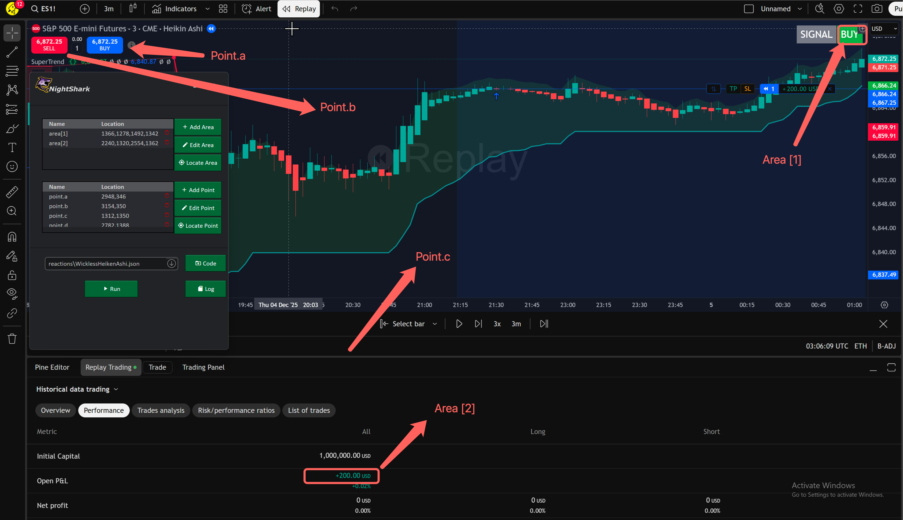

import VideoStructuredData from '@site/src/components/VideoStructuredData';

<VideoStructuredData
  videoId="VOenj6ka53s"
  uploadDate="2025-12-07T13:48:13-08:00"
  duration="PT7M57S"
/>

<!--
  TEMPLATE FOR YOUTUBE VIDEO DOCUMENTATION
  
  To use this template:
  1. Copy this file and rename it (e.g., video-1.mdx, scalping-strategy.mdx)
  2. Replace all placeholder text with your actual content
  3. Update the sidebar_position if needed
  4. Replace VIDEO_ID_HERE with your YouTube video ID
  5. Add your video thumbnail image to /static/img/ and update the path
  6. Paste your indicator and Nightshark code in the respective code blocks
-->

# SuperTrend Trading Bot

This walkthrough shows how to automate trades by pairing TradingView’s SuperTrend script with NightShark and Tradovate. Copy the Pine Script into TradingView, attach it to a clean chart, and inspect replay signals. Load the NightShark script, map buy, sell, and neutral zones, then mirror orders to Tradovate while considering risk controls and expanded monitoring for ongoing insights.

## YouTube Video

<div className="video-container">
  <iframe
    src="https://www.youtube.com/embed/VOenj6ka53s"
    title="YouTube video player"
    frameBorder="0"
    allow="accelerometer; autoplay; clipboard-write; encrypted-media; gyroscope; picture-in-picture; web-share"
    allowFullScreen>
  </iframe>
</div>


## Screen Map




## Logic Flowchart

<iframe 
  frameBorder="0" 
  style={{width: '100%', height: '500px'}} 
  src="https://viewer.diagrams.net/?highlight=0000ff&edit=_blank&layers=1&nav=1&dark=1&title=BUYSELLFlowchart.drawio.xml#Uhttps%3A%2F%2Fcode.processoverprofit.blog%2Fimg%2FBUYSELLFlowchart.drawio.xml">
</iframe>

## Indicator Code

```python
//@version=6
// Copyright (c) 2019-present, Alex Orekhov (everget)
// Enhanced by ProcessOverProfit
// SuperTrend script may be freely distributed under the terms of the GPL-3.0 license.
indicator("SuperTrend", overlay = true)

const string calcGroup = "Calculation"
length = input.int(22, title = "ATR Period", group = calcGroup)
mult = input.float(3, step = 0.1, title = "ATR Multiplier", group = calcGroup)
src = input.source(hl2, title = "Source", group = calcGroup)
wicks = input.bool(true, title = "Take Wicks into Account", group = calcGroup)

const string visualGroup = "Visuals"
showLabels = input.bool(true, title = "Show Buy/Sell Labels", group = visualGroup)
highlightState = input.bool(true, title = "Highlight State", group = visualGroup)

//---

atr = mult * ta.atr(length)

highPrice = wicks ? high : close
lowPrice = wicks ? low : close
doji4price = open == close and open == low and open == high

longStop = src - atr
longStopPrev = nz(longStop[1], longStop)

if longStop > 0
    if doji4price
        longStop := longStopPrev
        longStop
    else
        longStop := lowPrice[1] > longStopPrev ? math.max(longStop, longStopPrev) : longStop
        longStop
else
    longStop := longStopPrev
    longStop

shortStop = src + atr
shortStopPrev = nz(shortStop[1], shortStop)

if shortStop > 0
    if doji4price
        shortStop := shortStopPrev
        shortStop
    else
        shortStop := highPrice[1] < shortStopPrev ? math.min(shortStop, shortStopPrev) : shortStop
        shortStop
else
    shortStop := shortStopPrev
    shortStop

var int dir = 1
dir := dir == -1 and highPrice > shortStopPrev ? 1 : dir == 1 and lowPrice < longStopPrev ? -1 : dir

const color textColor = color.white
const color longColor = color.green
const color shortColor = color.red
const color longFillColor = color.new(color.green, 85)
const color shortFillColor = color.new(color.red, 85)

longStopPlot = plot(dir == 1 ? longStop : na, title = "Long Stop", style = plot.style_linebr, linewidth = 2, color = longColor)
buySignal = dir == 1 and dir[1] == -1
plotshape(buySignal ? longStop : na, title = "Long Stop Start", location = location.absolute, style = shape.circle, size = size.tiny, color = longColor)

shortStopPlot = plot(dir == 1 ? na : shortStop, title = "Short Stop", style = plot.style_linebr, linewidth = 2, color = shortColor)
sellSignal = dir == -1 and dir[1] == 1
plotshape(sellSignal ? shortStop : na, title = "Short Stop Start", location = location.absolute, style = shape.circle, size = size.tiny, color = shortColor)

midPricePlot = plot(ohlc4, title = "", display = display.none, editable = false)

fill(midPricePlot, longStopPlot, title = "Long State Filling", color = (highlightState and dir == 1 ? longFillColor : na))
fill(midPricePlot, shortStopPlot, title = "Short State Filling", color = (highlightState and dir == -1 ? shortFillColor : na))

// Standardized signal logic
bullish = dir == 1
bearish = dir == -1
exit = false
signal = bullish ? "BUY" : bearish ? "SELL" : exit ? "EXIT" : "NONE"

// Baseline for visualization
superTrend = dir == 1 ? longStop : shortStop
baseLine = na(superTrend) ? close : superTrend

// Wave-style fills
pBull = plot(bullish ? baseLine : na, title = "Bull Wave", color = color.new(color.blue, 60), linewidth = 2)
pBear = plot(bearish ? baseLine : na, title = "Bear Wave", color = color.new(color.red, 60), linewidth = 2)
fill(pBull, pBear, color = bullish ? color.new(color.blue, 70) : color.new(color.red, 70))

// Trend-change dots
var int os = na
os := bullish ? 1 : bearish ? 0 : os[1]
plot(os != os[1] ? baseLine : na, title = "Trend Change", style = plot.style_circles, linewidth = 3, color = os == 1 ? color.blue : color.red)

// Top-right signal table
var table signalTable = table.new(position.top_right, 2, 1, border_width = 1)
bgColor = bullish ? color.new(color.green, 0) : bearish ? color.new(color.red, 0) : exit ? color.new(color.orange, 0) : color.new(color.white, 0)
textColorSignal = (bullish or bearish or exit) ? color.white : color.black

table.cell(signalTable, 0, 0, "SIGNAL", text_color = color.white, text_size = size.large, bgcolor = color.gray)
table.cell(signalTable, 1, 0, signal, text_color = textColorSignal, text_size = size.large, bgcolor = bgColor)

// Repainting detection
hasLookahead = false
hasFutureRef = false
usesFuture = false
repainting = hasLookahead or hasFutureRef or usesFuture

// Bottom-right repainting disclosure
if repainting
    var table warningTable = table.new(position.bottom_right, 1, 1)
    table.cell(warningTable, 0, 0,"This indicator may repaint.\nBacktesting may be inaccurate.",text_color = color.red,text_size = size.large,bgcolor = color.new(color.white, 80))


```

## Nightshark Code

```javascript
Skip_First_signal := true ; Set to true to skip the first signal after starting the script


BUY_Condition() {
    return area[1] ~= "BUY"
}

SELL_Condition() {
    return area[1] ~= "SELL"
}

click(point.c)

if(Skip_First_signal) {
    read_areas() 
    if (BUY_Condition()) {
        Log("Skipping first BUY signal, waiting for SELL signal")
        loop{
            read_areas()
        } Until (SELL_Condition()) 
    }
    else if (SELL_Condition()) {
        Log("Skipping first SELL signal, waiting for BUY signal")
        loop{
            read_areas()        
        } Until (BUY_Condition())
    }
}

loop 
{
    Log("Waiting for BUY or SELL signal...")
    loop {
        read_areas()
        sleep 100 ; reduce polling CPU usage
    } until (BUY_Condition() || SELL_Condition())

    if (BUY_Condition()) {
        Log("BUY signal detected ! Entered Long Position")
        click(point.a)
        sleep 500
        click(point.c)

        loop {
            read_areas()
        } until (SELL_Condition()) 

        Log("Long Closed due to SELL condition")

        click(point.b)
        sleep 500
        click(point.c)
    }

    else if (SELL_Condition()) {
        Log("SELL signal detected ! Entered SHORT Position")
        click(point.b)
        sleep 500
        click(point.c)
        loop {
            read_areas()
        } until (BUY_Condition() )
        Log("Short Closed due to BUY condition")
        click(point.a)
        sleep 500
        click(point.c)
    }
}


```

---
