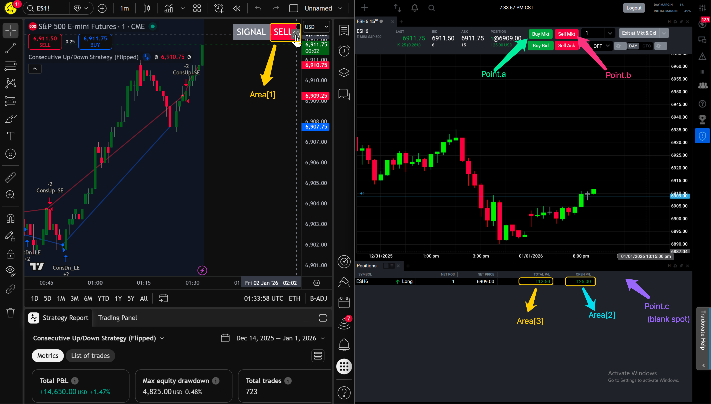

<!--
  TEMPLATE FOR YOUTUBE VIDEO DOCUMENTATION
  
  To use this template:
  1. Copy this file and rename it (e.g., video-1.mdx, scalping-strategy.mdx)
  2. Replace all placeholder text with your actual content
  3. Update the sidebar_position if needed
  4. Replace VIDEO_ID_HERE with your YouTube video ID
  5. Add your video thumbnail image to /static/img/ and update the path
  6. Paste your indicator and Nightshark code in the respective code blocks
-->

# Video-4 Mean Reversion

This walkthrough demonstrates a mean reversion strategy automated with NightShark. By detecting overextended price movements using custom mean reversion indicators on TradingView, we trigger automated entries and exits on Tradovate. The setup leverages NightShark's advanced risk management tools—including trailing open P/L stops and daily loss limits—to protect capital while capturing mean-reverting moves.

## YouTube Video

<div className="video-container">
  <iframe
    src="https://www.youtube.com/embed/uMKsVO2_mCw"
    title="YouTube video player"
    frameBorder="0"
    allow="accelerometer; autoplay; clipboard-write; encrypted-media; gyroscope; picture-in-picture; web-share"
    allowFullScreen>
  </iframe>
</div>


## Screen Map




## Indicator Code

```python
//@version=6
strategy("Consecutive Up/Down Strategy (Flipped)", overlay=true)

// Inputs
consecutiveBarsUp = input.int(3, "Consecutive bars up")
consecutiveBarsDown = input.int(3, "Consecutive bars down")

// Price
price = close

// Count consecutive up bars
ups = 0.0
ups := price > price[1] ? nz(ups[1]) + 1 : 0

// Count consecutive down bars
dns = 0.0
dns := price < price[1] ? nz(dns[1]) + 1 : 0

// FLIPPED ENTRIES
if ups >= consecutiveBarsUp
    strategy.entry("ConsUp_SE", strategy.short)

if dns >= consecutiveBarsDown
    strategy.entry("ConsDn_LE", strategy.long)

// Signal logic
bullish = dns >= consecutiveBarsDown
bearish = ups >= consecutiveBarsUp
exit = false
signal = bullish ? "BUY" : bearish ? "SELL" : exit ? "EXIT" : "NONE"

// Baseline
baseLine = close

// Wave-style fills
pBull = plot(bullish ? baseLine : na, title="Bull Wave", color=color.new(color.blue, 60), linewidth=2)
pBear = plot(bearish ? baseLine : na, title="Bear Wave", color=color.new(color.red, 60), linewidth=2)
fill(pBull, pBear, color=bullish ? color.new(color.blue, 70) : color.new(color.red, 70))

// Trend-change dots
var int os = na
os := bullish ? 1 : bearish ? 0 : os[1]
plot(os != os[1] ? baseLine : na, title="Trend Change", style=plot.style_circles, linewidth=3, color=os == 1 ? color.blue : color.red)

// Top-right signal table
var table signalTable = table.new(position.top_right, 2, 1, border_width=1)
bgColor = bullish ? color.new(color.green, 0) : bearish ? color.new(color.red, 0) : exit ? color.new(color.orange, 0) : color.new(color.white, 0)
textColor = (bullish or bearish or exit) ? color.white : color.black
table.cell(signalTable, 0, 0, "SIGNAL", text_color=color.white, text_size=size.large, bgcolor=color.gray)
table.cell(signalTable, 1, 0, signal, text_color=textColor, text_size=size.large, bgcolor=bgColor)

// Repainting detection
hasLookahead = false
hasFutureRef = false
usesFuture = false
repainting = hasLookahead or hasFutureRef or usesFuture

```

## Nightshark Code

```javascript
global daily_offset := 600
global open_offset := 150

BUY_condition() {
  return area[1]~= "BUY"
}

SELL_condition() {
  return area[1] ~= "SELL"
}

daily_trail(num) {
  if (num > 0) {
    return num-daily_offset
  }
  else {
    return -daily_offset
  }
}

open_trail(num) {
  if (num > 0) {
    return num-open_offset
  }
  else {
    return -open_offset
  }
}

dailyMax := 0

loop {
  openMax := 0
  Log("waiting for BUY or SELL signal")
  loop {
    read_areas()
  } until (BUY_condition() || SELL_condition())
  
  if (BUY_condition()) {
    Log("BUY condition detected !!")
    click(point.a)
    click(point.c)
    Log("Entered Long ! Waiting for exit condition")
    NewOpenSL := -open_offset
    loop{
      read_areas()
      if(toNumber(area[2]) > openMax) {
        openMax := toNumber(area[2])
        NewOpenSL := open_trail(openMax)
        Log("New openMax: " . openMax . " new open SL: " . NewopenSL)
      }
      if(toNumber(area[3]) > dailyMax) {
        dailyMax := toNumber(area[3])
        NewDailySL := daily_trail(dailyMax)
        Log("New dailyMax: " . dailyMax . " new daily SL: " . NewDailySL)        
        
      }
    } until (SELL_condition() || toNumber(area[2]) < NewOpenSL || toNumber(area[3]) < NewDailySL)
    
    ExitReason:= SELL_Condition() ? "Exited due to SELL signal" : toNumber(area[2]) < NewOpenSL ? "Exiting cause of openSL" : toNumber(area[3]) < NewDailySL ? "reached Daily limit" : ""
    
    Log(ExitReason)
    click(point.b)
    click(point.c)
    Log("Exited Long")
    
    if(toNumber(area[3]) < NewDailySL) {
      Log("Stopping Script due to DailyLimit")
      StopCode()
    }
    
  }
  
  else if (SELL_condition()) {
    Log("Sell Condition Exited")
    click(point.b)
    click(point.c)
    Log("Entered SHORT position")
    NewOpenSL := -open_offset
    loop{
      read_areas()
      if(toNumber(area[2]) > openMax) {
        openMax := toNumber(area[2])
        NewOpenSL := open_trail(openMax)
        Log("New openMax: " . openMax . " new open SL: " . NewopenSL)
      }
      if(toNumber(area[3]) > dailyMax) {
        dailyMax := toNumber(area[3])
        NewDailySL := daily_trail(dailyMax)
        Log("New dailyMax: " . dailyMax . " new daily SL: " . NewDailySL) 
        
      }
    } until (BUY_condition() || toNumber(area[2]) < NewOpenSL || toNumber(area[3]) < NewDailySL)
    
    ExitReason := BUY_Condition() ? "Exited due to SELL signal" : toNumber(area[2]) < NewOpenSL ? "Exiting cause of openSL" : toNumber(area[3]) < NewDailySL ? "reached Daily SL" : ""
    
    Log(ExitReason)
    click(point.a)
    click(point.c)
    Log("Exited SHORT")
    
    if(toNumber(area[3]) < NewDailySL) {
      Log("Stopping Script due to DailyLimit")
      StopCode()
    }
  }
}
```

---

