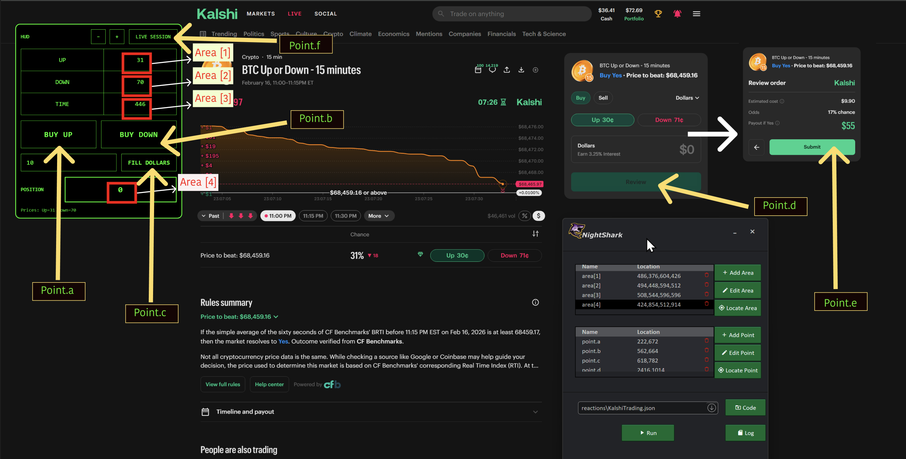

<!--
  TEMPLATE FOR YOUTUBE VIDEO DOCUMENTATION
  
  To use this template:
  1. Copy this file and rename it (e.g., video-1.mdx, scalping-strategy.mdx)
  2. Replace all placeholder text with your actual content
  3. Update the sidebar_position if needed
  4. Replace VIDEO_ID_HERE with your YouTube video ID
  5. Add your video thumbnail image to /static/img/ and update the path
  6. Paste your indicator and Nightshark code in the respective code blocks
-->

# Crypto 15 Min Kalshi Trading Bot

Build a crypto 15-minute market trading bot for Kalshi using trigger points for high-probability trades. This walkthrough shows how to identify confluence zones and trigger levels on TradingView, set up automated entries and exits, and execute on Kalshi’s crypto markets.

{/* ## YouTube Video

<div style={{textAlign: 'center', margin: '2rem 0'}}>
  <iframe
    width="100%"
    height="617"
    src="https://www.youtube.com/embed/yKKjG_o63u4"
    title="YouTube video player"
    frameBorder="0"
    allow="accelerometer; autoplay; clipboard-write; encrypted-media; gyroscope; picture-in-picture; web-share"
    allowFullScreen
    style={{maxWidth: '1097px', width: '100%', aspectRatio: '16/9', border: 'none'}}>
  </iframe>
</div>
*/}


## Screen Map





## Indicator Code

```python
(() => {
  // ================= CLEANUP (safe for SPA / re-run) =================
  const OLD = document.getElementById("KALSHI_HUD");
  if (OLD) OLD.remove();

  if (!window.__KALSHI_HUD_STATE__) window.__KALSHI_HUD_STATE__ = {};
  const STATE = window.__KALSHI_HUD_STATE__;

  try { (STATE.observers || []).forEach(o => o.disconnect()); } catch {}
  STATE.observers = [];

  // Abort previous global listeners so re-runs don't leak
  if (STATE.abortController) {
    try { STATE.abortController.abort(); } catch {}
  }
  STATE.abortController = new AbortController();
  const signal = STATE.abortController.signal;

  // ================= CONFIG =================
  const GREEN = "#00ff66";
  const LS_DOLLARS = "__KALSHI_DOLLARS__";
  const LS_POS = "__KALSHI_HUD_POS__";
  let fontSize = 16;

  // throttle: run at most once every THROTTLE_MS (not every rAF / ~16ms)
  const THROTTLE_MS = 300;
  let throttleTimer = null;
  let lastUIUpdate = 0;

  const scheduleUIUpdate = () => {
    if (throttleTimer) return;

    const elapsed = Date.now() - lastUIUpdate;
    if (elapsed >= THROTTLE_MS) {
      lastUIUpdate = Date.now();
      try { updatePrices(); updateTimer(); updatePosition(); } catch {}
    } else {
      throttleTimer = setTimeout(() => {
        throttleTimer = null;
        lastUIUpdate = Date.now();
        try { updatePrices(); updateTimer(); updatePosition(); } catch {}
      }, THROTTLE_MS - elapsed);
    }
  };

  // ================= HUD UI =================
  const hud = document.createElement("div");
  hud.id = "KALSHI_HUD";
  hud.style.cssText = `
    position: fixed;
    top: 90px;
    left: 90px;
    z-index: 2147483647;
    background: black;
    border: 2px solid ${GREEN};
    border-radius: 12px;
    padding: 12px;
    font-family: monospace;
    color: ${GREEN};
    user-select: none;
    min-width: 391px;
  `;

  // restore persisted position (if any)
  try {
    const saved = JSON.parse(localStorage.getItem(LS_POS) || "null");
    if (saved && Number.isFinite(saved.left) && Number.isFinite(saved.top)) {
      hud.style.left = `${saved.left}px`;
      hud.style.top = `${saved.top}px`;
    }
  } catch {}

  const storedDollars = localStorage.getItem(LS_DOLLARS) || "";

  hud.innerHTML = `
    <div id="hudHeader" style="display:flex;align-items:center;justify-content:space-between;gap:12px;margin-bottom:12px;cursor:move">
      <div style="opacity:.9;font-weight:700">HUD</div>
      <div style="display:flex;gap:10px">
        <button id="dec">−</button>
        <button id="inc">+</button>
        <button id="liveSession">LIVE SESSION</button>
      </div>
    </div>

    <table id="tbl" style="border-collapse:collapse;font-size:${fontSize}px;width:100%;text-align:center">
      <tr>
        <td style="border:1px solid ${GREEN};padding:18px" id="aLabel">UP</td>
        <td style="border:1px solid ${GREEN};padding:18px" id="aPrice">--</td>
      </tr>
      <tr>
        <td style="border:1px solid ${GREEN};padding:18px" id="bLabel">DOWN</td>
        <td style="border:1px solid ${GREEN};padding:18px" id="bPrice">--</td>
      </tr>
      <tr>
        <td style="border:1px solid ${GREEN};padding:18px" id="tLabel">TIME</td>
        <td style="border:1px solid ${GREEN};padding:18px" id="tVal">--</td>
      </tr>
    </table>

    <div style="display:flex;gap:12px;margin-top:14px">
      <button id="buyA" class="bigBuy">BUY UP</button>
      <button id="buyB" class="bigBuy">BUY DOWN</button>
    </div>

    <div style="display:flex;gap:12px;margin-top:14px;align-items:center">
      <input id="dollarsBox" placeholder="DOLLARS" value="${storedDollars.replace(/"/g, "&quot;")}"
        style="
          flex:1;
          background:black;
          color:${GREEN};
          border:1px solid ${GREEN};
          padding:12px 14px;
          font-family:monospace;
          outline:none;
          font-size:16px;
        "/>
      <button id="fillDollars" class="fillBtn">FILL DOLLARS</button>
    </div>

    <div style="display:flex;gap:12px;margin-top:14px;align-items:center">
      <div style="min-width:98px;opacity:0.9;font-weight:800">POSITION</div>
      <div id="posBox" style="
          flex:1;
          border:2px solid ${GREEN};
          padding:18px 22px;
          text-align:center;
          letter-spacing:2px;
          font-weight:900;
          font-size: 20px;
        ">0</div>
    </div>

    <div id="dbg" style="margin-top:12px;font-size:12px;opacity:0.85;text-align:left"></div>
  `;

  // Base button style
  hud.querySelectorAll("button").forEach(b => {
    b.style.cssText = `
      background:black;
      color:${GREEN};
      border:1px solid ${GREEN};
      cursor:pointer;
      font-family:monospace;
      white-space:nowrap;
    `;
  });

  // Header buttons
  hud.querySelector("#dec").style.padding = "10px 14px";
  hud.querySelector("#inc").style.padding = "10px 14px";
  hud.querySelector("#liveSession").style.padding = "10px 16px";

  // Big BUY buttons
  hud.querySelectorAll(".bigBuy").forEach(b => {
    b.style.flex = "1";
    b.style.padding = "22px 18px";
    b.style.fontSize = "20px";
    b.style.fontWeight = "900";
    b.style.letterSpacing = "1px";
  });

  // Fill button
  const fillBtn = hud.querySelector("#fillDollars");
  fillBtn.style.padding = "12px 16px";
  fillBtn.style.fontSize = "16px";
  fillBtn.style.fontWeight = "800";

  document.body.appendChild(hud);

  const dbg = hud.querySelector("#dbg");
  const posBox = hud.querySelector("#posBox");
  const table = hud.querySelector("#tbl");
  const hudHeader = hud.querySelector("#hudHeader");

  const aLabelEl = hud.querySelector("#aLabel");
  const bLabelEl = hud.querySelector("#bLabel");
  const aPriceEl = hud.querySelector("#aPrice");
  const bPriceEl = hud.querySelector("#bPrice");

  const tValEl = hud.querySelector("#tVal");

  const log = (msg) => (dbg.textContent = msg);

  // ================= DRAG (only from header, persist position) =================
  let dragging = false, dx = 0, dy = 0;

  const savePos = () => {
    try {
      localStorage.setItem(LS_POS, JSON.stringify({
        left: hud.offsetLeft,
        top: hud.offsetTop
      }));
    } catch {}
  };

  hudHeader.addEventListener("mousedown", e => {
    // Don't start drag if the target is a button or input
    if (e.target.closest("button") || e.target.closest("input")) return;
    dragging = true;
    dx = e.clientX - hud.offsetLeft;
    dy = e.clientY - hud.offsetTop;
    e.preventDefault();
  });

  document.addEventListener("mousemove", e => {
    if (!dragging) return;
    hud.style.left = (e.clientX - dx) + "px";
    hud.style.top  = (e.clientY - dy) + "px";
  }, { signal });

  document.addEventListener("mouseup", () => {
    if (!dragging) return;
    dragging = false;
    savePos();
  }, { signal });

  window.addEventListener("blur", () => {
    if (dragging) { dragging = false; savePos(); }
  }, { signal });

  // ================= FONT SIZE =================
  hud.querySelector("#inc").onclick = () => {
    fontSize += 2;
    table.style.fontSize = fontSize + "px";
  };
  hud.querySelector("#dec").onclick = () => {
    fontSize = Math.max(10, fontSize - 2);
    table.style.fontSize = fontSize + "px";
  };

  // ================= HELPERS =================
  const sleep = (ms) => new Promise(r => setTimeout(r, ms));
  const norm = (s) => (s || "").replace(/\s+/g, " ").trim().toLowerCase();

  function pointerClick(el) {
    if (!el) return false;
    try { el.scrollIntoView({ block: "center", inline: "center" }); } catch {}
    const r = el.getBoundingClientRect();
    const x = Math.floor(r.left + r.width / 2);
    const y = Math.floor(r.top + r.height / 2);

    const common = {
      bubbles: true, cancelable: true, composed: true, view: window,
      clientX: x, clientY: y, screenX: x, screenY: y,
      button: 0, buttons: 1
    };

    try {
      el.focus?.();
      el.dispatchEvent(new PointerEvent("pointerdown", { ...common, pointerId: 1, pointerType: "mouse", isPrimary: true }));
      el.dispatchEvent(new MouseEvent("mousedown", common));
      el.dispatchEvent(new PointerEvent("pointerup", { ...common, pointerId: 1, pointerType: "mouse", isPrimary: true }));
      el.dispatchEvent(new MouseEvent("mouseup", common));
      el.dispatchEvent(new MouseEvent("click", common));
      return true;
    } catch {
      try { el.click?.(); return true; } catch {}
      return false;
    }
  }

  function setNativeValue(input, value) {
    const proto = Object.getPrototypeOf(input);
    const desc = Object.getOwnPropertyDescriptor(proto, "value");
    if (desc && desc.set) desc.set.call(input, value);
    else input.value = value;
  }

  // ================= ROBUST OUTCOME PRICES =================
  function findOutcomePillsRobust() {
    const pills = [...document.querySelectorAll('button[data-testid="price-pill"]')];

    // Prefer Up/Down
    let up = null, down = null;
    for (const b of pills) {
      const t = norm(b.textContent);
      if (!up && /\bup\b/.test(t)) up = b;
      if (!down && /\bdown\b/.test(t)) down = b;
    }
    if (up || down) return { aLabel: "UP", bLabel: "DOWN", aEl: up, bEl: down };

    // Fallback Yes/No
    let yes = null, no = null;
    for (const b of pills) {
      const t = norm(b.textContent);
      if (!yes && /\byes\b/.test(t)) yes = b;
      if (!no && /\bno\b/.test(t)) no = b;
    }
    return { aLabel: "UP", bLabel: "DOWN", aEl: yes, bEl: no };
  }

  function extractCents(el) {
    if (!el) return null;
    const m = (el.textContent || "").match(/(\d+)\s*¢/);
    return m ? m[1] : null;
  }

  function updatePrices() {
    const { aLabel, bLabel, aEl, bEl } = findOutcomePillsRobust();

    aLabelEl.textContent = aLabel;
    bLabelEl.textContent = bLabel;

    aPriceEl.textContent = extractCents(aEl) ?? "--";
    bPriceEl.textContent = extractCents(bEl) ?? "--";

    STATE.aEl = aEl;
    STATE.bEl = bEl;

    log(`Prices: Up=${aPriceEl.textContent} Down=${bPriceEl.textContent}`);
  }

  // ================= POSITION DETECTION =================
  const QTY_RE = /^(\d+)\s+(yes|no)$/i;

  function findPositionQuantity() {
    // Method 1: "Your position" label
    const spans = document.querySelectorAll("span");
    for (const s of spans) {
      if (hud.contains(s)) continue;
      if ((s.textContent || "").trim() !== "Your position") continue;
      const container = s.closest("div");
      if (!container) continue;
      const inner = container.querySelectorAll("span");
      for (const ps of inner) {
        const m = (ps.textContent || "").trim().match(QTY_RE);
        if (m) return parseInt(m[1], 10);
      }
    }

    // Method 2: CheckCircleIcon with adjacent "N Yes" / "N No" span
    const icons = document.querySelectorAll('svg[data-testid="CheckCircleIcon"]');
    for (const ic of icons) {
      if (hud.contains(ic)) continue;
      const wrapper = ic.closest("div");
      if (!wrapper) continue;
      const nearby = wrapper.querySelectorAll("span");
      for (const ps of nearby) {
        const m = (ps.textContent || "").trim().match(QTY_RE);
        if (m) return parseInt(m[1], 10);
      }
    }

    return 0;
  }

  function updatePosition() {
    posBox.textContent = findPositionQuantity();
  }

  // ================= COUNTDOWN TIMER =================
  function findCountdownSpan() {
    const spans = document.querySelectorAll("span");
    for (const s of spans) {
      if (hud.contains(s)) continue;
      const ff = s.style.fontFeatureSettings || "";
      if (ff.includes("tnum") && ff.includes("cv09")) {
        const t = (s.textContent || "").trim();
        if (/^\d{1,2}:\d{2}$/.test(t)) return s;
      }
    }
    return null;
  }

  function mmssToSeconds(mmss) {
    const parts = mmss.split(":");
    if (parts.length !== 2) return null;
    const mins = parseInt(parts[0], 10);
    const secs = parseInt(parts[1], 10);
    if (isNaN(mins) || isNaN(secs)) return null;
    return mins * 60 + secs;
  }

  function updateTimer() {
    const span = findCountdownSpan();
    if (!span) {
      tValEl.textContent = "--";
      return;
    }
    const raw = (span.textContent || "").trim();
    const totalSec = mmssToSeconds(raw);
    if (totalSec === null) {
      tValEl.textContent = "--";
      return;
    }
    tValEl.textContent = totalSec;
  }

  // ================= DOLLARS INPUT + FILL =================
  const dollarsBox = hud.querySelector("#dollarsBox");
  dollarsBox.addEventListener("input", () => localStorage.setItem(LS_DOLLARS, dollarsBox.value));

  function findDollarsInput() {
    return document.querySelector("#cost-input") || null;
  }

  function fillDollars() {
    const raw = (dollarsBox.value || "").trim();
    if (!raw) return log("FILL DOLLARS: empty");

    const val = raw.replace(/[^\d.]/g, "");
    if (!val) return log("FILL DOLLARS: invalid");

    const input = findDollarsInput();
    if (!input) return log("FILL DOLLARS: dollars input not found");

    input.focus();
    pointerClick(input);

    setNativeValue(input, val);
    input.dispatchEvent(new Event("input", { bubbles: true }));
    input.dispatchEvent(new Event("change", { bubbles: true }));
    input.blur();

    log(`FILL DOLLARS: ${val}`);
  }

  hud.querySelector("#fillDollars").onclick = () => fillDollars();

  // ================= BUY UP / BUY DOWN =================
  function findReviewButton() {
    const btns = [...document.querySelectorAll("button")];
    return btns.find(b => {
      if (hud.contains(b)) return false;
      return norm(b.textContent) === "review" && !b.disabled;
    }) || null;
  }

  async function buy(side /* "UP"|"DOWN" */) {
    // Re-read pills fresh in case DOM changed since last update
    const { aEl, bEl } = findOutcomePillsRobust();
    const pill = side === "UP" ? aEl : bEl;
    if (!pill) return log(`BUY ${side}: pill not found`);

    log(`BUY ${side}: select`);
    pointerClick(pill);

    await sleep(140);

    const reviewBtn = findReviewButton();
    if (!reviewBtn) return log(`BUY ${side}: Review not found/enabled`);

    log(`BUY ${side}: click Review`);
    pointerClick(reviewBtn);
  }

  hud.querySelector("#buyA").onclick = () => buy("UP");
  hud.querySelector("#buyB").onclick = () => buy("DOWN");

  // ================= LIVE SESSION =================
  function findLiveSessionButton() {
    const pings = document.querySelectorAll(".animate-ping");
    for (const ping of pings) {
      if (hud.contains(ping)) continue;
      const btn = ping.closest("a, button");
      if (!btn || hud.contains(btn)) continue;
      const timeRe = /\b\d{1,2}:\d{2}\s*(AM|PM)\b/i;
      if (timeRe.test(btn.textContent || "")) return btn;
    }
    return null;
  }

  function clickLiveSession() {
    const btn = findLiveSessionButton();
    if (!btn) return log("LIVE SESSION: no live session found");
    log("LIVE SESSION: clicking " + (btn.textContent || "").trim());
    pointerClick(btn);
  }

  hud.querySelector("#liveSession").onclick = () => clickLiveSession();

  // ================= AUTO-DISMISS DONE PANEL =================
  function autoDismissDonePanel() {
    const btns = document.querySelectorAll("button");
    for (const b of btns) {
      if (hud.contains(b)) continue;
      if (norm(b.textContent) !== "done") continue;
      const panel = b.closest("div.sticky");
      if (!panel) continue;
      log("AUTO-DISMISS: clicking Done");
      pointerClick(b);
      return;
    }
  }

  // ================= OBSERVERS =================
  const obs = new MutationObserver((mutations) => {
    // Skip mutations that originated inside the HUD itself
    for (const m of mutations) {
      if (!hud.contains(m.target)) {
        scheduleUIUpdate();
        return;
      }
    }
  });
  obs.observe(document.body, { childList: true, subtree: true, characterData: true });
  STATE.observers.push(obs);

  // ================= TIMER TICK (1s interval, independent of throttle) =================
  if (STATE.timerInterval) clearInterval(STATE.timerInterval);
  STATE.timerInterval = setInterval(() => {
    try { updateTimer(); updatePosition(); autoDismissDonePanel(); } catch {}
  }, 1000);

  // ================= INIT =================
  scheduleUIUpdate();
  log("Kalshi HUD: ON");
})();


```

## Nightshark Code

```javascript
triggerPoint := 85

Log("Application Started !!")
loop {
  Log("Monitoring UP & Down to hit Trigger Price > " . triggerPoint )
  loop{
    read_areas()
  } until (toNumber(area[1]) > triggerPoint || toNumber(area[2]) > triggerPoint || toNumber(area[3]) < 60 )
  
  if (toNumber(area[1]) > triggerPoint) {
  Log("UP triggered !! Placing Up Order")
  loop, 4{
      click(point.a)
      sleep 200
      click(point.c)
      sleep 2000
      click(point.d)
      sleep 2000
      click(point.e)
      sleep 4000
      read_areas()
      if (toNumber(area[4]) > 0) {
        Log("UP position confirmed")
        break
      }
      else {
        Log("Position not confirmed ! Retrying ...")
        sleep 1000
      }
    }  
  }
  
  else if (toNumber(area[2]) > triggerPoint) {
  Log("Down triggered !! Placing Down Order")
      loop, 4 {
      click(point.b)
      sleep 200
      click(point.c)
      sleep 2000
      click(point.d)
      sleep 2000
      click(point.e)
      sleep 4000
      read_areas()
      if (toNumber(area[4]) > 0) {
        Log("UP position confirmed")
        break
      } 
      else {
        Log("Position not confirmed ! Retrying ...")
        sleep 1000
      }
    }
  }
  
  else if (toNumber(area[3]) < 60) {
    Log("Last Minute ! No Trade Zone. Skipping this session.")
  }
  
  Log("Waiting for Next Session")
  loop {
    read_area(3)
  } until (toNumber(area[3]) < 1 || toNumber(area[3]) > 850)
  Log("Loading New Session")
  sleep 3000
  click(point.f)
}
```

---

