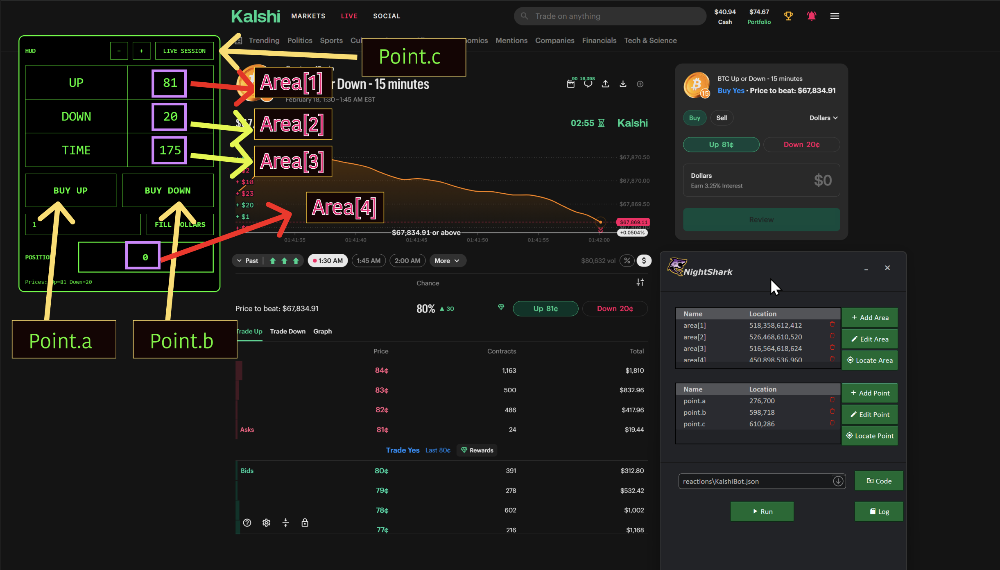

import KalshiV4Popup from '@site/src/components/KalshiV4Popup';
import VideoStructuredData from '@site/src/components/VideoStructuredData';

<VideoStructuredData
  videoId="eq8xoz7o07U"
  uploadDate="2026-02-21T10:00:47-08:00"
  duration="PT11M23S"
/>

<!--
  TEMPLATE FOR YOUTUBE VIDEO DOCUMENTATION
  
  To use this template:
  1. Copy this file and rename it (e.g., video-1.mdx, scalping-strategy.mdx)
  2. Replace all placeholder text with your actual content
  3. Update the sidebar_position if needed
  4. Replace VIDEO_ID_HERE with your YouTube video ID
  5. Add your video thumbnail image to /static/img/ and update the path
  6. Paste your indicator and Nightshark code in the respective code blocks
-->

# Video 6: Kalshi 15-Minute Crypto Trading Bot

<KalshiV4Popup />

Build a crypto 15-minute market trading bot for Kalshi using trigger points for high-probability trades. This walkthrough shows how to identify confluence zones and trigger levels on TradingView, set up automated entries and exits, and execute on Kalshi’s crypto markets.

 ## YouTube Video

<div style={{textAlign: 'center', margin: '2rem 0'}}>
  <iframe
    width="100%"
    height="100%"
    src="https://www.youtube.com/embed/eq8xoz7o07U"
    title="YouTube video player"
    frameBorder="0"
    allow="accelerometer; autoplay; clipboard-write; encrypted-media; gyroscope; picture-in-picture; web-share"
    allowFullScreen
    style={{maxWidth: '1097px', width: '100%', aspectRatio: '16/9', border: 'none'}}>
  </iframe>
</div>


## Screen Map





## HUD Code

```python
Script =
(%
(()=>{const t=document.getElementById("KALSHI_HUD");t&&t.remove(),window.__KALSHI_HUD_STATE__||(window.__KALSHI_HUD_STATE__={});const e=window.__KALSHI_HUD_STATE__;try{(e.observers||[]).forEach(t=>t.disconnect())}catch{}if(e.observers=[],e.abortController)try{e.abortController.abort()}catch{}e.abortController=new AbortController;const n=e.abortController.signal,o="#00ff66",i="__KALSHI_DOLLARS__",l="__KALSHI_HUD_POS__",r="__KALSHI_HUD_ZOOM__";let c=parseInt(localStorage.getItem(r),10)||16;let s=null,a=0;const u=(...t)=>t.forEach(t=>{try{t()}catch{}}),d=()=>{if(s)return;const t=Date.now()-a;t>=300?(a=Date.now(),u(B,M,Y)):s=setTimeout(()=>{s=null,a=Date.now(),u(B,M,Y)},300-t)},p=document.createElement("div");p.id="KALSHI_HUD",p.style.cssText=``\n    position: fixed;\n    top: 90px;\n    left: 90px;\n    z-index: 2147483647;\n    background: black;\n    border: 2px solid ${o};\n    border-radius: 12px;\n    padding: 12px;\n    font-family: monospace;\n    color: ${o};\n    user-select: none;\n    min-width: 391px;\n  ``;try{const t=JSON.parse(localStorage.getItem(l)||"null");t&&Number.isFinite(t.left)&&Number.isFinite(t.top)&&(p.style.left=``${t.left}px``,p.style.top=``${t.top}px``)}catch{}const f=localStorage.getItem(i)||"";p.innerHTML=``\n    <div id="hudHeader" style="display:flex;align-items:center;justify-content:space-between;gap:12px;margin-bottom:12px;cursor:move">\n      <div style="opacity:.9;font-weight:700">HUD</div>\n      <div style="display:flex;gap:10px">\n        <button id="dec">−</button>\n        <button id="inc">+</button>\n        <button id="liveSession">LIVE SESSION</button>\n      </div>\n    </div>\n\n    <table id="tbl" style="border-collapse:collapse;font-size:${c}px;width:100%;text-align:center">\n      <tr>\n        <td style="border:1px solid ${o};padding:18px" id="aLabel">UP</td>\n        <td style="border:1px solid ${o};padding:18px" id="aPrice">--</td>\n      </tr>\n      <tr>\n        <td style="border:1px solid ${o};padding:18px" id="bLabel">DOWN</td>\n        <td style="border:1px solid ${o};padding:18px" id="bPrice">--</td>\n      </tr>\n      <tr>\n        <td style="border:1px solid ${o};padding:18px" id="tLabel">TIME</td>\n        <td style="border:1px solid ${o};padding:18px" id="tVal">--</td>\n      </tr>\n    </table>\n\n    <div style="display:flex;gap:12px;margin-top:14px">\n      <button id="buyA" class="bigBuy">BUY UP</button>\n      <button id="buyB" class="bigBuy">BUY DOWN</button>\n    </div>\n\n    <div style="display:flex;gap:12px;margin-top:14px;align-items:center">\n      <input id="dollarsBox" placeholder="DOLLARS" value="${f.replace(/"/g,"&quot;")}"\n        style="\n          flex:1;\n          background:black;\n          color:${o};\n          border:1px solid ${o};\n          padding:12px 14px;\n          font-family:monospace;\n          outline:none;\n          font-size:16px;\n        "/>\n      <button id="fillDollars" class="fillBtn">FILL DOLLARS</button>\n    </div>\n\n    <div style="display:flex;gap:12px;margin-top:14px;align-items:center">\n      <div style="min-width:98px;opacity:0.9;font-weight:800">POSITION</div>\n      <div id="posBox" style="\n          flex:1;\n          border:2px solid ${o};\n          padding:18px 22px;\n          text-align:center;\n          letter-spacing:2px;\n          font-weight:900;\n          font-size: 20px;\n        ">0</div>\n    </div>\n\n    <div id="dbg" style="margin-top:12px;font-size:12px;opacity:0.85;text-align:left"></div>\n  ``,p.querySelectorAll("button").forEach(t=>{t.style.cssText=``\n      background:black;\n      color:${o};\n      border:1px solid ${o};\n      cursor:pointer;\n      font-family:monospace;\n      white-space:nowrap;\n    ``}),p.querySelector("#dec").style.padding="10px 14px",p.querySelector("#inc").style.padding="10px 14px",p.querySelector("#liveSession").style.padding="10px 16px",p.querySelectorAll(".bigBuy").forEach(t=>{t.style.flex="1",t.style.padding="22px 18px",t.style.fontSize="20px",t.style.fontWeight="900",t.style.letterSpacing="1px"});const b=p.querySelector("#fillDollars");b.style.padding="12px 16px",b.style.fontSize="16px",b.style.fontWeight="800",document.body.appendChild(p);const y=p.querySelector("#dbg"),x=p.querySelector("#posBox"),g=p.querySelector("#tbl"),m=p.querySelector("#hudHeader"),S=p.querySelector("#aLabel"),v=p.querySelector("#bLabel"),w=p.querySelector("#aPrice"),L=p.querySelector("#bPrice"),h=p.querySelector("#tVal"),E=t=>y.textContent=t;let I=!1,C=0,_=0;const D=()=>{try{localStorage.setItem(l,JSON.stringify({left:p.offsetLeft,top:p.offsetTop}))}catch{}};m.addEventListener("mousedown",t=>{t.target.closest("button")||t.target.closest("input")||(I=!0,C=t.clientX-p.offsetLeft,_=t.clientY-p.offsetTop,t.preventDefault())}),document.addEventListener("mousemove",t=>{I&&(p.style.left=t.clientX-C+"px",p.style.top=t.clientY-_+"px")},{signal:n}),document.addEventListener("mouseup",()=>{I&&(I=!1,D())},{signal:n}),window.addEventListener("blur",()=>{I&&(I=!1,D())},{signal:n}),p.querySelector("#inc").onclick=()=>{c+=2,g.style.fontSize=c+"px",localStorage.setItem(r,c)},p.querySelector("#dec").onclick=()=>{c=Math.max(10,c-2),g.style.fontSize=c+"px",localStorage.setItem(r,c)};const A=t=>new Promise(e=>setTimeout(e,t)),q=t=>(t||"").replace(/\s+/g," ").trim().toLowerCase();function $(t){if(!t)return!1;try{t.scrollIntoView({block:"center",inline:"center"})}catch{}const e=t.getBoundingClientRect(),n=Math.floor(e.left+e.width/2),o=Math.floor(e.top+e.height/2),i={bubbles:!0,cancelable:!0,composed:!0,view:window,clientX:n,clientY:o,screenX:n,screenY:o,button:0,buttons:1};try{return t.focus?.(),t.dispatchEvent(new PointerEvent("pointerdown",{...i,pointerId:1,pointerType:"mouse",isPrimary:!0})),t.dispatchEvent(new MouseEvent("mousedown",i)),t.dispatchEvent(new PointerEvent("pointerup",{...i,pointerId:1,pointerType:"mouse",isPrimary:!0})),t.dispatchEvent(new MouseEvent("mouseup",i)),t.dispatchEvent(new MouseEvent("click",i)),!0}catch{try{return t.click?.(),!0}catch{}return!1}}function O(){const t=[...document.querySelectorAll('button[data-testid="price-pill"]')];let e=null,n=null;for(const o of t){const t=q(o.textContent);!e&&/\bup\b/.test(t)&&(e=o),!n&&/\bdown\b/.test(t)&&(n=o)}if(e||n)return{aLabel:"UP",bLabel:"DOWN",aEl:e,bEl:n};let o=null,i=null;for(const e of t){const t=q(e.textContent);!o&&/\byes\b/.test(t)&&(o=e),!i&&/\bno\b/.test(t)&&(i=e)}return{aLabel:"UP",bLabel:"DOWN",aEl:o,bEl:i}}function U(t){if(!t)return null;const e=(t.textContent||"").match(/([\d.]+)\s*¢/);return e?String(Math.floor(parseFloat(e[1]))):null}function B(){const{aLabel:t,bLabel:n,aEl:o,bEl:i}=O();S.textContent=t,v.textContent=n,w.textContent=U(o)??"--",L.textContent=U(i)??"--",e.aEl=o,e.bEl=i,E(``Prices: Up=${w.textContent} Down=${L.textContent}``)}const N=/^([\d,.]+)\s+(yes|no)$/i,P=/([\d,.]+)\s+(yes|no)/i;function k(t){if(!t)return!1;if(null===t.offsetParent&&"fixed"!==getComputedStyle(t).position)return!1;const e=t.getBoundingClientRect();return e.width>0&&e.height>0}function H(t){if(!t)return null;const e=t.querySelectorAll("span");for(const t of e){const e=(t.textContent||"").replace(/\s+/g," ").trim().match(N);if(!e)continue;const n=parseFloat(e[1].replace(/,/g,""));if(Number.isFinite(n))return n}const n=(t.textContent||"").replace(/\s+/g," ").trim().match(P);if(n){const t=parseFloat(n[1].replace(/,/g,""));if(Number.isFinite(t))return t}return null}function T(){x.textContent=0}function Y(){const t=function(){const t=document.querySelectorAll("span");for(const e of t){if(p.contains(e))continue;if("Your position"!==(e.textContent||"").trim())continue;if(!k(e))continue;const t=H(e.closest(".justify-between")||e.closest("div"));if(null!==t)return t}const e=document.querySelectorAll('svg[data-testid="CheckCircleIcon"]');for(const t of e){if(p.contains(t))continue;if(!k(t))continue;const e=H(t.closest(".justify-between")||t.closest("div"));if(null!==e)return e}const n=document.querySelectorAll('span[class*="text-yes"], span[class*="text-no"]');for(const t of n){if(p.contains(t))continue;if(!k(t))continue;const e=(t.textContent||"").replace(/\s+/g," ").trim().match(N);if(!e)continue;const n=parseFloat(e[1].replace(/,/g,""));if(Number.isFinite(n))return n}return 0}();x.textContent=t?Math.round(t):0}function M(){const t=function(){const t=document.querySelectorAll("span");for(const e of t)if(!p.contains(e)&&(e.style.fontFeatureSettings||"").includes("tnum")){const t=(e.textContent||"").trim();if(/^\d{1,2}:\d{2}$/.test(t))return e}return null}();if(!t)return h.textContent="--",void T();const e=function(t){const e=t.split(":");if(2!==e.length)return null;const n=parseInt(e[0],10),o=parseInt(e[1],10);return isNaN(n)||isNaN(o)?null:60*n+o}((t.textContent||"").trim());null!==e?(h.textContent=e,e<=1&&T()):h.textContent="--"}const F=p.querySelector("#dollarsBox");function R(){const t=(F.value||"").trim();if(!t)return E("FILL DOLLARS: empty");const e=t.replace(/[^\d.]/g,"");if(!e)return E("FILL DOLLARS: invalid");const n=document.querySelector("#cost-input")||null;if(!n)return E("FILL DOLLARS: dollars input not found");n.focus(),$(n),function(t,e){const n=Object.getPrototypeOf(t),o=Object.getOwnPropertyDescriptor(n,"value");o&&o.set?o.set.call(t,e):t.value=e}(n,e),n.dispatchEvent(new Event("input",{bubbles:!0})),n.dispatchEvent(new Event("change",{bubbles:!0})),n.blur(),E(``FILL DOLLARS: ${e}``)}function z(){return[...document.querySelectorAll("button")].find(t=>!p.contains(t)&&("review"===q(t.textContent)&&!t.disabled))||null}function K(){return[...document.querySelectorAll("button")].find(t=>!p.contains(t)&&("submit"===q(t.textContent)&&!t.disabled))||null}async function W(t,e,n=6e4){const o=Date.now();let i=100;for(;Date.now()-o<n;){const e=t();if(e)return e;await A(i),i=Math.min(1.5*i,1e3)}return null}async function V(t){const{aEl:e,bEl:n}=O(),o="UP"===t?e:n;if(!o)return E(``BUY ${t}: pill not found``);E(``BUY ${t}: select``),$(o),await A(200),E(``BUY ${t}: fill dollars``),R(),await A(300),E(``BUY ${t}: waiting for Review``);const i=await W(z);if(!i)return E(``BUY ${t}: Review not found``);E(``BUY ${t}: click Review``),$(i),E(``BUY ${t}: waiting for Submit``);const l=await W(K);if(!l)return E(``BUY ${t}: Submit not found``);E(``BUY ${t}: click Submit``),$(l),E(``BUY ${t}: DONE``)}function j(){const t=function(){const t=document.querySelectorAll(".animate-ping");for(const e of t){if(p.contains(e))continue;const t=e.closest("a, button");if(t&&!p.contains(t)&&/\b\d{1,2}:\d{2}\s*(AM|PM)\b/i.test(t.textContent||""))return t}return null}();if(!t)return E("LIVE SESSION: no live session found");E("LIVE SESSION: clicking "+(t.textContent||"").trim()),$(t)}function X(){const t=document.querySelectorAll("button");for(const e of t){if(p.contains(e))continue;if("done"!==q(e.textContent))continue;if(e.closest("div.sticky"))return E("AUTO-DISMISS: clicking Done"),void $(e)}}F.addEventListener("input",()=>localStorage.setItem(i,F.value)),p.querySelector("#fillDollars").onclick=()=>R(),p.querySelector("#buyA").onclick=()=>V("UP"),p.querySelector("#buyB").onclick=()=>V("DOWN"),p.querySelector("#liveSession").onclick=()=>j();const J=new MutationObserver(t=>{for(const e of t)if(!p.contains(e.target))return void d()});J.observe(document.body,{childList:!0,subtree:!0,characterData:!0}),e.observers.push(J),e.timerInterval&&clearInterval(e.timerInterval),e.timerInterval=setInterval(()=>{u(M,Y,X)},1e3),d(),E("Kalshi HUD: ON")})();
)

LoadIndicator() {
    global Script
    Clipboard :=
    Clipboard := Script
    ClipWait, 1
    SendInput, ^+j
    Sleep 1200
    SendInput, ^v
    Sleep 1200
    SendInput, allow pasting
    Sleep 4000
    SendInput, {Enter}
    Sleep 2000
    SendInput, ^v
    sleep 1000
    SendInput, {Enter}
    sleep 1200
    SendInput, ^+j
}

click(point.a)
LoadIndicator()

```

## Nightshark Code

```javascript

triggerPoint := 85 ; Trigger Price Point

Log("Application Started !!")
loop {
  Log("Monitoring UP & Down to hit Trigger Price > " . triggerPoint )
    click(point.c)
  loop{
    read_areas()
  } until (toNumber(area[1]) > triggerPoint || toNumber(area[2]) > triggerPoint || toNumber(area[3]) < 60 )
  
  if (toNumber(area[1]) > triggerPoint && toNumber(area[4]) = 0) {
  Log("UP triggered !! Placing Up Order")
  loop, 4{
      click(point.a)
      sleep 4000
      read_areas()
      if (toNumber(area[4]) > 0) {
        Log("UP position confirmed")
        break
      }
      else {
        Log("Position not confirmed ! Retrying ...")
        sleep 1000
      }
    }  
  }
  
  else if (toNumber(area[2]) > triggerPoint && toNumber(area[4] = 0)) {
  Log("Down triggered !! Placing Down Order")
      loop, 4 {
      click(point.b)
      sleep 4000
      read_areas()
      if (toNumber(area[4]) > 0) {
        Log("DOWN position confirmed")
        break
      } 
      else {
        Log("Position not confirmed ! Retrying ...")
        sleep 1000
      }
    }
  }
  
  else if (toNumber(area[3]) < 60) {
    Log("Last Minute ! No Trade Zone. Skipping this session.")
  }
  
  else if (toNumber(area[4]) > 0) {
    Log("Position already exists , skipping this session")
  }
  
  Log("Waiting for Next Session")
  loop {
    read_area(3)
  } until (toNumber(area[3]) < 1 || toNumber(area[3]) > 850)
  Log("Loading New Session")
  sleep 3000
  click(point.c)
}
```

---
