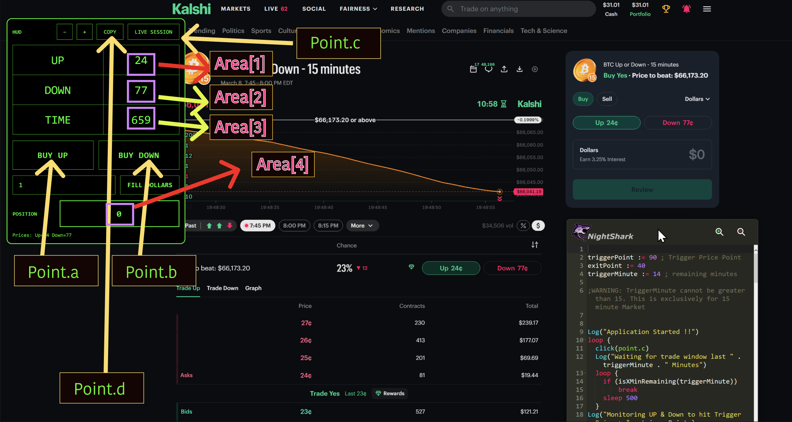

<!--
  TEMPLATE FOR YOUTUBE VIDEO DOCUMENTATION
  
  To use this template:
  1. Copy this file and rename it (e.g., video-1.mdx, scalping-strategy.mdx)
  2. Replace all placeholder text with your actual content
  3. Update the sidebar_position if needed
  4. Replace VIDEO_ID_HERE with your YouTube video ID
  5. Add your video thumbnail image to /static/img/ and update the path
  6. Paste your indicator and Nightshark code in the respective code blocks
-->

# Kalshi Trading Bot Version 2

Version 2 of the Kalshi 15-minute crypto market trading bot, built on top of v1 by popular request. This update adds fully customizable stop loss and time delay restriction features for the Kalshi 14-minute crypto market, giving you tighter risk control and smarter entry timing on every session.

{/* ## YouTube Video

<div style={{textAlign: 'center', margin: '2rem 0'}}>
  <iframe
    width="100%"
    height="617"
    src="https://www.youtube.com/embed/yKKjG_o63u4"
    title="YouTube video player"
    frameBorder="0"
    allow="accelerometer; autoplay; clipboard-write; encrypted-media; gyroscope; picture-in-picture; web-share"
    allowFullScreen
    style={{maxWidth: '1097px', width: '100%', aspectRatio: '16/9', border: 'none'}}>
  </iframe>
</div>
*/}


## Screen Map




## HUD v2 Code

```javascript
Script =
(%
(()=>{const t=document.getElementById("KALSHI_HUD");t&&t.remove(),window.__KALSHI_HUD_STATE__||(window.__KALSHI_HUD_STATE__={});const e=window.__KALSHI_HUD_STATE__;try{(e.observers||[]).forEach(t=>t.disconnect())}catch{}if(e.observers=[],e.abortController)try{e.abortController.abort()}catch{}e.abortController=new AbortController;const n=e.abortController.signal,o="#00ff66",i="__KALSHI_DOLLARS__",l="__KALSHI_HUD_POS__",r="__KALSHI_HUD_ZOOM__";let c=parseInt(localStorage.getItem(r),10)||16;let s=null,a=0;const u=()=>{if(s)return;const t=Date.now()-a;if(t>=300){a=Date.now();try{A(),H(),Y()}catch{}}else s=setTimeout(()=>{s=null,a=Date.now();try{A(),H(),Y()}catch{}},300-t)},d=document.createElement("div");d.id="KALSHI_HUD",d.style.cssText=``\n      position: fixed;\n      top: 90px;\n      left: 90px;\n      z-index: 2147483647;\n      background: black;\n      border: 2px solid ${o};\n      border-radius: 12px;\n      padding: 12px;\n      font-family: monospace;\n      color: ${o};\n      user-select: none;\n      min-width: 391px;\n    ``;try{const t=JSON.parse(localStorage.getItem(l)||"null");t&&Number.isFinite(t.left)&&Number.isFinite(t.top)&&(d.style.left=``${t.left}px``,d.style.top=``${t.top}px``)}catch{}const p=localStorage.getItem(i)||"";d.innerHTML=``\n      <div id="hudHeader" style="display:flex;align-items:center;justify-content:space-between;gap:12px;margin-bottom:12px;cursor:move">\n        <div style="opacity:.9;font-weight:700">HUD</div>\n        <div style="display:flex;gap:10px">\n          <button id="dec">−</button>\n          <button id="inc">+</button>\n          <button id="copyPrice">COPY</button>\n          <button id="liveSession">LIVE SESSION</button>\n        </div>\n      </div>\n  \n      <table id="tbl" style="border-collapse:collapse;font-size:${c}px;width:100%;text-align:center">\n        <tr>\n          <td style="border:1px solid ${o};padding:18px" id="aLabel">UP</td>\n          <td style="border:1px solid ${o};padding:18px" id="aPrice">--</td>\n        </tr>\n        <tr>\n          <td style="border:1px solid ${o};padding:18px" id="bLabel">DOWN</td>\n          <td style="border:1px solid ${o};padding:18px" id="bPrice">--</td>\n        </tr>\n        <tr>\n          <td style="border:1px solid ${o};padding:18px" id="tLabel">TIME</td>\n          <td style="border:1px solid ${o};padding:18px" id="tVal">--</td>\n        </tr>\n      </table>\n  \n      <div style="display:flex;gap:12px;margin-top:14px">\n        <button id="buyA" class="bigBuy">BUY UP</button>\n        <button id="buyB" class="bigBuy">BUY DOWN</button>\n      </div>\n  \n      <div style="display:flex;gap:12px;margin-top:14px;align-items:center">\n        <input id="dollarsBox" placeholder="DOLLARS" value="${p.replace(/"/g,"&quot;")}"\n          style="\n            flex:1;\n            background:black;\n            color:${o};\n            border:1px solid ${o};\n            padding:12px 14px;\n            font-family:monospace;\n            outline:none;\n            font-size:16px;\n          "/>\n        <button id="fillDollars" class="fillBtn">FILL DOLLARS</button>\n      </div>\n  \n      <div style="display:flex;gap:12px;margin-top:14px;align-items:center">\n        <div style="min-width:98px;opacity:0.9;font-weight:800">POSITION</div>\n        <div id="posBox" style="\n            flex:1;\n            border:2px solid ${o};\n            padding:18px 22px;\n            text-align:center;\n            letter-spacing:2px;\n            font-weight:900;\n            font-size: 20px;\n          ">0</div>\n      </div>\n  \n      <div id="dbg" style="margin-top:12px;font-size:12px;opacity:0.85;text-align:left"></div>\n    ``,d.querySelectorAll("button").forEach(t=>{t.style.cssText=``\n        background:black;\n        color:${o};\n        border:1px solid ${o};\n        cursor:pointer;\n        font-family:monospace;\n        white-space:nowrap;\n      ``}),d.querySelector("#dec").style.padding="10px 14px",d.querySelector("#inc").style.padding="10px 14px",d.querySelector("#copyPrice").style.padding="10px 16px",d.querySelector("#liveSession").style.padding="10px 16px",d.querySelectorAll(".bigBuy").forEach(t=>{t.style.flex="1",t.style.padding="22px 18px",t.style.fontSize="20px",t.style.fontWeight="900",t.style.letterSpacing="1px"});const f=d.querySelector("#fillDollars");f.style.padding="12px 16px",f.style.fontSize="16px",f.style.fontWeight="800",document.body.appendChild(d);const b=d.querySelector("#dbg"),y=d.querySelector("#posBox"),x=d.querySelector("#tbl"),S=d.querySelector("#hudHeader"),m=d.querySelector("#aLabel"),g=d.querySelector("#bLabel"),L=d.querySelector("#aPrice"),v=d.querySelector("#bPrice"),w=d.querySelector("#tVal"),E=t=>b.textContent=t;let h=!1,C=0,I=0;const $=()=>{try{localStorage.setItem(l,JSON.stringify({left:d.offsetLeft,top:d.offsetTop}))}catch{}};S.addEventListener("mousedown",t=>{t.target.closest("button")||t.target.closest("input")||(h=!0,C=t.clientX-d.offsetLeft,I=t.clientY-d.offsetTop,t.preventDefault())}),document.addEventListener("mousemove",t=>{h&&(d.style.left=t.clientX-C+"px",d.style.top=t.clientY-I+"px")},{signal:n}),document.addEventListener("mouseup",()=>{h&&(h=!1,$())},{signal:n}),window.addEventListener("blur",()=>{h&&(h=!1,$())},{signal:n}),d.querySelector("#inc").onclick=()=>{c+=2,x.style.fontSize=c+"px",localStorage.setItem(r,c)},d.querySelector("#dec").onclick=()=>{c=Math.max(10,c-2),x.style.fontSize=c+"px",localStorage.setItem(r,c)};const D=t=>new Promise(e=>setTimeout(e,t)),q=t=>(t||"").replace(/\s+/g," ").trim().toLowerCase();function O(t){if(!t)return!1;try{t.scrollIntoView({block:"center",inline:"center"})}catch{}const e=t.getBoundingClientRect(),n=Math.floor(e.left+e.width/2),o=Math.floor(e.top+e.height/2),i={bubbles:!0,cancelable:!0,composed:!0,view:window,clientX:n,clientY:o,screenX:n,screenY:o,button:0,buttons:1};try{return t.focus?.(),t.dispatchEvent(new PointerEvent("pointerdown",{...i,pointerId:1,pointerType:"mouse",isPrimary:!0})),t.dispatchEvent(new MouseEvent("mousedown",i)),t.dispatchEvent(new PointerEvent("pointerup",{...i,pointerId:1,pointerType:"mouse",isPrimary:!0})),t.dispatchEvent(new MouseEvent("mouseup",i)),t.dispatchEvent(new MouseEvent("click",i)),!0}catch{try{return t.click?.(),!0}catch{}return!1}}function U(){const t=[...document.querySelectorAll('button[data-testid="price-pill"]')];let e=null,n=null;for(const o of t){const t=q(o.textContent);!e&&/\bup\b/.test(t)&&(e=o),!n&&/\bdown\b/.test(t)&&(n=o)}if(e||n)return{aLabel:"UP",bLabel:"DOWN",aEl:e,bEl:n};let o=null,i=null;for(const e of t){const t=q(e.textContent);!o&&/\byes\b/.test(t)&&(o=e),!i&&/\bno\b/.test(t)&&(i=e)}return{aLabel:"UP",bLabel:"DOWN",aEl:o,bEl:i}}function _(t){if(!t)return null;const e=(t.textContent||"").match(/(\d+)\s*¢/);return e?e[1]:null}function A(){const{aLabel:t,bLabel:n,aEl:o,bEl:i}=U();m.textContent=t,g.textContent=n,L.textContent=_(o)??"--",v.textContent=_(i)??"--",e.aEl=o,e.bEl=i,E(``Prices: Up=${L.textContent} Down=${v.textContent}``)}const P=/^(\d+)\s+(yes|no)$/i;let B=null;const k=d.querySelector("#buyA"),N=d.querySelector("#buyB");function Y(){const{qty:t,side:e}=function(){const t=document.querySelectorAll("span");for(const e of t){if(d.contains(e))continue;if("Your position"!==(e.textContent||"").trim())continue;const t=e.closest("div");if(!t)continue;const n=t.querySelectorAll("span");for(const t of n){const e=(t.textContent||"").trim().match(P);if(e)return{qty:parseInt(e[1],10),side:e[2].toLowerCase()}}}const e=document.querySelectorAll('svg[data-testid="CheckCircleIcon"]');for(const t of e){if(d.contains(t))continue;const e=t.closest("div");if(!e)continue;const n=e.querySelectorAll("span");for(const t of n){const e=(t.textContent||"").trim().match(P);if(e)return{qty:parseInt(e[1],10),side:e[2].toLowerCase()}}}return{qty:0,side:null}}();y.textContent=t,B=e,"yes"===e?(k.textContent="SELL UP",N.textContent="BUY DOWN"):"no"===e?(k.textContent="BUY UP",N.textContent="SELL DOWN"):(k.textContent="BUY UP",N.textContent="BUY DOWN")}function H(){const t=function(){const t=document.querySelectorAll("span");for(const e of t){if(d.contains(e))continue;const t=e.style.fontFeatureSettings||"";if(t.includes("tnum")&&t.includes("cv09")){const t=(e.textContent||"").trim();if(/^\d{1,2}:\d{2}$/.test(t))return e}}return null}();if(!t)return void(w.textContent="--");const e=function(t){const e=t.split(":");if(2!==e.length)return null;const n=parseInt(e[0],10),o=parseInt(e[1],10);return isNaN(n)||isNaN(o)?null:60*n+o}((t.textContent||"").trim());w.textContent=null!==e?e:"--"}const T=d.querySelector("#dollarsBox");function M(){const t=(T.value||"").trim();if(!t)return E("FILL DOLLARS: empty");const e=t.replace(/[^\d.]/g,"");if(!e)return E("FILL DOLLARS: invalid");const n=document.querySelector("#cost-input")||null;if(!n)return E("FILL DOLLARS: dollars input not found");n.focus(),O(n),function(t,e){const n=Object.getPrototypeOf(t),o=Object.getOwnPropertyDescriptor(n,"value");o&&o.set?o.set.call(t,e):t.value=e}(n,e),n.dispatchEvent(new Event("input",{bubbles:!0})),n.dispatchEvent(new Event("change",{bubbles:!0})),n.blur(),E(``FILL DOLLARS: ${e}``)}function R(){return[...document.querySelectorAll("button")].find(t=>!d.contains(t)&&("review"===q(t.textContent)&&!t.disabled))||null}function W(){return[...document.querySelectorAll("button")].find(t=>!d.contains(t)&&("submit"===q(t.textContent)&&!t.disabled))||null}async function z(t,e,n=6e4){const o=Date.now();let i=100;for(;Date.now()-o<n;){const e=t();if(e)return e;await D(i),i=Math.min(1.5*i,1e3)}return null}async function K(t){const{aEl:e,bEl:n}=U(),o="UP"===t?e:n;if(!o)return E(``BUY ${t}: pill not found``);E(``BUY ${t}: select``),O(o),await D(200),E(``BUY ${t}: fill dollars``),M(),await D(300),E(``BUY ${t}: waiting for Review``);const i=await z(R);if(!i)return E(``BUY ${t}: Review not found``);E(``BUY ${t}: click Review``),O(i),E(``BUY ${t}: waiting for Submit``);const l=await z(W);if(!l)return E(``BUY ${t}: Submit not found``);E(``BUY ${t}: click Submit``),O(l),E(``BUY ${t}: DONE``)}function F(){return[...document.querySelectorAll('button[type="button"]')].find(t=>!d.contains(t)&&"sell"===q(t.textContent))||null}async function V(t){const{aEl:e,bEl:n}=U(),o="UP"===t?e:n;if(!o)return E(``SELL ${t}: pill not found``);E(``SELL ${t}: select pill``),O(o),await D(300),E(``SELL ${t}: switching to Sell tab``);const i=await z(F);if(!i)return E(``SELL ${t}: Sell tab not found``);O(i),await D(300),E(``SELL ${t}: fill dollars``),M(),await D(300),E(``SELL ${t}: waiting for Review``);const l=await z(R);if(!l)return E(``SELL ${t}: Review not found``);E(``SELL ${t}: click Review``),O(l),E(``SELL ${t}: waiting for Submit``);const r=await z(W);if(!r)return E(``SELL ${t}: Submit not found``);E(``SELL ${t}: click Submit``),O(r),E(``SELL ${t}: DONE``)}function X(){const t=function(){const t=document.querySelectorAll(".animate-ping");for(const e of t){if(d.contains(e))continue;const t=e.closest("a, button");if(t&&!d.contains(t)&&/\b\d{1,2}:\d{2}\s*(AM|PM)\b/i.test(t.textContent||""))return t}return null}();if(!t)return E("LIVE SESSION: no live session found");E("LIVE SESSION: clicking "+(t.textContent||"").trim()),O(t)}T.addEventListener("input",()=>localStorage.setItem(i,T.value)),d.querySelector("#fillDollars").onclick=()=>M(),k.onclick=()=>"yes"===B?V("UP"):K("UP"),N.onclick=()=>"no"===B?V("DOWN"):K("DOWN"),d.querySelector("#liveSession").onclick=()=>X(),d.querySelector("#copyPrice").onclick=()=>{let t=null;if("yes"===B){const e=L.textContent.trim();"--"!==e&&(t=e)}else if("no"===B){const e=v.textContent.trim();"--"!==e&&(t=e)}if(null===t)return E("COPY: no position to copy");navigator.clipboard.writeText(t).then(()=>E(``COPIED: ${t}``),()=>E("COPY: clipboard failed"))};const j=new MutationObserver(t=>{for(const e of t)if(!d.contains(e.target))return void u()});j.observe(document.body,{childList:!0,subtree:!0,characterData:!0}),e.observers.push(j),e.timerInterval&&clearInterval(e.timerInterval),e.timerInterval=setInterval(()=>{try{H(),Y(),function(){const t=document.querySelectorAll("button");for(const e of t)if(!d.contains(e)&&"done"===q(e.textContent)&&e.closest("div.sticky"))return E("AUTO-DISMISS: clicking Done"),void O(e)}()}catch{}},1e3),u(),E("Kalshi HUD: ON")})();
)

LoadIndicator() {
    global Script
    ClipSaved := ClipboardAll
    Clipboard :=
    Clipboard := Script
    ClipWait, 1
    SendInput, ^+j
    Sleep 1200
    SendInput, ^v
    Sleep 1200
    SendInput, allow pasting
    Sleep 1000
    SendInput, {Enter}
    Sleep 4000
    SendInput, ^v
    SendInput, {Enter}
    Sleep 1000
    Clipboard := ClipSaved
    sleep 1200
    SendInput, ^+j
}

click(point.a)
LoadIndicator()

```
## Nightshark TradingBot code

```javascript
triggerPoint := 90 ; BUY Price Point
exitPoint := 40 ; Stop Loss price point
triggerMinute := 14 ; remaining minutes

;WARNING: TriggerMinute cannot be greater than 15. This is exclusively for 15 minute Market


Log("Application Started !!")
loop {
  click(point.c)
  Log("Waiting for trade window last " . triggerMinute . " Minutes")
  loop {
    if (isXMinRemaining(triggerMinute))
        break
    sleep 500
  }
Log("Monitoring UP & Down to hit Trigger Price > " . triggerPoint )
  loop{
    read_areas()
    sleep 50 ; Adding a small sleep to prevent excessive CPU usage
  } until (toNumber(area[1]) > triggerPoint || toNumber(area[2]) > triggerPoint || is5SecBeforeQuarter() )
  
  if (toNumber(area[1]) > triggerPoint && toNumber(area[4]) = 0) {
    Log("UP triggered !! Placing Up Order")
    loop, 4{
        click(point.a)
        sleep 4000
        read_areas()
        if (toNumber(area[4]) > 0) {
          Log("UP position confirmed")
          break
        }
        else {
          Log("Position not confirmed ! Retrying ...")
          sleep 1000
        }
      } 
      Log("Monitoring StopLoss or Resolution")
      loop {
        read_areas()
        if (toNumber(area[1]) < exitPoint) {
          if(DoubleExitCheck() < exitPoint) {
            break
          }
        }
        sleep 50 ; Adding a small sleep to prevent excessive CPU usage
      } until (is5SecBeforeQuarter()) 
      if (toNumber(area[1]) < exitPoint && DoubleExitCheck() < exitPoint ) {
      Log("Stop Loss Triggered !! Closing UP Position")
      loop, 4 {
          click(point.a)
          sleep 4000
          read_areas()
          if (toNumber(area[4]) =0) {
            Log("UP Position closed ")
            break
          }
          else {
            Log("Position not confirmed ! Retrying ...")
            sleep 1000
          }
        }
      }
  }
  
  else if (toNumber(area[2]) > triggerPoint && toNumber(area[4]) = 0) {
  Log("Down triggered !! Placing Down Order")
      loop, 4 {
      click(point.b)
      sleep 4000
      read_areas()
      if (toNumber(area[4]) > 0) {
        Log("Down position confirmed")
        break
      } 
      else {
        Log("Position not confirmed ! Retrying ...")
        sleep 1000
      }
    }
    Log("Monitoring StopLoss or Resolution")
      loop {
        read_areas()
        if (toNumber(area[2]) < exitPoint) {
          if(DoubleExitCheck() < exitPoint) {
            break
          }
        }
        sleep 50 ; Adding a small sleep to prevent excessive CPU usage
      } until (is5SecBeforeQuarter()) 
    if (toNumber(area[2]) < exitPoint && DoubleExitCheck() < exitPoint) {
      Log("Stop Loss Triggered !! Closing Down Position")
      loop, 4 {
          click(point.b)
          sleep 4000
          read_areas()
          if (toNumber(area[4]) = 0) {
            Log("Down Position closed ")
            break
          }
          else {
            Log("Position not confirmed ! Retrying ...")
            sleep 1000
          }
        }
      }
  }
  
  
  else if (toNumber(area[4]) > 0) {
    Log("Position already exists , skipping this session")
  }
  
  Log("Waiting for Next Session")
  loop {
    read_area(3)
  } until (toNumber(area[3]) < 1 || toNumber(area[3]) > 850)
  Log("Loading New Session")
  sleep 5000
  click(point.c)
}

isXMinRemaining(x) {
    currentMinute := A_Min + 0
    remaining := 15 - Mod(currentMinute, 15)

    if (remaining <= x)
        return true
    else
        return false
}


is5SecBeforeQuarter() {
    minute := A_Min + 0
    second := A_Sec + 0

    if (Mod(minute, 15) = 14 && second >= 55) {
        Log("Last 5 second of session. waiting for new session")
        return true
       }
    else {
    return false
    }
}

DoubleExitCheck() {
  click(point.d)
  sleep 1000
  value := Clipboard
  return value
}


```
---

