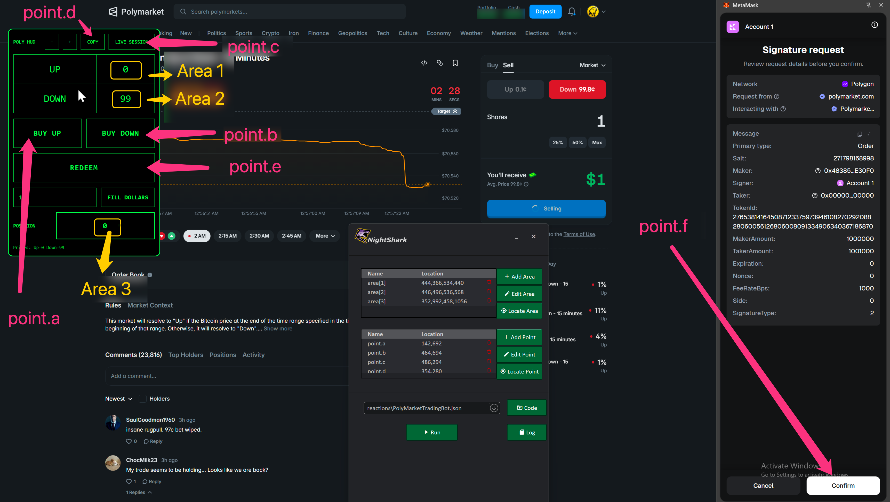

<!--
  TEMPLATE FOR YOUTUBE VIDEO DOCUMENTATION
  
  To use this template:
  1. Copy this file and rename it (e.g., video-1.mdx, scalping-strategy.mdx)
  2. Replace all placeholder text with your actual content
  3. Update the sidebar_position if needed
  4. Replace VIDEO_ID_HERE with your YouTube video ID
  5. Add your video thumbnail image to /static/img/ and update the path
  6. Paste your indicator and Nightshark code in the respective code blocks
-->

# Polymarket 15 Min Crypto Trading Bot

Automated trading bot for Polymarket's 15-minute crypto up/down markets. Features built-in stop loss for risk management, time delay restrictions for smarter entry timing, and wallet response time handling to account for on-chain confirmation delays. Designed to monitor price action, place trades at high-probability trigger points, and manage positions across sessions.

 {/*## YouTube Video

 <div style={{textAlign: 'center', margin: '2rem 0'}}>
  <iframe
    width="100%"
    height="100%"
    src="https://www.youtube.com/embed/VIDEO_ID_HERE"
    title="YouTube video player"
    frameBorder="0"
    allow="accelerometer; autoplay; clipboard-write; encrypted-media; gyroscope; picture-in-picture; web-share"
    allowFullScreen
    style={{maxWidth: '1097px', width: '100%', aspectRatio: '16/9', border: 'none'}}>
  </iframe>
</div> */}


## Screen Map

 


## HUD Code

```javascript

Script =
(%
(()=>{const t=document.getElementById("POLY_HUD");t&&t.remove(),window.__POLY_HUD_STATE__||(window.__POLY_HUD_STATE__={});const e=window.__POLY_HUD_STATE__;try{(e.observers||[]).forEach(t=>t.disconnect())}catch{}if(e.observers=[],e.abortController)try{e.abortController.abort()}catch{}e.abortController=new AbortController;const n=e.abortController.signal,o="#00ff66",i="__POLY_DOLLARS__",l="__POLY_HUD_POS__",r="__POLY_HUD_ZOOM__";let c=parseInt(localStorage.getItem(r),10)||16;let s=null,a=0;const u=(...t)=>t.forEach(t=>{try{t()}catch{}}),d=()=>{if(s)return;const t=Date.now()-a;t>=300?(a=Date.now(),u(U,N)):s=setTimeout(()=>{s=null,a=Date.now(),u(U,N)},300-t)},p=document.createElement("div");p.id="POLY_HUD",p.style.cssText=``\n    position: fixed;\n    top: 90px;\n    left: 90px;\n    z-index: 2147483647;\n    background: black;\n    border: 2px solid ${o};\n    border-radius: 12px;\n    padding: 12px;\n    font-family: monospace;\n    color: ${o};\n    user-select: none;\n    min-width: 391px;\n  ``;try{const t=JSON.parse(localStorage.getItem(l)||"null");t&&Number.isFinite(t.left)&&Number.isFinite(t.top)&&(p.style.left=``${t.left}px``,p.style.top=``${t.top}px``)}catch{}const f=localStorage.getItem(i)||"";p.innerHTML=``\n    <div id="hudHeader" style="display:flex;align-items:center;justify-content:space-between;gap:12px;margin-bottom:12px;cursor:move">\n      <div style="opacity:.9;font-weight:700">POLY HUD</div>\n      <div style="display:flex;gap:10px">\n        <button id="dec">−</button>\n        <button id="inc">+</button>\n        <button id="copyPrice">COPY</button>\n        <button id="liveSession">LIVE SESSION</button>\n      </div>\n    </div>\n\n    <table id="tbl" style="border-collapse:collapse;font-size:${c}px;width:100%;text-align:center">\n      <tr>\n        <td style="border:1px solid ${o};padding:18px" id="aLabel">UP</td>\n        <td style="border:1px solid ${o};padding:18px" id="aPrice">--</td>\n      </tr>\n      <tr>\n        <td style="border:1px solid ${o};padding:18px" id="bLabel">DOWN</td>\n        <td style="border:1px solid ${o};padding:18px" id="bPrice">--</td>\n      </tr>\n    </table>\n\n    <div style="display:flex;gap:12px;margin-top:14px">\n      <button id="buyA" class="bigBuy">BUY UP</button>\n      <button id="buyB" class="bigBuy">BUY DOWN</button>\n    </div>\n\n    <div style="display:flex;gap:12px;margin-top:14px">\n      <button id="redeemBtn" class="bigBuy">REDEEM</button>\n    </div>\n\n    <div style="display:flex;gap:12px;margin-top:14px;align-items:center">\n      <input id="dollarsBox" placeholder="DOLLARS" value="${f.replace(/"/g,"&quot;")}"\n        style="\n          flex:1;\n          background:black;\n          color:${o};\n          border:1px solid ${o};\n          padding:12px 14px;\n          font-family:monospace;\n          outline:none;\n          font-size:16px;\n        "/>\n      <button id="fillDollars" class="fillBtn">FILL DOLLARS</button>\n    </div>\n\n    <div style="display:flex;gap:12px;margin-top:14px;align-items:center">\n      <div style="min-width:98px;opacity:0.9;font-weight:800">POSITION</div>\n      <div id="posBox" style="\n          flex:1;\n          border:2px solid ${o};\n          padding:18px 22px;\n          text-align:center;\n          letter-spacing:2px;\n          font-weight:900;\n          font-size: 20px;\n        ">0</div>\n    </div>\n\n    <div id="dbg" style="margin-top:12px;font-size:12px;opacity:0.85;text-align:left"></div>\n  ``,p.querySelectorAll("button").forEach(t=>{t.style.cssText=``\n      background:black;\n      color:${o};\n      border:1px solid ${o};\n      cursor:pointer;\n      font-family:monospace;\n      white-space:nowrap;\n    ``}),p.querySelector("#dec").style.padding="10px 14px",p.querySelector("#inc").style.padding="10px 14px",p.querySelector("#copyPrice").style.padding="10px 16px",p.querySelector("#liveSession").style.padding="10px 16px",p.querySelectorAll(".bigBuy").forEach(t=>{t.style.flex="1",t.style.padding="22px 18px",t.style.fontSize="20px",t.style.fontWeight="900",t.style.letterSpacing="1px"});const b=p.querySelector("#fillDollars");b.style.padding="12px 16px",b.style.fontSize="16px",b.style.fontWeight="800",document.body.appendChild(p);const y=p.querySelector("#dbg"),x=p.querySelector("#posBox"),S=p.querySelector("#tbl"),g=p.querySelector("#hudHeader"),m=p.querySelector("#aLabel"),L=p.querySelector("#bLabel"),v=p.querySelector("#aPrice"),w=p.querySelector("#bPrice"),E=t=>y.textContent=t;let h=!1,O=0,q=0;const P=()=>{try{localStorage.setItem(l,JSON.stringify({left:p.offsetLeft,top:p.offsetTop}))}catch{}};g.addEventListener("mousedown",t=>{t.target.closest("button")||t.target.closest("input")||(h=!0,O=t.clientX-p.offsetLeft,q=t.clientY-p.offsetTop,t.preventDefault())}),document.addEventListener("mousemove",t=>{h&&(p.style.left=t.clientX-O+"px",p.style.top=t.clientY-q+"px")},{signal:n}),document.addEventListener("mouseup",()=>{h&&(h=!1,P())},{signal:n}),window.addEventListener("blur",()=>{h&&(h=!1,P())},{signal:n}),p.querySelector("#inc").onclick=()=>{c+=2,S.style.fontSize=c+"px",localStorage.setItem(r,c)},p.querySelector("#dec").onclick=()=>{c=Math.max(10,c-2),S.style.fontSize=c+"px",localStorage.setItem(r,c)};const C=t=>new Promise(e=>setTimeout(e,t)),D=t=>(t||"").replace(/\s+/g," ").trim().toLowerCase();function $(t){if(!t)return!1;try{t.scrollIntoView({block:"center",inline:"center"})}catch{}const e=t.getBoundingClientRect(),n=Math.floor(e.left+e.width/2),o=Math.floor(e.top+e.height/2),i={bubbles:!0,cancelable:!0,composed:!0,view:window,clientX:n,clientY:o,screenX:n,screenY:o,button:0,buttons:1};try{return t.focus?.(),t.dispatchEvent(new PointerEvent("pointerdown",{...i,pointerId:1,pointerType:"mouse",isPrimary:!0})),t.dispatchEvent(new MouseEvent("mousedown",i)),t.dispatchEvent(new PointerEvent("pointerup",{...i,pointerId:1,pointerType:"mouse",isPrimary:!0})),t.dispatchEvent(new MouseEvent("mouseup",i)),t.dispatchEvent(new MouseEvent("click",i)),!0}catch{try{return t.click?.(),!0}catch{}return!1}}function _(){const t=[...document.querySelectorAll("button.trading-button")];let e=null,n=null;for(const o of t){if(p.contains(o))continue;if("blue"===o.dataset.color)continue;const t=D(o.textContent);!e&&/\bup/.test(t)&&(e=o),!n&&/\bdown/.test(t)&&(n=o)}return{aLabel:"UP",bLabel:"DOWN",aEl:e,bEl:n}}function I(t){if(!t)return null;const e=(t.textContent||"").match(/([\d.]+)\s*¢/);return e?String(Math.floor(parseFloat(e[1]))):null}function U(){const{aLabel:t,bLabel:n,aEl:o,bEl:i}=_();m.textContent=t,L.textContent=n,v.textContent=I(o)??"--",w.textContent=I(i)??"--",e.aEl=o,e.bEl=i,E(``Prices: Up=${v.textContent} Down=${w.textContent}``)}let Y=null;const A=p.querySelector("#buyA"),B=p.querySelector("#buyB");function N(){let t=function(){const t=document.querySelectorAll("h3");for(const e of t){if(p.contains(e))continue;if("Positions"!==(e.textContent||"").trim())continue;const t=e.closest("div");if(!t)continue;const n=t.querySelectorAll("div.whitespace-nowrap.text-sm");for(let t=0;t<n.length;t++){const e=(n[t].textContent||"").trim();if(/^up$/i.test(e)&&t+1<n.length){const e=(n[t+1].textContent||"").trim(),o=parseInt(e,10);if(!isNaN(o)&&o>0)return{qty:o,side:"up"}}if(/^down$/i.test(e)&&t+1<n.length){const e=(n[t+1].textContent||"").trim(),o=parseInt(e,10);if(!isNaN(o)&&o>0)return{qty:o,side:"down"}}}}return{qty:0,side:null}}();0===t.qty&&(t=function(){const t=document.querySelectorAll("span");for(const e of t){if(p.contains(e))continue;const t=(e.textContent||"").trim().match(/([\d.]+)\s+shares?/i);if(t){const n=Math.floor(parseFloat(t[1]));if(n<=0)continue;let o=null,i=e.parentElement;for(;i;){if(i.classList.contains("flex-1")){const t=i.parentElement;if(t){const e=[...t.children].filter(t=>t.classList.contains("flex-1"));2===e.length&&(o=0===e.indexOf(i)?"up":"down")}break}i=i.parentElement}return{qty:n,side:o}}}return{qty:0,side:null}}()),x.textContent=t.qty,Y=t.side,"up"===t.side?(A.textContent="SELL UP",B.textContent="BUY DOWN"):"down"===t.side?(A.textContent="BUY UP",B.textContent="SELL DOWN"):(A.textContent="BUY UP",B.textContent="BUY DOWN")}const k=p.querySelector("#dollarsBox");function T(t,e){const n=document.querySelector("#market-order-amount-input")||null;if(!n)return E(``${e}: amount input not found``);n.focus(),$(n),function(t,e){const n=Object.getPrototypeOf(t),o=Object.getOwnPropertyDescriptor(n,"value");o&&o.set?o.set.call(t,e):t.value=e}(n,t),n.dispatchEvent(new Event("input",{bubbles:!0})),n.dispatchEvent(new Event("change",{bubbles:!0})),n.blur(),E(``${e}: ${t}``)}function H(){const t=(k.value||"").trim();if(!t)return E("FILL DOLLARS: empty");const e=t.replace(/[^\d.]/g,"");if(!e)return E("FILL DOLLARS: invalid");T(e,"FILL DOLLARS")}function M(){const t=document.querySelectorAll('button[role="radio"]');for(const e of t)if(!p.contains(e)&&("SELL"===e.value||"sell"===D(e.textContent)))return e;return null}function z(){const t=document.querySelectorAll("button.trading-button");for(const e of t)if(!p.contains(e)&&"blue"===e.dataset.color)return e;return null}async function W(t,e=6e4){const n=Date.now();let o=100;for(;Date.now()-n<e;){const e=t();if(e)return e;await C(o),o=Math.min(1.5*o,1e3)}return null}async function F(t){const{aEl:e,bEl:n}=_(),o="UP"===t?e:n;if(!o)return E(``BUY ${t}: pill not found``);const i=function(){const t=document.querySelectorAll('button[role="radio"]');for(const e of t)if(!p.contains(e)&&("BUY"===e.value||"buy"===D(e.textContent)))return e;return null}();i&&"checked"!==i.dataset.state&&(E(``BUY ${t}: switching to Buy tab``),$(i),await C(300)),E(``BUY ${t}: select``),$(o),await C(200),E(``BUY ${t}: fill dollars``),H(),await C(300),E(``BUY ${t}: waiting for action button``);const l=await W(z);if(!l)return E(``BUY ${t}: action button not found``);E(``BUY ${t}: click action``),$(l),await C(500);const r=M();r&&$(r),E(``BUY ${t}: DONE``)}async function R(t){const{aEl:e,bEl:n}=_(),o="UP"===t?e:n;if(!o)return E(``SELL ${t}: pill not found``);const i=M();if(!i)return E(``SELL ${t}: Sell tab not found``);E(``SELL ${t}: switching to Sell tab``),$(i),await C(300),E(``SELL ${t}: select pill``),$(o),await C(300),E(``SELL ${t}: clicking Max``);const r=await W(()=>{const t=document.querySelectorAll("button");for(const e of t){if(p.contains(e))continue;if(/^max$/i.test((e.textContent||"").trim()))return e}return null},5e3);if(!r)return E(``SELL ${t}: Max button not found``);$(r),await C(300),E(``SELL ${t}: waiting for action button``);const l=await W(z);if(!l)return E(``SELL ${t}: action button not found``);E(``SELL ${t}: click action``),$(l),E(``SELL ${t}: DONE``)}function V(){const t=function(){const t=document.querySelector('button[aria-label="Go to live market"]');return t&&!p.contains(t)?t:null}();if(!t)return E("LIVE SESSION: no live session found");E("LIVE SESSION: clicking "+(t.textContent||"").trim()),$(t)}function X(){const t=document.querySelectorAll("button");for(const e of t)if(!p.contains(e)&&"done"===D(e.textContent))return E("AUTO-DISMISS: clicking Done"),void $(e)}k.addEventListener("input",()=>localStorage.setItem(i,k.value)),p.querySelector("#fillDollars").onclick=()=>H(),A.onclick=()=>"up"===Y?R("UP"):F("UP"),B.onclick=()=>"down"===Y?R("DOWN"):F("DOWN");function Z1(){const t=document.querySelectorAll("button");for(const e of t){if(p.contains(e))continue;if(/\bcash\b/i.test((e.textContent||"").trim()))return e}return null}function Z2(){const t=document.querySelectorAll("button");for(const e of t){if(p.contains(e))continue;if(e.closest('[role="dialog"]'))continue;if(/^claim$/i.test((e.textContent||"").trim()))return e}return null}function Z3(){const t=document.querySelector('[role="dialog"]');if(!t)return null;const e=t.querySelectorAll("button");for(const n of e)if(/\bclaim\b/i.test(n.textContent))return n;return null}async function Z4(){E("REDEEM: clicking Cash button");const t=await W(Z1,5e3);if(!t)return E("REDEEM: Cash button not found");$(t),await C(500);E("REDEEM: waiting for Claim button");const e=await W(Z2,1e4);if(!e)return E("REDEEM: no claimable position found");$(e),await C(500);E("REDEEM: waiting for Claim dialog");const n=await W(Z3,1e4);if(!n)return E("REDEEM: Claim dialog not found");$(n),E("REDEEM: DONE")}p.querySelector("#redeemBtn").onclick=()=>Z4(),p.querySelector("#copyPrice").onclick=()=>{let t=null;if("up"===Y){const e=v.textContent.trim();"--"!==e&&(t=e)}else if("down"===Y){const e=w.textContent.trim();"--"!==e&&(t=e)}if(null===t)return E("COPY: no position to copy");navigator.clipboard.writeText(t).then(()=>E(``COPIED: ${t}``),()=>E("COPY: clipboard failed"))},p.querySelector("#liveSession").onclick=()=>V();const j=new MutationObserver(t=>{for(const e of t)if(!p.contains(e.target))return void d()});j.observe(document.body,{childList:!0,subtree:!0,characterData:!0}),e.observers.push(j),e.timerInterval&&clearInterval(e.timerInterval),e.timerInterval=setInterval(()=>{u(N,X)},1e3),d(),E("Poly HUD: ON")})();
)

LoadIndicator() {
    global Script
    Clipboard :=
    Clipboard := Script
    ClipWait, 1
    Send , ^+j
    Sleep 1200
    Send , ^v
    Sleep 1200
    SendInput, allow pasting
    Sleep 6000
    Send , {Enter}
    Sleep 3000
    Send , ^v
    Send, {Enter}
    sleep 3000
    Send, ^+j
}

click(point.a)
LoadIndicator()

```

## Nightshark TradingBot Code

```javascript
;=== THIS IS FOR POLYMARKET 15-MINUTE CRYPTO MARKET ONLY ====
triggerPoint := 70 ; BUY Price Point
exitPoint := 40 ; Stop Loss price point
triggerMinute := 8 ; remaining minutes
walletDelay := 3500 ; 3.5 seconds, you can adjust this based on your wallet response time

Log("Application Started !!")
loop {
  click(point.c)
  sleep 2000
  if (Mod(A_Index, 2) = 0) {
    Log("===REDEEMING REWARDS===")
    redeem()
  }
  Log("Waiting for trade window last " . triggerMinute . " Minutes")
  loop {
    if (isXMinRemaining(triggerMinute))
        break
    sleep 500
  }
Log("Monitoring UP & Down to hit Trigger Price > " . triggerPoint )
  loop{
    read_areas()
    sleep 50 ; Adding a small sleep to prevent excessive CPU usage
  } until (toNumber(area[1]) > triggerPoint || toNumber(area[2]) > triggerPoint || is5SecBeforeQuarter() )
  
  if (toNumber(area[1]) > triggerPoint && toNumber(area[3]) = 0) {
    Log("UP triggered !! Placing Up Order")
    loop, 4{
        click(point.a)
        sleep walletDelay
        click(point.f) ; Wallet signature
        sleep 4000
        read_areas()
        if (toNumber(area[3]) > 0) {
          Log("UP position confirmed")
          break
        }
        else {
          Log("Position not confirmed ! Retrying ...")
          sleep 1000
        }
      }
      
      if(toNumber(area[3]) > 0) {
        Log("Monitoring StopLoss @" . exitPoint . " or Resolution")
        loop {
          read_areas()
          if (toNumber(area[1]) < exitPoint) {
            if(DoubleExitCheck() < exitPoint) {
              break
            }
          }
          sleep 50 ; Adding a small sleep to prevent excessive CPU usage
        } until (is5SecBeforeQuarter()) 
        if (toNumber(area[1]) < exitPoint && DoubleExitCheck() < exitPoint && toNumber(area[1]) > 2) {
        Log("Stop Loss Triggered !! Closing UP Position")
        loop, 4 {
            click(point.a)
            sleep walletDelay
            click(point.f)
            sleep 4000
            read_areas()
            if (toNumber(area[3]) = 0) {
              Log("UP Position closed ")
              break
            }
            else {
              Log("Position not confirmed ! Retrying ...")
              sleep 1000
            }
          }
        }
      }
      else {
        Log("Position did not filled on 4 retries ! Skipping to next session")
      }
  }
  
  else if (toNumber(area[2]) > triggerPoint && toNumber(area[3]) = 0) {
  Log("Down triggered !! Placing Down Order")
      loop, 4 {
      click(point.b)
      sleep walletDelay
      click(point.f)
      sleep 4000
      read_areas()
      if (toNumber(area[3]) > 0) {
        Log("Down position confirmed")
        break
      } 
      else {
        Log("Position not confirmed ! Retrying ...")
        sleep 1000
      }
    }
    if(toNumber(area[3]) > 0) {
      Log("Monitoring StopLoss @" . exitPoint . " or Resolution")
        loop {
          read_areas()
          if (toNumber(area[2]) < exitPoint) {
            if(DoubleExitCheck() < exitPoint) {
              break
            }
          }
          sleep 50 ; Adding a small sleep to prevent excessive CPU usage
        } until (is5SecBeforeQuarter()) 
      if (toNumber(area[2]) < exitPoint && DoubleExitCheck() < exitPoint && toNumber(area[2]) > 2) {
        Log("Stop Loss Triggered !! Closing Down Position")
        loop, 4 {
            click(point.b)
            sleep walletDelay
            click(point.f)
            sleep 4000
            read_areas()
            if (toNumber(area[3]) = 0) {
              Log("Down Position closed ")
              break
            }
            else {
              Log("Position not confirmed ! Retrying ...")
              sleep 1000
            }
          }
      }
    }
      else {
        Log("Position did not filled on 4 retries ! Skipping to next session")
      }
  }
  
  
  else if (toNumber(area[3]) > 0) {
    Log("Position already exists , skipping this session")
  }
  
  Log("Waiting for end of Session")
  loop {
    sleep 100
  } until (is5SecBeforeQuarter()) 
  sleep 6000
}

isXMinRemaining(x) {
    currentMinute := A_Min + 0
    remaining := 15 - Mod(currentMinute, 15)

    if (remaining <= x)
        return true
    else
        return false
}


is5SecBeforeQuarter() {
    minute := A_Min + 0
    second := A_Sec + 0

    if (Mod(minute, 15) = 14 && second >= 55) {
        Log("Last 5 second. launching for new session")
        return true
       }
    else {
    return false
    }
}

DoubleExitCheck() {
  click(point.d)
  sleep 1000
  value := Clipboard
  return value
}

redeem() {
  click(point.e)
  click(point.e)
  sleep 6000
  click(point.f)
  Send, !{Left}
}
```
---
