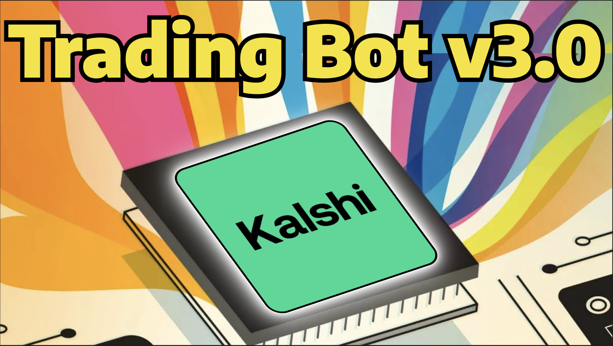

<!--
  TEMPLATE FOR YOUTUBE VIDEO DOCUMENTATION
  
  To use this template:
  1. Copy this file and rename it (e.g., video-1.mdx, scalping-strategy.mdx)
  2. Replace all placeholder text with your actual content
  3. Update the sidebar_position if needed
  4. Replace VIDEO_ID_HERE with your YouTube video ID
  5. Add your video thumbnail image to /static/img/ and update the path
  6. Paste your indicator and Nightshark code in the respective code blocks
-->

# Video 9: Kashi Trading Bot Version 3

This third iteration brings in an entirely new approach of routing orders through the Kalshi backend API rather than the front end. **The story behind Version 3 is that ongoing Kalshi updates kept breaking the HUD for Version 1 and Version 2.** To solve this, this strategy implements similar logic by bypassing the front end entirely and hooking directly into the Kalshi backend. This results in a much more lightweight and accurate setup.



:::tip Git Installation Required
This setup requires the installation of Git. Please download and install Git using the link below:
<a className="btn-git-shine" href="https://git-scm.com/install/windows" target="_blank" rel="noopener noreferrer">
  <span>Download Git</span>
</a>
:::

{/* ## YouTube Video

<div style={{textAlign: 'center', margin: '2rem 0'}}>
  <iframe
    width="100%"
    height="617"
    src="https://www.youtube.com/embed/yKKjG_o63u4"
    title="YouTube video player"
    frameBorder="0"
    allow="accelerometer; autoplay; clipboard-write; encrypted-media; gyroscope; picture-in-picture; web-share"
    allowFullScreen
    style={{maxWidth: '1097px', width: '100%', aspectRatio: '16/9', border: 'none'}}>
  </iframe>
</div>
*/}

## API key Filename
```
apikey
```
## Private Key Filename
```
privatekey
```

## Nightshark Code

```python
; =========================
; Strategy Configuration
; =========================
timeDelay := 8                ; activation window in remaining minutes
Entry := 0.85                 ; enter when side price >= 85c
Exit := 0.40                  ; stop/exit when entered side price < 40c
assets := ["BTC"] ; assets to trade
orderSize := 1

; =============================================================
; Kalshi Order API Config 
; DO NOT TOUCH BELOW VALUES UNLESS YOU KNOW WHAT YOU ARE DOING
; =============================================================
enableLiveOrders := true
pollIntervalMs := 700
restDelay := 600             ; ms to let order rest before checking position
entryDiff := 0.02           
exitDiff := 0.02  
kalshiApiBase := "https://api.elections.kalshi.com"
assetSeriesMap := { "BTC": "KXBTC15M", "ETH": "KXETH15M", "SOL": "KXSOL15M", "XRP": "KXXRP15M", "DOGE": "KXDOGE15M", "HYPE": "KXHYPE15M", "BNB": "KXBNB15M" }
kalshiApiKeyId := ""
kalshiApiKeyFile := "reactions/apikey.json"          
kalshiPrivateKeyFile := "reactions/privatekey.json"  
kalshiPrivateKeyPath := ""
kalshiApiKeyResolvedPath := ""
kalshiPrivateKeyResolvedPath := ""
kalshiKeyPassphrase := "" 
kalshiOpenSSLPath := ""                 

; Track one open position per asset.
positions := {}
assetPhase := {}              ; WAIT_WINDOW | MONITORING | IN_POSITION
assetSessionQuarter := {}     ; quarter index currently tracked per asset
assetLastPriceLogTick := {}   ; throttled logging control

LoadKalshiCredentialsFromFiles()
if (kalshiOpenSSLPath = "")
    kalshiOpenSSLPath := FindOpenSSL()
Log("Application Started | Entry: " Entry " | Exit: " Exit " | Window: last " timeDelay "m")
StartupCredentialCheck()

loop {
    for _, asset in assets {
        snapshot := GetKalshiMarketSnapshot(asset)
        if !IsObject(snapshot) {
            LogOnce(asset, "NO_DATA", asset " Waiting for market data")
            continue
        }

        up := snapshot.up
        down := snapshot.down
        minsLeft := (snapshot.minutesLeft != "") ? snapshot.minutesLeft : MinutesRemainingInQuarter()
        inEntryWindow := (minsLeft <= timeDelay)
        quarter := (snapshot.closeTime != "") ? snapshot.closeTime : CurrentQuarterIndex()

        if (!assetSessionQuarter.HasKey(asset) || assetSessionQuarter[asset] != quarter) {
            assetSessionQuarter[asset] := quarter
            assetPhase[asset] := "WAIT_WINDOW"
            assetLastPriceLogTick[asset] := 0
            LogOnceReset(asset)
            Log(asset " New session (" snapshot.marketTicker ")")

            if (snapshot.marketTicker != "" && HasExistingPosition(snapshot.marketTicker))
                assetPhase[asset] := "HAS_POSITION"
        }

        if IsObject(positions[asset]) {
            pos := positions[asset]
            current := (pos.side = "UP") ? up : down
            assetPhase[asset] := "IN_POSITION"

            if (CurrentQuarterIndex() != pos.quarterIndex) {
                Log(asset " " pos.side " held to resolution")
                positions.Delete(asset)
                assetPhase[asset] := "WAIT_WINDOW"
                continue
            }

            if (current < Exit) {
                Log(asset " Stop-loss triggered @ " Fmt(current) " < " Fmt(Exit))
                sellConfirmed := false
                loop, 4 {
                    if SellPosition(asset, pos.side, current, "exit_below_" Exit) {
                        Log(asset " Position closed")
                        sellConfirmed := true
                        break
                    }
                    if (A_Index < 4) {
                        Log(asset " Sell retry " A_Index "/3")
                        Sleep 1000
                    }
                }
                if (!sellConfirmed)
                    Log(asset " SELL FAILED after 4 retries")
                positions.Delete(asset)
                assetPhase[asset] := "STOPPED_OUT"
                Log(asset " Stopped out, waiting for next session")
            }
            continue
        }

        if (assetPhase[asset] = "STOPPED_OUT") {
            LogOnce(asset, "STOPPED_OUT", asset " Stopped out, waiting for next session")
            continue
        }

        if (assetPhase[asset] = "BUY_FAILED") {
            LogOnce(asset, "BUY_FAILED", asset " Buy failed earlier, waiting for next session")
            continue
        }

        if (assetPhase[asset] = "HAS_POSITION") {
            LogOnce(asset, "HAS_POSITION", asset " Existing position, waiting for next session")
            continue
        }

        ; --- Waiting for entry window ---
        if (!inEntryWindow) {
            LogOnce(asset, "WAIT_WINDOW", asset " Waiting for last " timeDelay " minutes")
            assetPhase[asset] := "WAIT_WINDOW"
            continue
        }

        ; --- Entry window open: monitoring prices ---
        if (!assetPhase.HasKey(asset) || assetPhase[asset] != "MONITORING") {
            assetPhase[asset] := "MONITORING"
            Log(asset " Monitoring for entry > " Fmt(Entry) " | UP: " Fmt(up) " DOWN: " Fmt(down))
        }

        side := ""
        entryPrice := ""
        if (up >= Entry || down >= Entry) {
            if (up >= down) {
                side := "UP"
                entryPrice := up
            } else {
                side := "DOWN"
                entryPrice := down
            }
        }

        if (side = "")
            continue

        if (entryPrice > 0.98) {
            LogOnce(asset, "PRICE_HIGH", asset " Price too high (" entryPrice "), waiting for drop")
            continue
        }

        if !CanPlaceOrderNow(asset) {
            LogOnce(asset, "NO_CREDS", asset " Missing credentials, cannot place orders")
            continue
        }

        if HasExistingPosition(snapshot.marketTicker) {
            assetPhase[asset] := "HAS_POSITION"
            Log(asset " Existing position found, waiting for next session")
            continue
        }

        Log(asset " " side " triggered @ " Fmt(entryPrice) " — placing order")
        buyConfirmed := false
        loop, 4 {
            if BuyPosition(asset, snapshot.marketTicker, side, entryPrice) {
                Log(asset " Position confirmed")
                buyConfirmed := true
                break
            }
            if (A_Index < 4) {
                Log(asset " Retry " A_Index "/3")
                Sleep 1000
            }
        }

        if (buyConfirmed) {
            positions[asset] := { side: side, entry: entryPrice, ticker: snapshot.marketTicker, quarterIndex: CurrentQuarterIndex() }
            assetPhase[asset] := "IN_POSITION"
            assetLastPriceLogTick[asset] := 0
            Log(asset " Monitoring stop-loss @ " Fmt(Exit))
        } else {
            assetPhase[asset] := "BUY_FAILED"
            Log(asset " Order not filled after 4 attempts, skipping session")
        }
    }

    Sleep %pollIntervalMs%
}

LogOnce(asset, reason, msg) {
    global logOnceKeys
    if !IsObject(logOnceKeys)
        logOnceKeys := {}
    key := asset "|" reason
    if (logOnceKeys.HasKey(key))
        return
    logOnceKeys[key] := true
    Log(msg)
}

LogOnceReset(asset) {
    global logOnceKeys
    if !IsObject(logOnceKeys)
        return
    toRemove := []
    for k, _ in logOnceKeys {
        if (InStr(k, asset "|") = 1)
            toRemove.Push(k)
    }
    for _, k in toRemove
        logOnceKeys.Delete(k)
}

Fmt(price) {
    return Round(price + 0, 2)
}

BuyPosition(asset, marketTicker, side, price) {
    global orderSize
    return PlaceKalshiOrder("BUY", marketTicker, side, price, orderSize)
}

SellPosition(asset, side, price, reason) {
    global positions, orderSize
    if !IsObject(positions[asset]) || !positions[asset].HasKey("ticker")
        return true
    return PlaceKalshiOrder("SELL", positions[asset].ticker, side, price, orderSize)
}

HasExistingPosition(marketTicker) {
    if (marketTicker = "")
        return false

    res := KalshiSignedRequest("GET", "/trade-api/v2/portfolio/positions?ticker=" marketTicker)
    if !IsObject(res) || (res.status != 200)
        return false

    qty := JsonField(res.body, "position_fp")
    if (qty = "")
        qty := JsonField(res.body, "market_exposure_dollars")

    return (qty != "" && Abs(qty + 0) > 0)
}

PlaceKalshiOrder(action, marketTicker, side, price, size) {
    global enableLiveOrders, kalshiApiKeyId, kalshiPrivateKeyPath, restDelay, entryDiff, exitDiff
    if (!enableLiveOrders)
        return true

    if (kalshiApiKeyId = "" || kalshiPrivateKeyPath = "")
        return false

    if (marketTicker = "")
        return false

    isBuy := (ToLower(action) = "buy")
    if (isBuy)
        price := price + entryDiff
    else
        price := price - exitDiff
    apiAction := ToLower(action)
    apiSide := (side = "UP") ? "yes" : "no"
    cents := Round(price * 100)
    if (cents < 1)
        cents := 1
    else if (cents > 99)
        cents := 99

    priceField := (apiSide = "yes") ? "yes_price" : "no_price"
    clientOrderId := BuildClientOrderId(marketTicker, apiAction, apiSide)

    payload := "{"
        . """ticker"":""" marketTicker ""","
        . """action"":""" apiAction ""","
        . """side"":""" apiSide ""","
        . """count"":" size ","
        . """type"":""limit"","
        . """" priceField """:" cents ","
        . """client_order_id"":""" clientOrderId """"
        . "}"

    res := KalshiSignedRequest("POST", "/trade-api/v2/portfolio/orders", payload)
    if !IsObject(res)
        return false

    if (res.status != 201 && res.status != 200)
        return false

    Sleep %restDelay%
    hasPos := HasExistingPosition(marketTicker)
    return (isBuy ? hasPos : !hasPos)
}

CancelKalshiOrder(orderId) {
    if (orderId = "")
        return
    KalshiSignedRequest("DELETE", "/trade-api/v2/portfolio/orders/" orderId)
}

LoadKalshiCredentialsFromFiles() {
    global kalshiApiKeyId, kalshiApiKeyFile, kalshiPrivateKeyPath, kalshiPrivateKeyFile, kalshiApiKeyResolvedPath, kalshiPrivateKeyResolvedPath

    kalshiApiKeyId := ""
    kalshiApiKeyResolvedPath := ResolveCredentialPath(kalshiApiKeyFile)
    if (kalshiApiKeyResolvedPath != "") {
        FileRead, apiRaw, %kalshiApiKeyResolvedPath%
        apiCode := JsonField(apiRaw, "code")
        if (apiCode != "")
            kalshiApiKeyId := Trim(JsonUnescape(apiCode))
    }

    kalshiPrivateKeyPath := ""
    kalshiPrivateKeyResolvedPath := ResolveCredentialPath(kalshiPrivateKeyFile)
    if (kalshiPrivateKeyResolvedPath != "") {
        FileRead, keyRaw, %kalshiPrivateKeyResolvedPath%
        keyCode := JsonField(keyRaw, "code")
        if (keyCode != "") {
            pemText := JsonUnescape(keyCode)
            tempBase := A_Temp
            if (tempBase = "")
                tempBase := A_ScriptDir
            tempPem := tempBase "\kalshi_ahk\privatekey_runtime.pem"
            FileCreateDir, % tempBase "\kalshi_ahk"
            FileDelete, %tempPem%
            FileAppend, %pemText%, %tempPem%
            kalshiPrivateKeyPath := tempPem
        }
    }
}

StartupCredentialCheck() {
    global enableLiveOrders, kalshiApiKeyId, kalshiPrivateKeyPath, kalshiOpenSSLPath

    apiReady := (kalshiApiKeyId != "")
    keyReady := (kalshiPrivateKeyPath != "" && FileExist(kalshiPrivateKeyPath))
    sslOut := RunAndCapture(QuoteForCmd(kalshiOpenSSLPath) " version")
    sslReady := InStr(sslOut, "OpenSSL")

    if (apiReady && keyReady && sslReady) {
        Log("Credentials processed successfully")
        return
    }

    if (!apiReady)
        Log("ERROR: API key not loaded")
    if (!keyReady)
        Log("ERROR: Private key not loaded")
    if (!sslReady)
        Log("ERROR: OpenSSL not found")
    Log("Please fix API credentials. Stopping script.")
    stopCode()
}

ResolveCredentialPath(pathSpec) {
    if (pathSpec = "")
        return ""

    if FileExist(pathSpec)
        return pathSpec

    normalized := StrReplace(pathSpec, "\", "/")
    if FileExist(normalized)
        return normalized

    relative := normalized
    while (SubStr(relative, 1, 1) = "/" || SubStr(relative, 1, 1) = "\")
        relative := SubStr(relative, 2)

    fromScriptDir := A_ScriptDir "/" relative
    if FileExist(fromScriptDir)
        return fromScriptDir

    fromScriptDirBackslash := StrReplace(fromScriptDir, "/", "\")
    if FileExist(fromScriptDirBackslash)
        return fromScriptDirBackslash

    return ""
}

JsonUnescape(s) {
    s := StrReplace(s, "\/", "/")
    s := StrReplace(s, "\n", "`n")
    s := StrReplace(s, "\r", "`r")
    s := StrReplace(s, "\t", A_Tab)
    s := StrReplace(s, Chr(92) Chr(34), Chr(34))
    s := StrReplace(s, Chr(92) Chr(92), Chr(92))
    return s
}

KalshiSignedRequest(method, endpointPath, bodyJson := "") {
    global kalshiApiBase, kalshiApiKeyId
    timestamp := CurrentTimeMillis()
    signPath := endpointPath
    if InStr(signPath, "?")
        signPath := SubStr(signPath, 1, InStr(signPath, "?") - 1)

    signature := SignKalshiMessage(timestamp method signPath)
    if (signature = "")
        return false

    url := kalshiApiBase endpointPath
    global httpSignedObj
    if !IsObject(httpSignedObj)
        httpSignedObj := ComObjCreate("WinHttp.WinHttpRequest.5.1")
    http := httpSignedObj
    http.Option(9) := 2048 | 8192
    http.Open(method, url, false)
    http.SetTimeouts(1000, 1000, 3000, 5000)
    http.SetRequestHeader("User-Agent", "Mozilla/5.0")
    http.SetRequestHeader("Cache-Control", "no-cache, no-store")
    http.SetRequestHeader("Pragma", "no-cache")
    http.SetRequestHeader("KALSHI-ACCESS-KEY", kalshiApiKeyId)
    http.SetRequestHeader("KALSHI-ACCESS-TIMESTAMP", timestamp)
    http.SetRequestHeader("KALSHI-ACCESS-SIGNATURE", signature)
    http.SetRequestHeader("Content-Type", "application/json")

    try {
        if (bodyJson != "")
            http.Send(bodyJson)
        else
            http.Send()
    } catch e {
        httpSignedObj := ""
        return false
    }

    obj := {}
    obj.status := http.Status
    obj.body := http.ResponseText
    return obj
}

SignKalshiMessage(message) {
    global kalshiPrivateKeyPath, kalshiKeyPassphrase, kalshiOpenSSLPath
    if (kalshiPrivateKeyPath = "" || !FileExist(kalshiPrivateKeyPath))
        return ""

    tempDir := A_Temp
    if (tempDir = "")
        tempDir := A_ScriptDir
    tempDir := tempDir "\kalshi_ahk"
    FileCreateDir, %tempDir%

    uid := A_TickCount
    msgFile := tempDir "\msg_" uid ".txt"
    sigFile := tempDir "\sig_" uid ".bin"
    FileDelete, %msgFile%
    FileDelete, %sigFile%
    FileAppend, %message%, %msgFile%

    if (!FileExist(msgFile))
        return ""

    passArg := ""
    if (kalshiKeyPassphrase != "")
        passArg := " -passin pass:" QuoteForCmd(kalshiKeyPassphrase)

    signCmd := QuoteForCmd(kalshiOpenSSLPath)
        . " dgst -sha256 -sigopt rsa_padding_mode:pss -sigopt rsa_pss_saltlen:digest -sign "
        . QuoteForCmd(kalshiPrivateKeyPath)
        . passArg
        . " -out " QuoteForCmd(sigFile) " " QuoteForCmd(msgFile)

    RunAndCapture(signCmd)
    if (!FileExist(sigFile))
        return ""

    b64Cmd := QuoteForCmd(kalshiOpenSSLPath) " base64 -A -in " QuoteForCmd(sigFile)
    b64 := Trim(RunAndCapture(b64Cmd))

    FileDelete, %msgFile%
    FileDelete, %sigFile%
    return b64
}

BuildClientOrderId(ticker, action, side) {
    nowUtc := CurrentUtcNowAhk()
    if (nowUtc = "")
        nowUtc := A_Now
    Random, r, 100000, 999999
    return ticker "-" action "-" side "-" nowUtc "-" A_TickCount "-" r
}

CurrentTimeMillis() {
    epoch := CurrentUtcNowAhk()
    if (epoch = "")
        return ""
    EnvSub, epoch, 19700101000000, Seconds
    return epoch * 1000
}

CurrentUtcNowAhk() {
    nowUtc := A_NowUTC
    if (nowUtc != "")
        return nowUtc

    out := Trim(RunAndCapture("powershell -NoProfile -Command ""[DateTime]::UtcNow.ToString('yyyyMMddHHmmss')"""))
    if RegExMatch(out, "^\d{14}$")
        return out
    return ""
}

QuoteForCmd(s) {
    s := StrReplace(s, """", "\""")
    return """" s """"
}

RunAndCapture(command) {
    shell := ComObjCreate("WScript.Shell")
    exec := shell.Exec("cmd.exe /S /C """ command """")
    output := ""
    while !exec.StdOut.AtEndOfStream
        output .= exec.StdOut.ReadLine() "`n"
    while !exec.StdErr.AtEndOfStream
        output .= exec.StdErr.ReadLine() "`n"
    return output
}

ToLower(s) {
    StringLower, out, s
    return out
}

FindOpenSSL() {
    candidates := [ "C:\Program Files\Git\usr\bin\openssl.exe"
        , "C:\Program Files\Git\mingw64\bin\openssl.exe"
        , "C:\Program Files (x86)\Git\usr\bin\openssl.exe"
        , "C:\OpenSSL-Win64\bin\openssl.exe"
        , "C:\OpenSSL-Win32\bin\openssl.exe"
        , "C:\Program Files\OpenSSL-Win64\bin\openssl.exe"
        , "C:\Program Files (x86)\OpenSSL-Win32\bin\openssl.exe"
        , "C:\Windows\System32\openssl.exe" ]

    for _, p in candidates {
        if FileExist(p)
            return p
    }

    whereOut := Trim(RunAndCapture("where openssl.exe"))
    if (whereOut != "" && !InStr(whereOut, "not find")) {
        Loop, Parse, whereOut, `n, `r
        {
            line := Trim(A_LoopField)
            if (line != "" && FileExist(line))
                return line
        }
    }

    return "openssl"
}

CanPlaceOrderNow(asset) {
    global enableLiveOrders, kalshiApiKeyId, kalshiPrivateKeyPath
    if (!enableLiveOrders)
        return true
    if (kalshiApiKeyId != "" && kalshiPrivateKeyPath != "" && FileExist(kalshiPrivateKeyPath))
        return true
    return false
}

ShouldLogPrice(asset, minIntervalMs) {
    global assetLastPriceLogTick
    nowTick := A_TickCount
    if !assetLastPriceLogTick.HasKey(asset) {
        assetLastPriceLogTick[asset] := nowTick
        return true
    }
    if ((nowTick - assetLastPriceLogTick[asset]) >= minIntervalMs) {
        assetLastPriceLogTick[asset] := nowTick
        return true
    }
    return false
}

MinutesRemainingInQuarter() {
    utc := CurrentUtcNowAhk()
    if (utc = "") {
        ; Fallback to local clock if UTC unavailable
        currentMinute := A_Min + 0
        remaining := 15 - Mod(currentMinute, 15)
        remaining := remaining - ((A_Sec + 0) / 60.0)
        return remaining
    }
    mm := SubStr(utc, 11, 2) + 0
    ss := SubStr(utc, 13, 2) + 0
    remaining := 15 - Mod(mm, 15) - (ss / 60.0)
    return remaining
}

IsXMinRemaining(x) {
    return (MinutesRemainingInQuarter() <= x)
}

CurrentQuarterIndex() {
    utc := CurrentUtcNowAhk()
    if (utc = "") {
        totalMinutes := (A_Hour + 0) * 60 + (A_Min + 0)
        return Floor(totalMinutes / 15)
    }
    hh := SubStr(utc, 9, 2) + 0
    mm := SubStr(utc, 11, 2) + 0
    totalMinutes := hh * 60 + mm
    return Floor(totalMinutes / 15)
}

GetKalshiMarketSnapshot(asset, maxRetries := 4) {
    global assetSeriesMap
    if !assetSeriesMap.HasKey(asset)
        return false
    series := assetSeriesMap[asset]

    attempt := 1
    while (attempt <= maxRetries) {
        url := "https://api.elections.kalshi.com/trade-api/v2/markets?series_ticker=" series "&status=open&limit=1&_=" A_TickCount "-" attempt
        body := HttpGet(url)

        if (body != "") {
            yesPrice := GetFirstNonEmptyJsonField(body, ["yes_ask_dollars", "yes_bid_dollars", "last_price_dollars"], true)
            noPrice  := GetFirstNonEmptyJsonField(body, ["no_ask_dollars", "no_bid_dollars"], true)

            if (noPrice = "" && yesPrice != "")
                noPrice := 1 - (yesPrice + 0)
            if (yesPrice = "" && noPrice != "")
                yesPrice := 1 - (noPrice + 0)

            closeIso := GetFirstNonEmptyJsonField(body, ["close_time", "expected_expiration_time", "expiration_time", "settlement_time"])
            minsLeft := MinutesUntilIsoUtc(closeIso)

            ; Skip markets that already closed or close in < 30 seconds (stale/expired)
            if (minsLeft != "" && minsLeft < 0.5) {
                if (attempt < maxRetries) {
                    Sleep 200
                    attempt++
                    continue
                }
            }

            if (yesPrice != "" && noPrice != "") {
                obj := {}
                obj.up := yesPrice + 0
                obj.down := noPrice + 0
                obj.minutesLeft := minsLeft
                obj.closeTime := closeIso
                obj.marketTicker := GetFirstNonEmptyJsonField(body, ["ticker"])
                return obj
            }
        }

        if (attempt < maxRetries)
            Sleep 200
        attempt++
    }
    return false
}

HttpGet(url) {
    global httpGetObj
    if !IsObject(httpGetObj)
        httpGetObj := ComObjCreate("WinHttp.WinHttpRequest.5.1")
    http := httpGetObj
    http.Option(9) := 2048 | 8192
    http.Open("GET", url, false)
    http.SetRequestHeader("User-Agent", "Mozilla/5.0")
    http.SetRequestHeader("Cache-Control", "no-cache, no-store, must-revalidate")
    http.SetRequestHeader("Pragma", "no-cache")
    http.SetTimeouts(1000, 1000, 1000, 1500)

    try {
        http.Send()
    } catch e {
        httpGetObj := ""
        return ""
    }

    if (http.Status != 200)
        return ""

    return http.ResponseText
}

GetFirstNonEmptyJsonField(json, fields, skipZero := false) {
    for _, field in fields {
        val := JsonField(json, field)
        if (val != "") {
            if (skipZero && IsNumericStr(val) && (val + 0) = 0)
                continue
            return val
        }
    }
    return ""
}

IsNumericStr(s) {
    s := Trim(s)
    return RegExMatch(s, "^-?\d+(\.\d+)?$")
}

JsonField(json, field) {
    pattern := """" field """\s*:\s*(""([^""]*)""|[^,}\s][^,}\r\n]*)"
    result := ""
    pos := 1
    while (pos := RegExMatch(json, pattern, m, pos)) {
        val := Trim(m1)
        val := Trim(val, """")
        if (val != "")
            result := val
        pos += StrLen(m)
    }
    return result
}

MinutesUntilIsoUtc(iso) {
    ts := IsoUtcToAhk(iso)
    if (ts = "")
        return ""

    nowUtc := CurrentUtcNowAhk()
    if (nowUtc = "")
        return ""

    diff := ts
    EnvSub, diff, %nowUtc%, Seconds
    return diff / 60.0
}

IsoUtcToAhk(iso) {
    if (iso = "")
        return ""
    if !RegExMatch(iso, "O)^(\d{4})-(\d{2})-(\d{2})T(\d{2}):(\d{2}):(\d{2})", m)
        return ""
    return m1 m2 m3 m4 m5 m6
}
```